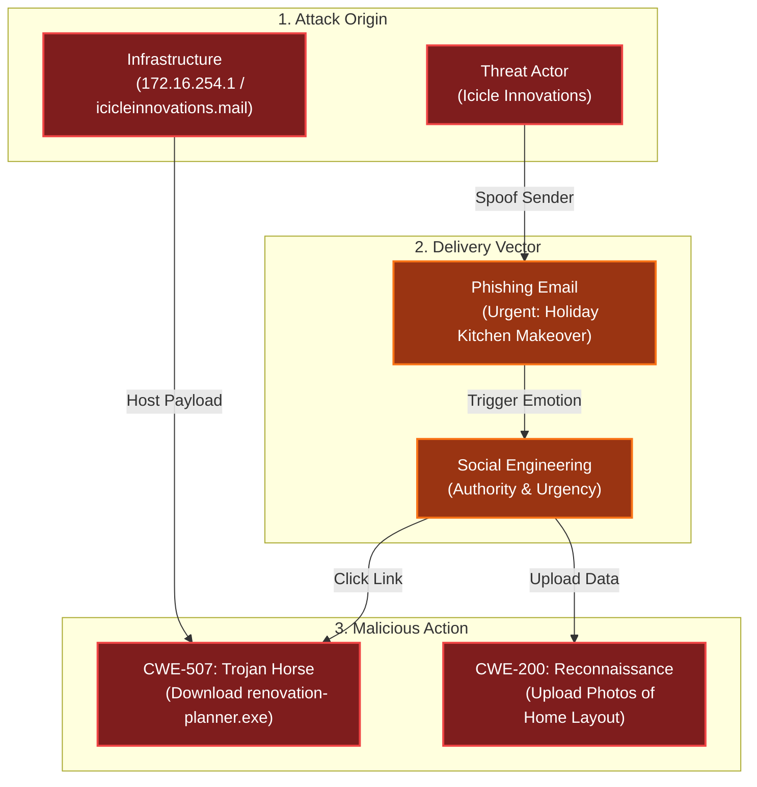

# Its All About Defang
Difficulty: <span style="color:red">❄</span> ❄ ❄ ❄ ❄  
Find Ed Skoudis upstairs in City Hall and help him troubleshoot a clever phishing tool in his cozy office.

## Hints
### Defang All The Thingz
The PTAS does a pretty good job at defanging, however, the feature we are still working on is one that defangs ALL scenarios. For now, you will need to write a custom `sed` command combining all defang options.
### Extract IOCs
Remember, the new Phishing Threat Analysis Station (PTAS) is still under construction. Even though the regex patterns are provided, they haven't been fine tuned. Some of the matches may need to be manually removed.

## Solution
The below email is given for IOCs extraction:
```
From: "Icicle Innovations" <sales@icicleinnovations.mail>
To: "Neighborhood Watch" <residents@dosisneighborhood.corp>
Subject: 🎄 URGENT: Holiday Kitchen Makeover - Smart Home Integration! 🎄
Date: Wed, 25 Dec 2025 09:15:33 -0500
Message-ID: <holiday2025-kitchen@dosisneighborhood.corp>
MIME-Version: 1.0
Content-Type: text/plain; charset="UTF-8"
X-Mailer: KitchenAlert v2.025
Received: from mail.icicleinnovations.mail (172.16.254.1) by dosisneighborhood.corp (10.0.0.5) with SMTP;
         Wed, 25 Dec 2025 09:15:28 -0500
Received: from core.icicleinnovations.mail (192.168.1.1) by mail.icicleinnovations.mail (172.16.254.1);
         Wed, 25 Dec 2025 09:15:22 -0500

Dear Valued Dosis Neighborhood Residents,

🚨 IMMEDIATE ACTION REQUIRED 🚨

Our elite team of Sunny's kitchen renovation specialists have detected some SERIOUSLY outdated kitchen setups in your neighborhood! It appears that certain homes are still using legacy appliances without proper smart home integration - like non-IoT fridges that can't automatically order milk, or microwaves that don't sync with your meal planning apps! 

While this sounds like a delightfully festive renovation opportunity (and totally not a security assessment), we need you to:

1) Download our FREE Kitchen Renovation Planner™ with built-in security features (totally legit, we promise!):
   https://icicleinnovations.mail/renovation-planner.exe
   
2) Upload high-resolution photos of your current kitchen to our secure design portal (we need to see ALL angles for proper renovation planning):
   https://icicleinnovations.mail/upload_photos

For instant help with any kitchen renovation questions, contact our 24/7 design hotline at 523.555.0100 or our renovation specialists at 523.555.0101.

Remember: If your old appliances start acting up during the assessment, it's probably just excitement about their upcoming upgrades! But please document any issues with photos.

Stay merry (and consider smart upgrades),
Icicle Innovations 
Chief Kitchen Design Specialist
📞 523.555.RENO
info@icicleinnovations.mail

P.S. - Has anyone else noticed their kitchen cabinets mysteriously rearranging themselves overnight? We can fix that with proper smart storage solutions!
```

### Extract IOCs (Step 1)
#### Domains
**Details:** The regex avoids catching the internal `dosisneighborhood.corp` domain and other unwanted parts of the mail  
**Regex:** `\b(?:(?!dosisneighborhood\.corp\b)(?!\d{1,3}(?:\.\d{1,3}){3}\b)[a-zA-Z](?:[a-zA-Z0-9-]*[a-zA-Z0-9])?\.)+(?:(?!exe\b)[a-zA-Z]{2,}|[a-zA-Z0-9]{2,}\.[a-zA-Z]{2,})\b`  
**Results:**
- `icicleinnovations.mail`
- `mail.icicleinnovations.mail`
- `core.icicleinnovations.mail`

#### IP Addresses
**Details:** The regex avoids catching the internal `10.0.0.0/8` subnet  
**Regex:** `\b(?!10)\d{1,3}\.\d{1,3}\.\d{1,3}\.\d{1,3}`  
**Results:**
- `172.16.254.1`
- `192.168.1.1`

### URLs
**Details:** The regex also catches HTTPS URLs  
**Regex:** `https?:\/\/[a-zA-Z0-9-]+(\.[a-zA-Z0-9-]+)+(:[0-9]+)?(\/[^\s]*)?`  
**Results:**
- `https://icicleinnovations.mail/renovation-planner.exe`
- `https://icicleinnovations.mail/upload_photos`

### Emails 
**Details:** The regex avoids catching the internal `dosisneighborhood.corp` domain   
**Regex:** `\b[a-zA-Z0-9._%+-]+@(?!dosisneighborhood\.corp\b)[a-zA-Z0-9.-]+\.[a-zA-Z]{2,}\b`  
**Results:**
- `sales@icicleinnovations.mail`
- `info@icicleinnovations.mail`

## Defang & report (Step 2)
To properly defang it's sufficient to concatenate all proposed patterns into `s/\./[.]/g;s/@/[@]/g;s/http/hxxp/g;s/:\//[://]/g` or call the `applyStandardDefanging()` function straigth in the browser console, obtaining:
- Domains (3)
  - `icicleinnovations[.]mail`
  - `mail[.]icicleinnovations[.]mail`
  - `core[.]icicleinnovations[.]mail`
- IP Addresses (2)
  - `172[.]16[.]254[.]1`
  - `192[.]168[.]1[.]1`
- URLs (2)
  - `hxxps[://]icicleinnovations[.]mail/renovation-planner[.]exe`
  - `hxxps[://]icicleinnovations[.]mail/upload_photos`
- Email Addresses (2)
  - `sales[@]icicleinnovations[.]mail`
  - `info[@]icicleinnovations[.]mail`

## Dissecting the attack

<table>
     <thead>
         <tr>
             <th style="text-align:center">Phase</th>
             <th style="text-align:center">Vulnerability (CWE)</th>
             <th style="text-align:center">Mitigation</th>
         </tr>
     </thead>
     <tbody>
         <tr>
             <td rowspan="1"><strong>1. Delivery</strong><br/></td>
             <td style="border: 1px solid #ddd; padding:10px;"> <strong>CWE-451</strong><br/>User Interface Misrepresentation of Critical Information<br/><em>(Email Spoofing / Phishing)</em> </td>
             <td style="background-color:#14532d; color:white; border-radius:5px; padding:10px; border: 2px dashed #22c55e;"> <strong>Email Auth</strong><br/><em>(DMARC / SPF / DKIM)</em> </td>
         </tr>
         <tr>
             <td rowspan="1"><strong>2. Execution</strong><br/></td>
             <td style="border: 1px solid #ddd; padding:10px;"> <strong>CWE-507</strong><br/>Trojan Horse<br/><em>(Fake 'Renovation Planner' Executable)</em> </td>
             <td style="background-color:#14532d; color:white; border-radius:5px; padding:10px; border: 2px dashed #22c55e;"> <strong>Endpoint Security</strong><br/><em>(Block .exe downloads / EDR)</em> </td>
         </tr>
         <tr>
             <td rowspan="1"><strong>3. Collection</strong><br/></td>
             <td style="border: 1px solid #ddd; padding:10px;"> <strong>CWE-200</strong><br/>Exposure of Sensitive Information to an Unauthorized Actor<br/><em>(Photos of physical layout)</em></td>
             <td style="background-color:#14532d; color:white; border-radius:5px; padding:10px; border: 2px dashed #22c55e;"> <strong>Security Awareness</strong><br/><em>(Verify Requests / OpSec)</em> </td>
         </tr>
     </tbody>
 </table>

### Fixing the Human Element (CWE-451)
**Vulnerability:** The attacker used "Urgency" ("IMMEDIATE ACTION REQUIRED") and "Authority" ("Chief Kitchen Design Specialist") to bypass the victim's critical thinking. The email UI misrepresented the safety of the situation, trying to convince the user into trusting a malicious sender.  
**Fix:** Implement robust Security Awareness Training combined with technical controls. Users must be trained to inspect `From` addresses (`@icicleinnovations.mail` vs `@dosisneighborhood.corp`) and hover over links before clicking.  
**Defense Strategy:**
- External Tags: Configure the email gateway to flag emails from outside the organization with a visible `EXTERNAL` banner.
- Defanging: As performed in the challenge, automated tools should "defang" URLs (change `http` to `hxxp`) in suspected emails to prevent accidental clicks during analysis.  

**Impact:** Technical controls like DMARC reject spoofed emails before they reach the inbox. Visual indicators (External tags) and safety measures (Defanging) disrupt the user's workflow, prompting critical assessment and preventing accidental engagement with malicious content.

### Fixing the Endpoint Execution (CWE-507)
**Vulnerability:** The email provided a direct link to a Windows executable (`renovation-planner.exe`). If executed, this would likely install malware while pretending to be a renovation tool.  
**Fix:** Enforce Application Allowlisting and Extension Blocking. User endpoints should not be allowed to download or run executable files from the internet unless explicitly authorized.  
**Secure Configuration (Network/Proxy):**
```yaml
# Block dangerous file types at the web gateway
deny_extensions:
  - .exe
  - .bat
  - .vbs
  - .iso
  - .ps1
  - .scr
  - ....
```
**Impact:** Even if the user falls for the phishing lure, the network prevents the payload from being downloaded, breaking the kill chain.

### Fixing the Information Leakage (CWE-200)
**Vulnerability:** The attacker requested "high-resolution photos" of the kitchen to see "ALL angles." In a targeted attack, this is physical reconnaissance. It reveals the layout of the home, the type of hardware present (IoT devices), and potential physical entry points.  
**Fix:** Establish Operational Security (OpSec) protocols. Users should be trained to minimize data disclosure. Technical controls like Data Loss Prevention (DLP) scanners can also be configured to detect and block outgoing uploads of image files to uncategorized or suspicious domains (`icicleinnovations.mail`).  
**Impact:** Prevents the attacker from gathering the intelligence needed to plan further cyber-physical attacks.
