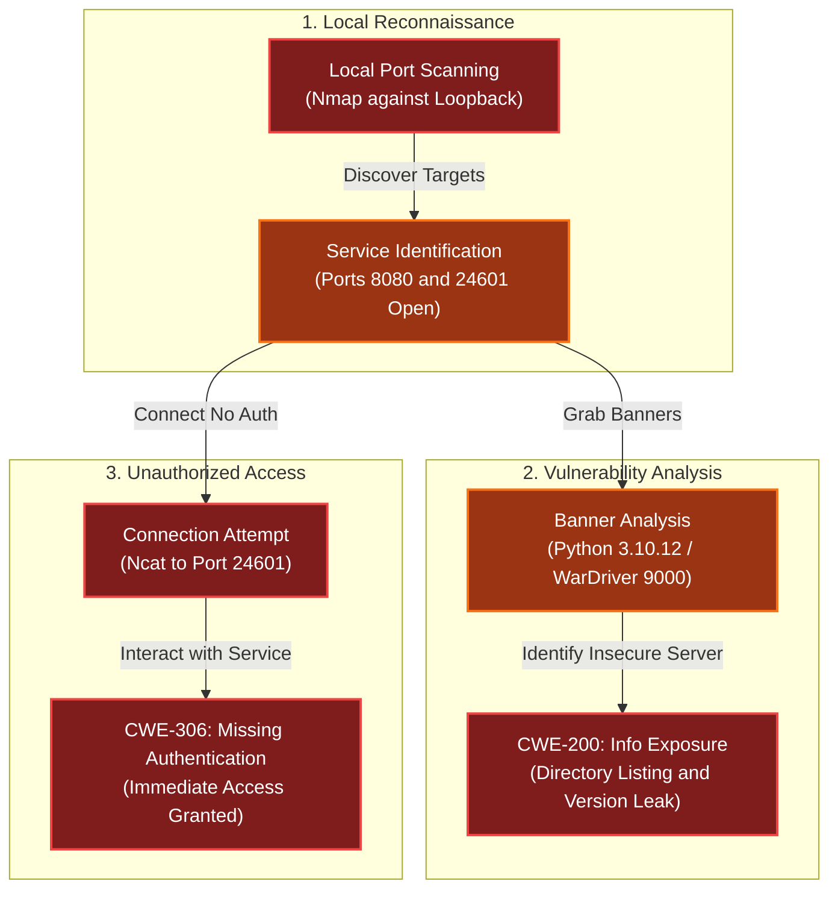

# Intro to Nmap
Difficulty: <span style="color:red">❄</span> ❄ ❄ ❄ ❄  
Meet Eric in the hotel parking lot for Nmap know-how and scanning secrets. Help him connect to the wardriving rig on his motorcycle!

## Hints
### Ncat Documentation
You may also want to check out the [Ncat Guide](https://nmap.org/ncat/guide/).
### Nmap Documentation
Nmap is pretty straightforward to use for basic port scans. Check out its [documentation](https://nmap.org/book/man.html)!

### Solution
```bash
Welcome to the Intro to Nmap terminal!  We will learn some Nmap basics by running commands to answer the questions asked, which will guide us in finding and connecting to the wardriving rig's service. 
Run the command "hint" to receive a hint.
────────────────────────────────────────────────────────────────────────────────────────────────────────────────────────────────────────────────────────────────────
Type [y]es to begin: y
```
```bash
1) When run without any options, nmap performs a TCP port scan of the top 1000 ports. Run a default nmap scan of 127.0.12.25 and see which port is open.
────────────────────────────────────────────────────────────────────────────────────────────────────────────────────────────────────────────────────────────────────
elf@484e5762e44f:~$ nmap 127.0.12.25
Starting Nmap 7.80 ( https://nmap.org ) at 2025-11-05 21:56 UTC
Nmap scan report for 127.0.12.25
Host is up (0.000063s latency).
Not shown: 999 closed ports
PORT     STATE SERVICE
8080/tcp open  http-proxy

Nmap done: 1 IP address (1 host up) scanned in 0.14 seconds
```
```bash
2) Sometimes the top 1000 ports are not enough. Run an nmap scan of all TCP ports on 127.0.12.25 and see which port is open.
────────────────────────────────────────────────────────────────────────────────────────────────────────────────────────────────────────────────────────────────────
elf@0921dbbac7b0:~$ nmap 127.0.12.25 -p-
Starting Nmap 7.80 ( https://nmap.org ) at 2025-11-05 22:02 UTC
Nmap scan report for 127.0.12.25
Host is up (0.000050s latency).
Not shown: 65534 closed ports
PORT      STATE SERVICE
24601/tcp open  unknown

Nmap done: 1 IP address (1 host up) scanned in 1.74 seconds
```
```bash
3) Nmap can also scan a range of IP addresses.  Scan the range 127.0.12.20 - 127.0.12.28 and see which has a port open.
────────────────────────────────────────────────────────────────────────────────────────────────────────────────────────────────────────────────────────────────────
elf@0921dbbac7b0:~$ nmap 127.0.12.20-28 -p-
Starting Nmap 7.80 ( https://nmap.org ) at 2025-11-05 22:03 UTC
Nmap scan report for 127.0.12.20
Host is up (0.00025s latency).
All 65535 scanned ports on 127.0.12.20 are closed

Nmap scan report for 127.0.12.21
Host is up (0.000068s latency).
All 65535 scanned ports on 127.0.12.21 are closed

Nmap scan report for 127.0.12.22
Host is up (0.00039s latency).
All 65535 scanned ports on 127.0.12.22 are closed

Nmap scan report for 127.0.12.23
Host is up (0.00023s latency).
All 65535 scanned ports on 127.0.12.23 are closed

Nmap scan report for 127.0.12.24
Host is up (0.00026s latency).
All 65535 scanned ports on 127.0.12.24 are closed

Nmap scan report for 127.0.12.25
Host is up (0.00013s latency).
Not shown: 65534 closed ports
PORT     STATE SERVICE
8080/tcp open  http-proxy

Nmap scan report for 127.0.12.26
Host is up (0.00018s latency).
All 65535 scanned ports on 127.0.12.26 are closed

Nmap scan report for 127.0.12.27
Host is up (0.00019s latency).
All 65535 scanned ports on 127.0.12.27 are closed

Nmap scan report for 127.0.12.28
Host is up (0.00027s latency).
All 65535 scanned ports on 127.0.12.28 are closed

Nmap done: 9 IP addresses (9 hosts up) scanned in 16.08 seconds
```
```bash
4) Nmap has a version detection engine, to help determine what services are running on a given port. What service is running on 127.0.12.25 TCP port 8080?
────────────────────────────────────────────────────────────────────────────────────────────────────────────────────────────────────────────────────────────────────
elf@0921dbbac7b0:~$ nmap 127.0.12.25 -p 8080 -sV 
Starting Nmap 7.80 ( https://nmap.org ) at 2025-11-05 22:06 UTC
Nmap scan report for 127.0.12.25
Host is up (0.000086s latency).

PORT     STATE SERVICE VERSION
8080/tcp open  http    SimpleHTTPServer 0.6 (Python 3.10.12)

Service detection performed. Please report any incorrect results at https://nmap.org/submit/ .
Nmap done: 1 IP address (1 host up) scanned in 6.66 seconds
```
```bash
5) Sometimes you just want to interact with a port, which is a perfect job for Ncat!  Use the ncat tool to connect to TCP port 24601 on 127.0.12.25 and view the banner returned.
────────────────────────────────────────────────────────────────────────────────────────────────────────────────────────────────────────────────────────────────────
elf@0921dbbac7b0:~$ ncat 127.0.12.25 24601
Welcome to the WarDriver 9000!
Terminated
```
```bash
Congratulations, you finished the Intro to Nmap and found the wardriving rig's service!
Type "exit" to close...
────────────────────────────────────────────────────────────────────────────────────────────────────────────────────────────────────────────────────────────────────
elf@0921dbbac7b0:~$ exit
```

## Dissecting the attack

<table>
     <thead>
         <tr>
             <th style="text-align:center">Phase</th>
             <th style="text-align:center">Vulnerability (CWE)</th>
             <th style="text-align:center">Mitigation</th>
         </tr>
     </thead>
     <tbody>
         <tr>
             <td rowspan="1"><strong>1. Access</strong><br/></td>
             <td style="border: 1px solid #ddd; padding:10px;"> <strong>CWE-306</strong><br/>Missing Authentication for Critical Function<br/><em>(Unrestricted Local Connection)</em> </td>
             <td style="background-color:#14532d; color:white; border-radius:5px; padding:10px; border: 2px dashed #22c55e;"> <strong>Authentication</strong><br/><em>(Implement Challenge-Response / API Key)</em> </td>
         </tr>
         <tr>
             <td rowspan="1"><strong>2. Discovery</strong><br/></td>
             <td style="border: 1px solid #ddd; padding:10px;"> <strong>CWE-200</strong><br/>Exposure of Sensitive Information<br/><em>(Precise Version Disclosure)</em> </td>
             <td style="background-color:#14532d; color:white; border-radius:5px; padding:10px; border: 2px dashed #22c55e;"> <strong>Hardening</strong><br/><em>(Suppress Server Banners)</em> </td>
         </tr>
         <tr>
             <td rowspan="1"><strong>3. Architecture</strong><br/></td>
             <td style="border: 1px solid #ddd; padding:10px;"> <strong>CWE-1188</strong><br/>Initialization of Resource with Insecure Default<br/><em>(Python SimpleHTTPServer)</em> </td>
             <td style="background-color:#14532d; color:white; border-radius:5px; padding:10px; border: 2px dashed #22c55e;"> <strong>Production Server</strong><br/><em>(Use Gunicorn/Nginx/Apache)</em> </td>
         </tr>
     </tbody>
 </table>

### Fixing the Insecure Web Server (CWE-1188)
**Vulnerability:** The service on port 8080 is running `SimpleHTTPServer` (or `http.server` in Python 3). This module is designed strictly for development and testing. By default, it:
- Enables Directory Listing: If an `index.html` is missing, it lists all files in the directory, potentially exposing source code or sensitive data.
- Is Single-Threaded: It handles requests sequentially, making it trivial to crash or hang with a simple DoS attack.
- Lacks Security Headers: It does not send headers like `X-Content-Type-Options` or `Content-Security-Policy`.  

**Fix:** Replace the development server with a production-grade WSGI application server (like Gunicorn or uWSGI) sitting behind a robust reverse proxy (like Nginx or Apache).  
**Vulnerable Command:**
```bash
# FLAW: Do not use in production
python3 -m http.server 8080
```
**Secure Command:**
```bash
# FIX: Use a production WSGI server
gunicorn -w 4 myapp:app -b 127.0.0.1:8080
```
**Impact:** Eliminates the directory listing risk, provides concurrency to handle multiple connections, and allows for proper security header configuration.

### Fixing the Unauthenticated Access (CWE-306)
**Vulnerability:** The "WarDriver 9000" service on port 24601 accepts connections from 127.0.12.25 without any form of authentication. In a localhost context (127.0.0.0/8), this means any user or malicious process running on the system can connect to and control the rig. Binding to loopback restricts remote attackers but does nothing to stop local attackers.  
**Fix:** Implement an Authentication Mechanism at the application layer. This could be a simple password prompt upon connection, an API Key header, or mTLS.  
**Vulnerable Code (Concept):**
```python
# FLAW: Accepts connection and immediately trusts the client
client_socket, addr = server.accept()
client_socket.send(b"Welcome to WarDriver 9000!\n")
process_commands(client_socket)
```
**Secure Code:**
```python
# FIX: Require a shared secret before allowing commands
client_socket, addr = server.accept()
client_socket.send(b"Auth Required: ")
password = client_socket.recv(1024).strip()

if password == SECRET_KEY:
    client_socket.send(b"Welcome to WarDriver 9000!\n")
    process_commands(client_socket)
else:
    client_socket.close()
```
**Impact:** Prevents unauthorized local users from accessing the control interface.

### Fixing the Version Leakage (CWE-200)
**Vulnerability:** The web service on port 8080 explicitly identifies itself as `SimpleHTTPServer 0.6 (Python 3.10.12)`. This gives a local attacker precise knowledge of the runtime environment, allowing them to verify if the system is vulnerable to specific local privilege escalation exploits targeting that Python version.  
**Fix:** Suppress or Obfuscate the server banners. Production services should not reveal version numbers.  
**Secure Configuration (Python):**
```python
import http.server

class SecureHandler(http.server.SimpleHTTPRequestHandler):
    # FIX: Override default version headers
    server_version = "GenericWebSrv"
    sys_version = "" 

# ... init server with SecureHandler ...
```
**Impact:** Forces an attacker to spend time fuzzing or guessing the environment, increasing the likelihood of detection before they can launch a successful exploit.
