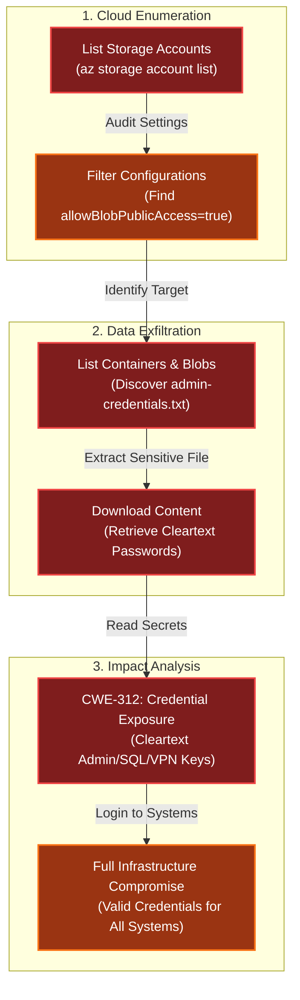

# Blob Storage Challenge in the Neighborhood
Difficulty: <span style="color:red">❄</span> ❄ ❄ ❄ ❄  
Help the Goose Grace near the pond find which Azure Storage account has been misconfigured to allow public blob access by analyzing the export file.

## Hints
### Blob Storage Challenge in the Neighborhood
This terminal has built-in hints!

### Solution
```bash
🎄 Welcome! 🎄
In a moment, you will be connected to an Azure CLI session in the "neighborhood" tenant.
Your mission: 🔍 Investigate and find WHERE a security vulnerability exists.
Good luck! I'm sure you will do great. Connecting you now...
──────────────────────────────────────────────────────────────────────────────────────────────────────────────────────────────────────────────
```
```bash
You may not know this but the Azure cli help messages are very easy to access. First, try typing:
$ az help | less
──────────────────────────────────────────────────────────────────────────────────────────────────────────────────────────────────────────────
neighbor@cbbe041f015e:~$ az help | less
```
```bash
Next, you've already been configured with credentials. 🔑
  $ az account show | less
  - Pipe the output to | less so you can scroll.
  - Press 'q' to exit less.
──────────────────────────────────────────────────────────────────────────────────────────────────────────────────────────────────────────────
neighbor@cbbe041f015e:~$ az account show | less
{
  "environmentName": "AzureCloud",
  "id": "2b0942f3-9bca-484b-a508-abdae2db5e64",
  "isDefault": true,
  "name": "theneighborhood-sub",
  "state": "Enabled",
  "tenantId": "90a38eda-4006-4dd5-924c-6ca55cacc14d",
  "user": {
    "name": "theneighborhood@theneighborhood.invalid",
    "type": "user"
  }
}
```
```bash
Now that you've run a few commands, Let's take a look at some Azure storage accounts.
Try: az storage account list | less
For more information:
https://learn.microsoft.com/en-us/cli/azure/storage/account?view=azure-cli-latest
──────────────────────────────────────────────────────────────────────────────────────────────────────────────────────────────────────────────
neighbor@cbbe041f015e:~$ az storage account list | less
[
  {
    "id": "/subscriptions/2b0942f3-9bca-484b-a508-abdae2db5e64/resourceGroups/theneighborhood-rg1/providers/Microsoft.Storage/storageAccounts/
neighborhood1",
    "kind": "StorageV2",
    "location": "eastus",
    "name": "neighborhood1",
    "properties": {
      "accessTier": "Hot",
      "allowBlobPublicAccess": false,
      "encryption": {
        "keySource": "Microsoft.Storage",
        "services": {
          "blob": {
            "enabled": true
          }
        }
      },
      "minimumTlsVersion": "TLS1_2"
    },
    "resourceGroup": "theneighborhood-rg1",
    "sku": {
      "name": "Standard_LRS"
    },
    "tags": {
      "env": "dev"
    }
  },
  {
    "id": "/subscriptions/2b0942f3-9bca-484b-a508-abdae2db5e64/resourceGroups/theneighborhood-rg1/providers/Microsoft.Storage/storageAccounts/
neighborhood2",
    "kind": "StorageV2",
    "location": "eastus2",
    "name": "neighborhood2",
    "properties": {
      "accessTier": "Cool",
      "allowBlobPublicAccess": true,
      "encryption": {
        "keySource": "Microsoft.Storage",
        "services": {
          "blob": {
            "enabled": false
          }
        }
      },
      "minimumTlsVersion": "TLS1_0"
    },
    "resourceGroup": "theneighborhood-rg1",
    "sku": {
      "name": "Standard_GRS"
    },
    "tags": {
      "owner": "Admin"
    }
  },
  {
    "id": "/subscriptions/2b0942f3-9bca-484b-a508-abdae2db5e64/resourceGroups/theneighborhood-rg2/providers/Microsoft.Storage/storageAccounts/
neighborhood3",
    "kind": "BlobStorage",
    "location": "westus",
    "name": "neighborhood3",
    "properties": {
      "accessTier": "Hot",
      "allowBlobPublicAccess": false,
      "encryption": {
        "keySource": "Microsoft.Keyvault",
        "services": {
          "blob": {
            "enabled": true
          }
        }
      },
      "minimumTlsVersion": "TLS1_2"
    },
    "resourceGroup": "theneighborhood-rg2",
    "sku": {
      "name": "Standard_RAGRS"
    },
    "tags": {
      "department": "NeighborhoodWatch"
    }
  },
  {
    "id": "/subscriptions/2b0942f3-9bca-484b-a508-abdae2db5e64/resourceGroups/theneighborhood-rg2/providers/Microsoft.Storage/storageAccounts/
neighborhood4",
    "kind": "StorageV2",
    "location": "westus2",
    "name": "neighborhood4",
    "properties": {
      "accessTier": "Hot",
      "allowBlobPublicAccess": false,
      "minimumTlsVersion": "TLS1_2",
      "networkAcls": {
       "bypass": "AzureServices",
        "virtualNetworkRules": []
      }
    },
    "resourceGroup": "theneighborhood-rg2",
    "sku": {
      "name": "Premium_LRS"
    },
    "tags": {
      "critical": "true"
    }
  },
  {
    "id": "/subscriptions/2b0942f3-9bca-484b-a508-abdae2db5e64/resourceGroups/theneighborhood-rg1/providers/Microsoft.Storage/storageAccounts/
neighborhood5",
    "kind": "StorageV2",
    "location": "eastus",
    "name": "neighborhood5",
    "properties": {
      "accessTier": "Cool",
      "allowBlobPublicAccess": false,
      "isHnsEnabled": true,
      "minimumTlsVersion": "TLS1_2"
    },
    "resourceGroup": "theneighborhood-rg1",
    "sku": {
      "name": "Standard_LRS"
    },
    "tags": {
      "project": "Homes"
    }
  },
  {
    "id": "/subscriptions/2b0942f3-9bca-484b-a508-abdae2db5e64/resourceGroups/theneighborhood-rg2/providers/Microsoft.Storage/storageAccounts/
neighborhood6",
    "kind": "StorageV2",
    "location": "centralus",
    "name": "neighborhood6",
    "properties": {
      "accessTier": "Hot",
      "allowBlobPublicAccess": false,
      "minimumTlsVersion": "TLS1_2",
      "tags": {
        "replicate": "true"
      }
    },
    "resourceGroup": "theneighborhood-rg2",
    "sku": {
      "name": "Standard_ZRS"
    },
    "tags": {}
  }
]
```
```bash
Mmm... one of these looks suspicious 🚨, i think there may be a misconfiguration here somewhere.
Try showing the account that has a common misconfiguration: az storage account show --name xxxxxxxxxx | less
──────────────────────────────────────────────────────────────────────────────────────────────────────────────────────────────────────────────
neighbor@cbbe041f015e:~$ az storage account show --name neighborhood2 | less
{
  "id": "/subscriptions/2b0942f3-9bca-484b-a508-abdae2db5e64/resourceGroups/theneighborhood-rg1/providers/Microsoft.Storage/storageAccounts/neighborhood2",
  "name": "neighborhood2",
  "location": "eastus2",
  "kind": "StorageV2",
  "sku": {
    "name": "Standard_GRS"
  },
  "properties": {
    "accessTier": "Cool",
    "allowBlobPublicAccess": true,
    "minimumTlsVersion": "TLS1_0",
    "encryption": {
      "services": {
        "blob": {
          "enabled": false
        }
      },
      "keySource": "Microsoft.Storage"
    }
  },
  "resourceGroup": "theneighborhood-rg1",
  "tags": {
    "owner": "Admin"
  }
}
```
```bash
Now we need to list containers in neighborhood2. After running the command what's interesting in the list?
For more information:
https://learn.microsoft.com/en-us/cli/azure/storage/container?view=azure-cli-latest#az-storage-container-list
──────────────────────────────────────────────────────────────────────────────────────────────────────────────────────────────────────────────
neighbor@cbbe041f015e:~$ key=$(az storage account keys list --account-name neighborhood2 --query "[0].value" -o tsv)
neighbor@cbbe041f015e:~$ az storage container list --account-name neighborhood2 --account-key "$key"
[
  {
    "name": "public",
    "properties": {
      "lastModified": "2024-01-15T09:00:00Z",
      "publicAccess": "Blob"
    }
  },
  {
    "name": "private",
    "properties": {
      "lastModified": "2024-02-05T11:12:00Z",
      "publicAccess": null
    }
  }
]
```
```bash
Let's take a look at the blob list in the public container for neighborhood2.
For more information:
https://learn.microsoft.com/en-us/cli/azure/storage/blob?view=azure-cli-latest#az-storage-blob-list
──────────────────────────────────────────────────────────────────────────────────────────────────────────────────────────────────────────────
neighbor@cbbe041f015e:~$ az storage blob list --account-name neighborhood2 --container-name public 
[
  {
    "name": "refrigerator_inventory.pdf",
    "properties": {
      "contentLength": 45678,
      "contentType": "application/pdf",
      "metadata": {
        "created_by": "NeighborhoodWatch",
        "document_type": "inventory",
        "last_updated": "2024-12-15"
      }
    }
  },
  {
    "name": "admin_credentials.txt",
    "properties": {
      "contentLength": 1024,
      "contentType": "text/plain",
      "metadata": {
        "note": "admins only"
      }
    }
  },
  {
    "name": "network_config.json",
    "properties": {
      "contentLength": 2048,
      "contentType": "application/json",
      "metadata": {
        "encrypted": "false",
        "environment": "prod"
      }
    }
  }
]
```
```bash
Try downloading and viewing the blob file named admin_credentials.txt from the public container.
💡 hint: --file /dev/stdout should print in the terminal. Dont forget to use | less!
──────────────────────────────────────────────────────────────────────────────────────────────────────────────────────────────────────────────
neighbor@cbbe041f015e:~$ az storage blob download --account-name neighborhood2 --container-name public --name admin_credentials.txt --file /dev/stdout 
 
# You have discovered an Azure Storage account with "allowBlobPublicAccess": true.
# This misconfiguration allows ANYONE on the internet to view and download files
# from the blob container without authentication.

# Public blob access is highly insecure when sensitive data (like admin credentials)
# is stored in these containers. Always disable public access unless absolutely required.

Azure Portal Credentials
User: azureadmin
Pass: AzUR3!P@ssw0rd#2025

Windows Server Credentials
User: administrator
Pass: W1nD0ws$Srv!@42

SQL Server Credentials
User: sa
Pass: SqL!P@55#2025$

Active Directory Domain Admin
User: corp\administrator
Pass: D0m@in#Adm!n$765

Exchange Admin Credentials
User: exchangeadmin
Pass: Exch@ng3!M@il#432

VMware vSphere Credentials
User: vsphereadmin
Pass: VMW@r3#Clu$ter!99
 
Network Switch Credentials
User: netadmin
Pass: N3t!Sw!tch$C0nfig#

Firewall Admin Credentials
User: fwadmin
Pass: F1r3W@ll#S3cur3!77

Backup Server Credentials
User: backupadmin
Pass: B@ckUp!Srv#2025$

Monitoring System Admin
User: monitoradmin
Pass: M0n!t0r#Sys$P@ss!

SharePoint Admin Credentials
User: spadmin
Pass: Sh@r3P0!nt#Adm!n2025

Git Server Admin
User: gitadmin
Pass: G1t#Srv!Rep0$C0de
```
```bash
🎊 Great, you found the misconfiguration allowing public access to sensitive information!

✅ Challenge Complete! To finish, type: finish
──────────────────────────────────────────────────────────────────────────────────────────────────────────────────────────────────────────────
neighbor@cbbe041f015e:~$ finish
Completing challenge...
```
```bash
🎉 Blob Storage Challenge completed! 🎉
──────────────────────────────────────────────────────────────────────────────────────────────────────────────────────────────────────────────
```

## Dissecting the attack

<table>
     <thead>
         <tr>
             <th style="text-align:center">Phase</th>
             <th style="text-align:center">Vulnerability (CWE)</th>
             <th style="text-align:center">Mitigation</th>
         </tr>
     </thead>
     <tbody>
         <tr>
             <td rowspan="1"><strong>1. Discovery</strong><br/></td>
             <td style="border: 1px solid #ddd; padding:10px;"> <strong>CWE-668</strong><br/>Exposure of Resource to Wrong Sphere<br/><em>(Public Blob Access Enabled)</em> </td>
             <td style="background-color:#14532d; color:white; border-radius:5px; padding:10px; border: 2px dashed #22c55e;"> <strong>Access Control</strong><br/><em>(Disable Public Access / Private Link)</em> </td>
         </tr>
         <tr>
             <td rowspan="1"><strong>2. Disclosure</strong><br/></td>
             <td style="border: 1px solid #ddd; padding:10px;"> <strong>CWE-312</strong><br/>Cleartext Storage of Sensitive Information<br/><em>(Credentials in Text File)</em> </td>
             <td style="background-color:#14532d; color:white; border-radius:5px; padding:10px; border: 2px dashed #22c55e;"> <strong>Secret Management</strong><br/><em>(Azure Key Vault / Managed Identity)</em> </td>
         </tr>
     </tbody>
 </table>

### Fixing the Access Control (CWE-668)
**Vulnerability:** The Azure Storage account was misconfigured with the property `"allowBlobPublicAccess": true`. This setting allows anyone on the internet to read data in containers configured for public access, without requiring authentication or a SAS token.  
**Fix:** Enforce `Deny Public Network Access` at the storage account level. This overrides any individual container settings and ensures that data is only accessible via authorized Azure AD identities or private network endpoints.  
**Vulnerable Configuration (JSON):**
```js
{
  "name": "publicdata",
  "allowBlobPublicAccess": true, // FLAW: Allows anonymous internet access
  "publicNetworkAccess": "Enabled"
}
```
**Secure Configuration (Azure CLI):**
```bash
# FIX: Disable public blob access globally for the account
az storage account update \
  --name publicdata \
  --resource-group theneighborhood \
  --allow-blob-public-access false
```
**Impact:** Prevents anonymous users from enumerating or downloading blobs, even if a container is accidentally set to "Public".

### Fixing the Credential Storage (CWE-312)
**Vulnerability:** A file named `admin-credentials.txt` was stored in the blob container. This file contained cleartext usernames and passwords for critical infrastructure, including Domain Controllers, SQL Servers, and Firewalls.  
**Fix:** Never store credentials in static files (blobs, source code, or config files). Use a dedicated secrets management solution like Azure Key Vault. Applications should retrieve these secrets dynamically at runtime using Managed Identities.  
**Vulnerable Storage:**
- File: `admin-credentials.txt`
- Content: `User: azureadmin, Pass: AzUR3!P@ssw0rd#2025`

**Secure Architecture:**
- Delete the text file.
- Upload secrets to Key Vault.
- Grant access only to specific applications via Access Policies or RBAC. 

**Impact:** Even if the storage account is compromised, the attacker finds no usable credentials, only encrypted blobs or data references that require further authentication to decrypt.
