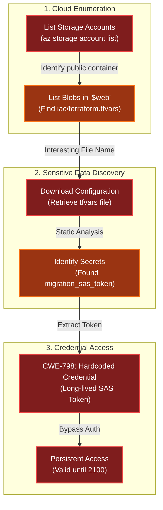

# Spare Key
Difficulty: <span style="color:red">❄</span> ❄ ❄ ❄ ❄  
Help Goose Barry near the pond identify which identity has been granted excessive Owner permissions at the subscription level, violating the principle of least privilege.

## Hints
### Spare Key
This terminal has built-in hints!

## Solution
```bash
🎄 Welcome to the Spare Key! 🎄
You're connected to a read-only Azure CLI session in "The Neighborhood" tenant.
Your mission: Someone left a spare key out in the open. Find WHERE it is.
Connecting you now... ❄️
──────────────────────────────────────────────────────────────────────────────────────────────────────────────────────────────────────────────
```
```bash
Let's start by listing all resource groups
$ az group list -o table
This will show all resource groups in a readable table format.
──────────────────────────────────────────────────────────────────────────────────────────────────────────────────────────────────────────────
neighbor@c69f6c28686f:~$ az group list -o table
Name                 Location    ProvisioningState
-------------------  ----------  -------------------
rg-the-neighborhood  eastus      Succeeded
rg-hoa-maintenance   eastus      Succeeded
rg-hoa-clubhouse     eastus      Succeeded
rg-hoa-security      eastus      Succeeded
rg-hoa-landscaping   eastus      Succeeded
```
```bash
Now let's find storage accounts in the neighborhood resource group 📦
$ az storage account list --resource-group rg-the-neighborhood -o table
This shows what storage accounts exist and their types.
──────────────────────────────────────────────────────────────────────────────────────────────────────────────────────────────────────────────
neighbor@c69f6c28686f:~$ az storage account list --resource-group rg-the-neighborhood -o table
Name             Kind         Location    ResourceGroup        ProvisioningState
---------------  -----------  ----------  -------------------  -------------------
neighborhoodhoa  StorageV2    eastus      rg-the-neighborhood  Succeeded
hoamaintenance   StorageV2    eastus      rg-hoa-maintenance   Succeeded
hoaclubhouse     StorageV2    eastus      rg-hoa-clubhouse     Succeeded
hoasecurity      BlobStorage  eastus      rg-hoa-security      Succeeded
hoalandscaping   StorageV2    eastus      rg-hoa-landscaping   Succeeded
```
```bash
Someone mentioned there was a website in here.
maybe a static website?
try:$ az storage blob service-properties show --account-name <insert_account_name> --auth-mode login
──────────────────────────────────────────────────────────────────────────────────────────────────────────────────────────────────────────────
neighbor@c69f6c28686f:~$ az storage blob service-properties show --account-name neighborhoodhoa --auth-mode login
{
  "enabled": true,
  "errorDocument404Path": "404.html",
  "indexDocument": "index.html"
}
```
```bash
Let's see what 📦 containers exist in the storage account
💡 Hint: You will need to use az storage container list
We want to list the container and its public access levels.
──────────────────────────────────────────────────────────────────────────────────────────────────────────────────────────────────────────────
neighbor@c69f6c28686f:~$ az storage container list --account-name neighborhoodhoa --auth-mode login
[
  {
    "name": "$web",
    "properties": {
      "lastModified": "2025-09-20T10:30:00Z",
      "publicAccess": null
    }
  },
  {
    "name": "public",
    "properties": {
      "lastModified": "2025-09-15T14:20:00Z",
      "publicAccess": "Blob"
    }
  }
]
```
```bash
Examine what files are in the static website container
💡 hint: when using --container-name you might need '<name>'
Look 👀 for any files that shouldn't be publicly accessible!
──────────────────────────────────────────────────────────────────────────────────────────────────────────────────────────────────────────────
neighbor@c69f6c28686f:~$ az storage blob list --account-name neighborhoodhoa --auth-mode login --container-name '$web' 
[
  {
    "name": "index.html",
    "properties": {
      "contentLength": 512,
      "contentType": "text/html",
      "metadata": {
        "source": "hoa-website"
      }
    }
  },
  {
    "name": "about.html",
    "properties": {
      "contentLength": 384,
      "contentType": "text/html",
      "metadata": {
        "source": "hoa-website"
      }
    }
  },
  {
    "name": "iac/terraform.tfvars",
    "properties": {
      "contentLength": 1024,
      "contentType": "text/plain",
      "metadata": {
        "WARNING": "LEAKED_SECRETS"
      }
    }
  }
]
```
```bash
Take a look at the files here, what stands out?
Try examining a suspect file 🕵️:
💡 hint: --file /dev/stdout | less will print to your terminal 💻.
──────────────────────────────────────────────────────────────────────────────────────────────────────────────────────────────────────────────
neighbor@c69f6c28686f:~$ az storage blob download --account-name neighborhoodhoa --auth-mode login --container-name '$web' --name 'iac/terraform.tfvars' --file /dev/stdout
# Terraform Variables for HOA Website Deployment
# Application: Neighborhood HOA Service Request Portal  
# Environment: Production
# Last Updated: 2025-09-20
# DO NOT COMMIT TO PUBLIC REPOS

# === Application Configuration ===
app_name = "hoa-service-portal"
app_version = "2.1.4"
environment = "production"

# === Database Configuration ===
database_server = "sql-neighborhoodhoa.database.windows.net"
database_name = "hoa_requests"
database_username = "hoa_app_user"
# Using Key Vault reference for security
database_password_vault_ref = "@Microsoft.KeyVault(SecretUri=https://kv-neighborhoodhoa-prod.vault.azure.net/secrets/db-password/)"

# === Storage Configuration for File Uploads ===
storage_account = "neighborhoodhoa"
uploads_container = "resident-uploads"
documents_container = "hoa-documents"

# TEMPORARY: Direct storage access for migration script
# WARNING: Remove after data migration to new storage account
# This SAS token provides full access - HIGHLY SENSITIVE!
migration_sas_token = "sv=2023-11-03&ss=b&srt=co&sp=rlacwdx&se=2100-01-01T00:00:00Z&spr=https&sig=1djO1Q%2Bv0wIh7mYi3n%2F7r1d%2F9u9H%2F5%2BQxw
8o2i9QMQc%3D"

# === Email Service Configuration ===
# Using Key Vault for sensitive email credentials
sendgrid_api_key_vault_ref = "@Microsoft.KeyVault(SecretUri=https://kv-neighborhoodhoa-prod.vault.azure.net/secrets/sendgrid-key/)"
from_email = "noreply@theneighborhood.com" 
admin_email = "admin@theneighborhood.com"

# === Application Settings ===
session_timeout_minutes = 60
max_file_upload_mb = 10
allowed_file_types = ["pdf", "jpg", "jpeg", "png", "doc", "docx"]

# === Feature Flags ===
enable_online_payments = true
enable_maintenance_requests = true
enable_document_portal = false
enable_resident_directory = true

# === API Keys (Key Vault References) ===
maps_api_key_vault_ref = "@Microsoft.KeyVault(SecretUri=https://kv-neighborhoodhoa-prod.vault.azure.net/secrets/maps-api-key/)"
weather_api_key_vault_ref = "@Microsoft.KeyVault(SecretUri=https://kv-neighborhoodhoa-prod.vault.azure.net/secrets/weather-api-key/)"

# === Notification Settings (Key Vault References) ===
sms_service_vault_ref = "@Microsoft.KeyVault(SecretUri=https://kv-neighborhoodhoa-prod.vault.azure.net/secrets/sms-credentials/)"
notification_webhook_vault_ref = "@Microsoft.KeyVault(SecretUri=https://kv-neighborhoodhoa-prod.vault.azure.net/secrets/slack-webhook/)"

# === Deployment Configuration ===
deploy_static_files_to_cdn = true
cdn_profile = "hoa-cdn-prod"
cache_duration_hours = 24

# Backup schedule
backup_frequency = "daily"
backup_retention_days = 30
{
  "downloaded": true,
  "file": "/dev/stdout"
}
```
```bash
You found the leak! A migration_sas_token within /iac/terraform.tfvars exposed a long-lived SAS token (expires 2100-01-01) 🔑
⚠️   Accidentally uploading config files to $web can leak secrets. 🔐

Challenge Complete! To finish, type: finish
──────────────────────────────────────────────────────────────────────────────────────────────────────────────────────────────────────────────
neighbor@c69f6c28686f:~$ finish
Completing challenge...
```
```bash
🎉 Challenge complete! 🎉
──────────────────────────────────────────────────────────────────────────────────────────────────────────────────────────────────────────────
```

## Dissecting the attack


<table>
     <thead>
         <tr>
             <th style="text-align:center">Phase</th>
             <th style="text-align:center">Vulnerability (CWE)</th>
             <th style="text-align:center">Mitigation</th>
         </tr>
     </thead>
     <tbody>
         <tr>
             <td rowspan="1"><strong>1. Discovery</strong><br/></td>
             <td style="border: 1px solid #ddd; padding:10px;"> <strong>CWE-219</strong><br/>Storage of File with Sensitive Data Under Web Root<br/><em>(IaC Files in Public CDN)</em> </td>
             <td style="background-color:#14532d; color:white; border-radius:5px; padding:10px; border: 2px dashed #22c55e;"> <strong>Deployment Hygiene</strong><br/><em>(Exclude Config Files from Artifacts)</em> </td>
         </tr>
         <tr>
             <td rowspan="1"><strong>2. Credentials</strong><br/></td>
             <td style="border: 1px solid #ddd; padding:10px;"> <strong>CWE-798</strong><br/>Use of Hard-coded Credentials<br/><em>(Static SAS Token in tfvars)</em> </td>
             <td style="background-color:#14532d; color:white; border-radius:5px; padding:10px; border: 2px dashed #22c55e;"> <strong>Secret Management</strong><br/><em>(Use Key Vault References)</em> </td>
         </tr>
     </tbody>
 </table>

### Fixing the Data Exposure (CWE-219)
**Vulnerability:** The `$web` container in Azure Storage is typically used to host static websites (publicly accessible). The deployment process mistakenly uploaded the `iac/terraform.tfvars` file, a configuration file meant for infrastructure provisioning, into this public web root. This made the sensitive variables readable by anyone who could guess the URL.  
**Fix:** configure the deployment pipeline to Exclude Sensitivity Configuration Files from the upload artifacts. Ensure that `.tfvars`, `.env`, and `.git` directories are listed in `.gitignore` or the deployment script's exclusion list.  
**Secure Deployment Script (Concept):**
```bash
# FIX: Exclude infrastructure config when uploading web assets
az storage blob upload-batch \
  --source ./src/frontend \
  --destination '$web' \
  --pattern "*" \
  --exclude "iac/*" "*.tfvars"
```
**Impact:** Prevents internal configuration artifacts from being served to the public internet.

### Fixing the Hardcoded Credential (CWE-798)
**Vulnerability:** The `terraform.tfvars` file contained a hardcoded `migration_sas_token` that was valid until the year 2100. Unlike the other keys in the file (which correctly used `@Microsoft.KeyVault` references), this token was pasted directly in cleartext.  
**Fix:** Eliminate hardcoded secrets by using Secret Management Services (like Azure Key Vault). The application or infrastructure script should fetch the credential dynamically at runtime using a Managed Identity.  
**Vulnerable Code (terraform.tfvars):**
```terraform
# FLAW: Hardcoded secret
migration_sas_token = "?sv=2022-11-02&ss=b&srt=co&sp=rwdlaciytfx&se=2100-01-01..."
```
**Secure Code:**
```terraform
# FIX: Use Key Vault Reference (like the adjacent keys)
migration_sas_token = "@Microsoft.KeyVault(SecretUri=https://kv-prod.vault.azure.net/secrets/migration-sas/)"
```
**Impact:** Even if the file is exposed, the attacker sees only a pointer to the Key Vault. Without the proper Managed Identity permissions to read that vault, the pointer is useless.
