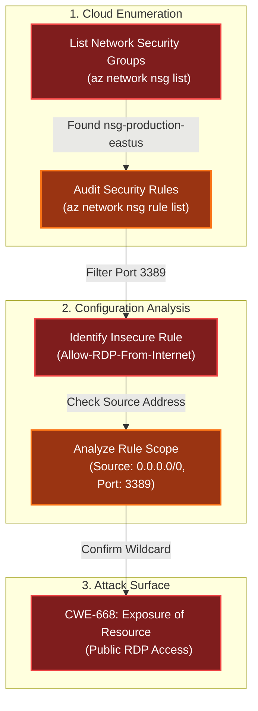

# The Open Door
Difficulty: <span style="color:red">❄</span> ❄ ❄ ❄ ❄  
Help Goose Lucas in the hotel parking lot find the dangerously misconfigured Network Security Group rule that's allowing unrestricted internet access to sensitive ports like RDP or SSH.

## Hints
### The Open Door
This terminal has built-in hints!

## Solution
```bash
🎄 Welcome to The Open Door Challenge! 🎄
You're connected to a read-only Azure CLI session in "The Neighborhood" tenant.
Your mission: Review their network configurations and find what doesn't belong.
Connecting you now... ❄️
──────────────────────────────────────────────────────────────────────────────────────────────────────────────────────────────────────────────
```
```bash
Welcome back! Let's start by exploring output formats.
First, let's see resource groups in JSON format (the default):
$ az group list
JSON format shows detailed structured data.
──────────────────────────────────────────────────────────────────────────────────────────────────────────────────────────────────────────────
neighbor@1b5e300c9110:~$ az group list
[
  {
    "id": "/subscriptions/2b0942f3-9bca-484b-a508-abdae2db5e64/resourceGroups/theneighborhood-rg1",
    "location": "eastus",
    "managedBy": null,
    "name": "theneighborhood-rg1",
    "properties": {
      "provisioningState": "Succeeded"
    },
    "tags": {}
  },
  {
    "id": "/subscriptions/2b0942f3-9bca-484b-a508-abdae2db5e64/resourceGroups/theneighborhood-rg2",
    "location": "westus",
    "managedBy": null,
    "name": "theneighborhood-rg2",
    "properties": {
      "provisioningState": "Succeeded"
    },
    "tags": {}
  }
]
```
```bash
Great! Now let's see the same data in table format for better readability 👀
$ az group list -o table
Notice how -o table changes the output format completely!
Both commands show the same data, just formatted differently.
──────────────────────────────────────────────────────────────────────────────────────────────────────────────────────────────────────────────
neighbor@1b5e300c9110:~$ az group list -o table
Name                 Location    ProvisioningState
-------------------  ----------  -------------------
theneighborhood-rg1  eastus      Succeeded
theneighborhood-rg2  westus      Succeeded
```
```bash
Lets take a look at Network Security Groups (NSGs).
To do this try: az network nsg list -o table
This lists all NSGs across resource groups.
For more information:
https://learn.microsoft.com/en-us/cli/azure/network/nsg?view=azure-cli-latest
──────────────────────────────────────────────────────────────────────────────────────────────────────────────────────────────────────────────
neighbor@1b5e300c9110:~$ az network nsg list -o table
Location    Name                   ResourceGroup
----------  ---------------------  -------------------
eastus      nsg-web-eastus         theneighborhood-rg1
eastus      nsg-db-eastus          theneighborhood-rg1
eastus      nsg-dev-eastus         theneighborhood-rg2
eastus      nsg-mgmt-eastus        theneighborhood-rg2
eastus      nsg-production-eastus  theneighborhood-rg1
```
```bash
Inspect the Network Security Group (web)  🕵️
Here is the NSG and its resource group:--name nsg-web-eastus --resource-group theneighborhood-rg1 

Hint: We want to show the NSG details. Use | less to page through the output.
Documentation: https://learn.microsoft.com/en-us/cli/azure/network/nsg?view=azure-cli-latest#az-network-nsg-show
──────────────────────────────────────────────────────────────────────────────────────────────────────────────────────────────────────────────
neighbor@1b5e300c9110:~$ az network nsg show --name nsg-web-eastus --resource-group theneighborhood-rg1
{
  "id": "/subscriptions/2b0942f3-9bca-484b-a508-abdae2db5e64/resourceGroups/theneighborhood-rg1/providers/Microsoft.Network/networkSecurityGro
ups/nsg-web-eastus",
  "location": "eastus",
  "name": "nsg-web-eastus",
  "properties": {
    "securityRules": [
      {
        "name": "Allow-HTTP-Inbound",
        "properties": {
          "access": "Allow",
          "destinationPortRange": "80",
          "direction": "Inbound",
          "priority": 100,
          "protocol": "Tcp",
          "sourceAddressPrefix": "0.0.0.0/0"
        }
      },
      {
        "name": "Allow-HTTPS-Inbound",
        "properties": {
          "access": "Allow",
          "destinationPortRange": "443",
          "direction": "Inbound",
          "priority": 110,
          "protocol": "Tcp",
          "sourceAddressPrefix": "0.0.0.0/0"
        }
      },
      {
        "name": "Allow-AppGateway-HealthProbes",
         "properties": {
          "access": "Allow",
          "destinationPortRange": "80,443",
          "direction": "Inbound",
          "priority": 130,
          "protocol": "Tcp",
          "sourceAddressPrefix": "AzureLoadBalancer"
        }
      },
      {
        "name": "Allow-Web-To-App",
        "properties": {
          "access": "Allow",
          "destinationPortRange": "8080,8443",
          "direction": "Inbound",
          "priority": 200,
          "protocol": "Tcp",
          "sourceAddressPrefix": "VirtualNetwork"
        }
      },
      {
        "name": "Deny-All-Inbound",
        "properties": {
          "access": "Deny",
          "destinationPortRange": "*",
          "direction": "Inbound",
          "priority": 4096,
          "protocol": "*",
          "sourceAddressPrefix": "*"
        }
      }
    ]
  },
  "resourceGroup": "theneighborhood-rg1",
  "tags": {
    "env": "web"
  }
}
```
```bash
Inspect the Network Security Group (mgmt)  🕵️
Here is the NSG and its resource group:--nsg-name nsg-mgmt-eastus --resource-group theneighborhood-rg2 

Hint: We want to list the NSG rules
Documentation: https://learn.microsoft.com/en-us/cli/azure/network/nsg/rule?view=azure-cli-latest#az-network-nsg-rule-list
──────────────────────────────────────────────────────────────────────────────────────────────────────────────────────────────────────────────
neighbor@1b5e300c9110:~$ az network nsg show --name nsg-mgmt-eastus --resource-group theneighborhood-rg2
{
  "id": "/subscriptions/2b0942f3-9bca-484b-a508-abdae2db5e64/resourceGroups/theneighborhood-rg2/providers/Microsoft.Network/networkSecurityGro
ups/nsg-mgmt-eastus",
  "location": "eastus",
  "name": "nsg-mgmt-eastus",
  "properties": {
    "securityRules": [
      {
        "name": "Allow-AzureBastion",
        "properties": {
          "access": "Allow",
          "destinationPortRange": "443",
          "direction": "Inbound",
          "priority": 100,
          "protocol": "Tcp",
          "sourceAddressPrefix": "AzureBastion"
        }
      },
      {
        "name": "Allow-Monitoring-Inbound",
        "properties": {
          "access": "Allow",
          "destinationPortRange": "443",
          "direction": "Inbound",
          "priority": 110,
          "protocol": "Tcp",
          "sourceAddressPrefix": "AzureMonitor"
        }
      },
      {
        "name": "Allow-DNS-From-VNet",
        "properties": {
          "access": "Allow",
          "destinationPortRange": "53",
          "direction": "Inbound",
          "priority": 115,
          "protocol": "Udp",
          "sourceAddressPrefix": "VirtualNetwork"
        }
      },
      {
        "name": "Deny-All-Inbound",
        "properties": {
          "access": "Deny",
          "destinationPortRange": "*",
          "direction": "Inbound",
          "priority": 4096,
          "protocol": "*",
          "sourceAddressPrefix": "*"
        }
      },
      {
        "name": "Allow-Monitoring-Outbound",
        "properties": {
          "access": "Allow",
          "destinationAddressPrefix": "AzureMonitor",
          "destinationPortRange": "443",
          "direction": "Outbound",
          "priority": 200,
          "protocol": "Tcp"
        }
      },
      {
        "name": "Allow-AD-Identity-Outbound",
        "properties": {
          "access": "Allow",
          "destinationAddressPrefix": "AzureActiveDirectory",
          "destinationPortRange": "443",
          "direction": "Outbound",
          "priority": 210,
          "protocol": "Tcp"
        }
      },
      {
        "name": "Allow-Backup-Outbound",
        "properties": {
          "access": "Allow",
          "destinationAddressPrefix": "AzureBackup",
          "destinationPortRange": "443",
          "direction": "Outbound",
          "priority": 220,
          "protocol": "Tcp"
        }
      }
    ]
  },
  "resourceGroup": "theneighborhood-rg2",
  "tags": {
    "env": "mgmt"
  }
}
```
```bash
Take a look at the rest of the NSG rules and examine their properties.
After enumerating the NSG rules, enter the command string to view the suspect rule and inspect its properties.
Hint: Review fields such as direction, access, protocol, source, destination and port settings.

Documentation: https://learn.microsoft.com/en-us/cli/azure/network/nsg/rule?view=azure-cli-latest#az-network-nsg-rule-show
──────────────────────────────────────────────────────────────────────────────────────────────────────────────────────────────────────────────
neighbor@1b5e300c9110:~$ for nsg in $(az network nsg list --resource-group theneighborhood-rg1 --query "[].name" -o tsv); do az network nsg rule list --resource-group theneighborhood-rg1 --nsg-name "$nsg" -o table; done
Network security group '/subscriptions/2b0942f3-9bca-484b-a508-abdae2db5e64/resourceGroups/theneighborhood-rg1/providers/Microsoft.Network/networkSecurityGroups/nsg-web-eastus' could not be found.
Network security group 'eastus' could not be found.
Access    Direction    Name                           Priority    Protocol    NSG             SourceAddressPrefix    SourcePortRange    DestinationAddressPrefix    DestinationPortRange
--------  -----------  -----------------------------  ----------  ----------  --------------  ---------------------  -----------------  --------------------------  ----------------------
Allow     Inbound      Allow-HTTP-Inbound             100         Tcp         nsg-web-eastus  0.0.0.0/0              *                  *                           80
Allow     Inbound      Allow-HTTPS-Inbound            110         Tcp         nsg-web-eastus  0.0.0.0/0              *                  *                           443
Allow     Inbound      Allow-AppGateway-HealthProbes  130         Tcp         nsg-web-eastus  AzureLoadBalancer      *                  *                           80,443
Allow     Inbound      Allow-Web-To-App               200         Tcp         nsg-web-eastus  VirtualNetwork         *                  *                           8080,8443
Deny      Inbound      Deny-All-Inbound               4096        *           nsg-web-eastus  *                      *                  *                           *
Network security group 'theneighborhood-rg1' could not be found.
Network security group '/subscriptions/2b0942f3-9bca-484b-a508-abdae2db5e64/resourceGroups/theneighborhood-rg1/providers/Microsoft.Network/networkSecurityGroups/nsg-db-eastus' could not be found.
Network security group 'eastus' could not be found.
Access    Direction    Name                     Priority    Protocol    NSG            SourceAddressPrefix    SourcePortRange    DestinationAddressPrefix    DestinationPortRange
--------  -----------  -----------------------  ----------  ----------  -------------  ---------------------  -----------------  --------------------------  ------------------------
Allow     Inbound      Allow-App-To-DB          100         Tcp         nsg-db-eastus  VirtualNetwork         *                  *                           1433
Allow     Inbound      Allow-AD-Trusted-Subnet  110         Tcp         nsg-db-eastus  10.1.0.0/24            *                  *                           88,389,636,3268-3269,445
Deny      Inbound      Deny-All-Inbound         4096        *           nsg-db-eastus  *                      *                  *                           *
Deny      Inbound      Deny-All-Inbound         4096        *           nsg-db-eastus  *                      *                  *                           *
Network security group 'theneighborhood-rg1' could not be found.
Network security group '/subscriptions/2b0942f3-9bca-484b-a508-abdae2db5e64/resourceGroups/theneighborhood-rg2/providers/Microsoft.Network/networkSecurityGroups/nsg-dev-eastus' could not be found.
Network security group 'eastus' could not be found.
Network security group 'nsg-dev-eastus' could not be found in resource group 'theneighborhood-rg1'.
Network security group 'theneighborhood-rg2' could not be found.
Network security group '/subscriptions/2b0942f3-9bca-484b-a508-abdae2db5e64/resourceGroups/theneighborhood-rg2/providers/Microsoft.Network/networkSecurityGroups/nsg-mgmt-eastus' could not be found.
Network security group 'eastus' could not be found.
Network security group 'nsg-mgmt-eastus' could not be found in resource group 'theneighborhood-rg1'.
Network security group 'theneighborhood-rg2' could not be found.
Network security group '/subscriptions/2b0942f3-9bca-484b-a508-abdae2db5e64/resourceGroups/theneighborhood-rg1/providers/Microsoft.Network/networkSecurityGroups/nsg-production-eastus' could not be found.
Network security group 'eastus' could not be found.
Access    Direction    Name                           Priority    Protocol    NSG                    SourceAddressPrefix    SourcePortRange    DestinationAddressPrefix    DestinationPortRange
--------  -----------  -----------------------------  ----------  ----------  ---------------------  ---------------------  -----------------  --------------------------  ----------------------
Allow     Inbound      Allow-HTTP-Inbound             100         Tcp         nsg-production-eastus  0.0.0.0/0              *                  *                           80
Allow     Inbound      Allow-HTTPS-Inbound            110         Tcp         nsg-production-eastus  0.0.0.0/0              *                  *                           443
Allow     Inbound      Allow-AppGateway-HealthProbes  115         Tcp         nsg-production-eastus  AzureLoadBalancer      *                  *                           80,443
Allow     Inbound      Allow-RDP-From-Internet        120         Tcp         nsg-production-eastus  0.0.0.0/0              *                  *                           3389
Deny      Inbound      Deny-All-Inbound               4096        *           nsg-production-eastus  *                      *                  *                           *
Network security group 'theneighborhood-rg1' could not be found.
Network security group '/subscriptions/2b0942f3-9bca-484b-a508-abdae2db5e64/resourceGroups/theneighborhood-rg2/providers/Microsoft.Network/networkSecurityGroups/nsg-dev-eastus' could not be found.
Network security group 'eastus' could not be found.
Network security group 'nsg-dev-eastus' could not be found in resource group 'theneighborhood-rg1'.
Network security group 'theneighborhood-rg2' could not be found.
Network security group '/subscriptions/2b0942f3-9bca-484b-a508-abdae2db5e64/resourceGroups/theneighborhood-rg2/providers/Microsoft.Network/networkSecurityGroups/nsg-mgmt-eastus' could not be found.
Network security group 'eastus' could not be found.
Network security group 'nsg-mgmt-eastus' could not be found in resource group 'theneighborhood-rg1'.
Network security group 'theneighborhood-rg2' could not be found.
Network security group '/subscriptions/2b0942f3-9bca-484b-a508-abdae2db5e64/resourceGroups/theneighborhood-rg1/providers/Microsoft.Network/networkSecurityGroups/nsg-production-eastus' could not be found.
Network security group 'eastus' could not be found.
Access    Direction    Name                           Priority    Protocol    NSG                    SourceAddressPrefix    SourcePortRange    DestinationAddressPrefix    DestinationPortRange
--------  -----------  -----------------------------  ----------  ----------  ---------------------  ---------------------  -----------------  --------------------------  ----------------------
Allow     Inbound      Allow-HTTP-Inbound             100         Tcp         nsg-production-eastus  0.0.0.0/0              *                  *                           80
Allow     Inbound      Allow-HTTPS-Inbound            110         Tcp         nsg-production-eastus  0.0.0.0/0              *                  *                           443
Allow     Inbound      Allow-AppGateway-HealthProbes  115         Tcp         nsg-production-eastus  AzureLoadBalancer      *                  *                           80,443
Allow     Inbound      Allow-RDP-From-Internet        120         Tcp         nsg-production-eastus  0.0.0.0/0              *                  *                           3389
Deny      Inbound      Deny-All-Inbound               4096        *           nsg-production-eastus  *                      *                  *                           *
Network security group 'theneighborhood-rg1' could not be found.

neighbor@1b5e300c9110:~$ az network nsg rule show --name Allow-RDP-From-Internet --nsg-name nsg-production-eastus --resource-group theneighborhood-rg1
{
  "name": "Allow-RDP-From-Internet",
  "properties": {
    "access": "Allow",
    "destinationPortRange": "3389",
    "direction": "Inbound",
    "priority": 120,
    "protocol": "Tcp",
    "sourceAddressPrefix": "0.0.0.0/0"
  }
}
```
```bash
Port 3389 is used by Remote Desktop Protocol — exposing it broadly allows attackers to brute-force credentials, exploit RDP vulnerabilities, and pivot within the network.

✨  To finish, type: finish
──────────────────────────────────────────────────────────────────────────────────────────────────────────────────────────────────────────────
neighbor@1b5e300c9110:~$ finish
Completing challenge...
```
```bash
🎉 Challenge complete! 🎉
──────────────────────────────────────────────────────────────────────────────────────────────────────────────────────────────────────────────
```

## Dissecting the attack

<table>
     <thead>
         <tr>
             <th style="text-align:center">Phase</th>
             <th style="text-align:center">Vulnerability (CWE)</th>
             <th style="text-align:center">Mitigation</th>
         </tr>
     </thead>
     <tbody>
         <tr>
             <td rowspan="1"><strong>1. Configuration</strong><br/></td>
             <td style="border: 1px solid #ddd; padding:10px;"> <strong>CWE-668</strong><br/>Exposure of Resource to Wrong Sphere<br/><em>(Wildcard Source Address)</em> </td>
             <td style="background-color:#14532d; color:white; border-radius:5px; padding:10px; border: 2px dashed #22c55e;"> <strong>Access Control</strong><br/><em>(Whitelist Specific IPs)</em> </td>
         </tr>
         <tr>
             <td rowspan="1"><strong>2. Exposure</strong><br/></td>
             <td style="border: 1px solid #ddd; padding:10px;"> <strong>CWE-284</strong><br/>Improper Access Control<br/><em>(Management Interface Exposure)</em> </td>
             <td style="background-color:#14532d; color:white; border-radius:5px; padding:10px; border: 2px dashed #22c55e;"> <strong>Architecture</strong><br/><em>(Use VPN / Azure Bastion)</em> </td>
         </tr>
     </tbody>
 </table>

### Fixing the Access Control (CWE-668)
**Vulnerability:** The Network Security Group (NSG) rule `Allow-RDP-From-Internet` is configured with `sourceAddressPrefix: "0.0.0.0/0"`. This allows any IP address on the internet to initiate a TCP connection to port `3389` (RDP), effectively exposing the login prompt to the entire world.  
**Fix:** Restrict the Source Address Prefix to a specific trusted IP address (e.g., the corporate office static IP) or a narrow CIDR range. Never use `0.0.0.0/0` or `*` for management ports.  
**Vulnerable Configuration:**
```js
{
  "name": "Allow-RDP-From-Internet",
  "properties": {
    "access": "Allow",
    "destinationPortRange": "3389",
    "sourceAddressPrefix": "0.0.0.0/0" // FLAW: The entire internet
  }
}
```
**Secure Configuration (Azure CLI):**
```bash
# FIX: Update the rule to allow ONLY the admin's specific IP
az network nsg rule update \
  --resource-group theneighborhood-rg1 \
  --nsg-name nsg-production-eastus \
  --name Allow-RDP-From-Internet \
  --source-address-prefixes 203.0.113.15/32
```
**Impact:** Attackers scanning for open RDP ports will be blocked at the network level, preventing brute-force attempts against the server credentials.

### Fixing the Management Architecture (CWE-284)
**Vulnerability:** Exposing RDP (Remote Desktop Protocol) directly to the internet is inherently risky, even with IP restrictions, due to the history of critical RCE vulnerabilities in the RDP stack (e.g., BlueKeep).  
**Fix:** Remove direct public access entirely. Use Azure Bastion, which provides secure RDP/SSH access over SSL (HTTPS) via the Azure Portal, or implement a VPN Gateway.  
**Secure Architecture:**
- Delete the `Allow-RDP-From-Internet` rule entirely.
- Deploy Azure Bastion in a dedicated subnet.
- Connect via the Azure Portal (TLS 443).  

**Impact:** This removes port 3389 from the public attack surface completely. Authentication is handled via Microsoft Entra ID (formerly Azure AD) before traffic ever reaches the VM.
