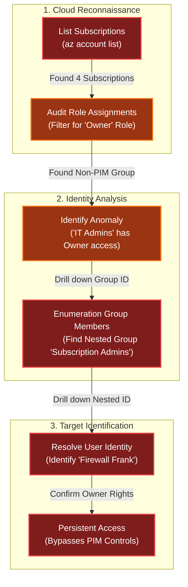

# Owner
Difficulty: <span style="color:red">❄</span> ❄ ❄ ❄ ❄  
Help Goose James near the park discover the accidentally leaked SAS token in a public JavaScript file and determine what Azure Storage resource it exposes and what permissions it grants.

## Hints
### Owner
This terminal has built-in hints!

## Solution
```bash
🎄 Welcome to the Owner Challenge! 🎄
You're connected to a read-only Azure CLI session in "The Neighborhood" tenant.
Your mission: Investigate the permissions and identify WHO has access they shouldn't.
Connecting you now... ❄️
──────────────────────────────────────────────────────────────────────────────────────────────────────────────────────────────────────────────
```
```bash
Let's learn some more Azure CLI, the --query parameter with JMESPath syntax!
$ az account list --query "[].name"
Here, [] loops through each item, .name grabs the name field
──────────────────────────────────────────────────────────────────────────────────────────────────────────────────────────────────────────────
neighbor@ec62ddacba3b:~$ az account list --query "[].name"
[
  "theneighborhood-sub",
  "theneighborhood-sub-2",
  "theneighborhood-sub-3",
  "theneighborhood-sub-4"
]
```
```bash
You can do some more advanced queries using conditional filtering with custom output.
  $ az account list --query "[?state=='Enabled'].{Name:name, ID:id}"
Cool! 😎  [?condition] filters what you want, {custom:fields} makes clean output ✨
──────────────────────────────────────────────────────────────────────────────────────────────────────────────────────────────────────────────
neighbor@ec62ddacba3b:~$ az account list --query "[?state=='Enabled'].{Name:name, ID:id}"
[
  {
    "ID": "2b0942f3-9bca-484b-a508-abdae2db5e64",
    "Name": "theneighborhood-sub"
  },
  {
    "ID": "4d9dbf2a-90b4-4d40-a97f-dc51f3c3d46e",
    "Name": "theneighborhood-sub-2"
  },
  {
    "ID": "065cc24a-077e-40b9-b666-2f4dd9f3a617",
    "Name": "theneighborhood-sub-3"
  },
  {
    "ID": "681c0111-ca84-47b2-808d-d8be2325b380",
    "Name": "theneighborhood-sub-4"
  }
]
```
```bash
Let's take a look at the Owner's of the first listed subscription 🔍. Pass in the first subscription id.
Try: az role assignment list --scope "/subscriptions/{ID of first Subscription}" --query [?roleDefinition=='Owner']
──────────────────────────────────────────────────────────────────────────────────────────────────────────────────────────────────────────────
neighbor@ec62ddacba3b:~$ az role assignment list --scope "/subscriptions/2b0942f3-9bca-484b-a508-abdae2db5e64" --query [?roleDefinition=='Owner']
[
  {
    "condition": "null",
    "conditionVersion": "null",
    "createdBy": "85b095fa-a9b4-4bdc-a3af-c9f95ebb8dd6",
    "createdOn": "2025-09-10T15:45:12.439266+00:00",
    "delegatedManagedIdentityResourceId": "null",
    "description": "null",
    "id": "/subscriptions/2b0942f3-9bca-484b-a508-abdae2db5e64/providers/Microsoft.Authorization/roleAssignments/b1c69caa-a4d6-449a-a090-efacb23b55f3",
    "name": "b1c69caa-a4d6-449a-a090-efacb23b55f3",
    "principalId": "2b5c7aed-2728-4e63-b657-98f759cc0936",
    "principalName": "PIM-Owners",
    "principalType": "Group",
    "roleDefinitionId": "/subscriptions/2b0942f3-9bca-484b-a508-abdae2db5e64/providers/Microsoft.Authorization/roleDefinitions/8e3af657-a8ff-443c-a75c-2fe8c4bcb635",
    "roleDefinitionName": "Owner",
    "scope": "/subscriptions/2b0942f3-9bca-484b-a508-abdae2db5e64",
    "type": "Microsoft.Authorization/roleAssignments",
    "updatedBy": "85b095fa-a9b4-4bdc-a3af-c9f95ebb8dd6",
    "updatedOn": "2025-09-10T15:45:12.439266+00:00"
  }
]
```
```bash
Ok 🤔 — there is a group present for the Owners permission; however, we've been assured this is a 🔐 PIM enabled group.
Currently, no PIM activations are present. 🚨
Let's run the previous command against the other subscriptions to see what we come up with.
──────────────────────────────────────────────────────────────────────────────────────────────────────────────────────────────────────────────
neighbor@ec62ddacba3b:~$ az role assignment list --scope "/subscriptions/4d9dbf2a-90b4-4d40-a97f-dc51f3c3d46e" --query [?roleDefinition=='Owner']
[
  {
    "condition": "null",
    "conditionVersion": "null",
    "createdBy": "85b095fa-a9b4-4bdc-a3af-c9f95ebb8dd6",
    "createdOn": "2025-09-10T15:45:12.439266+00:00",
    "delegatedManagedIdentityResourceId": "null",
    "description": "null",
    "id": "/subscriptions/4d9dbf2a-90b4-4d40-a97f-dc51f3c3d46e/providers/Microsoft.Authorization/roleAssignments/b1c69caa-a4d6-449a-a090-efacb23b55f3",
    "name": "b1c69caa-a4d6-449a-a090-efacb23b55f3",
    "principalId": "2b5c7aed-2728-4e63-b657-98f759cc0936",
    "principalName": "PIM-Owners",
    "principalType": "Group",
    "roleDefinitionId": "/subscriptions/4d9dbf2a-90b4-4d40-a97f-dc51f3c3d46e/providers/Microsoft.Authorization/roleDefinitions/8e3af657-a8ff-443c-a75c-2fe8c4bcb635",
    "roleDefinitionName": "Owner",
    "scope": "/subscriptions/4d9dbf2a-90b4-4d40-a97f-dc51f3c3d46e",
    "type": "Microsoft.Authorization/roleAssignments",
    "updatedBy": "85b095fa-a9b4-4bdc-a3af-c9f95ebb8dd6",
    "updatedOn": "2025-09-10T15:45:12.439266+00:00"
  }
]
neighbor@ec62ddacba3b:~$ az role assignment list --scope "/subscriptions/065cc24a-077e-40b9-b666-2f4dd9f3a617" --query [?roleDefinition=='Owner']
[
  {
    "condition": "null",
    "conditionVersion": "null",
    "createdBy": "85b095fa-a9b4-4bdc-a3af-c9f95ebb8dd6",
    "createdOn": "2025-09-10T15:45:12.439266+00:00",
    "delegatedManagedIdentityResourceId": "null",
    "description": "null",
    "id": "/subscriptions/065cc24a-077e-40b9-b666-2f4dd9f3a617/providers/Microsoft.Authorization/roleAssignments/b1c69caa-a4d6-449a-a090-efacb
23b55f3",
    "name": "b1c69caa-a4d6-449a-a090-efacb23b55f3",
    "principalId": "2b5c7aed-2728-4e63-b657-98f759cc0936",
    "principalName": "PIM-Owners",
    "principalType": "Group",
    "roleDefinitionId": "/subscriptions/065cc24a-077e-40b9-b666-2f4dd9f3a617/providers/Microsoft.Authorization/roleDefinitions/8e3af657-a8ff-4
43c-a75c-2fe8c4bcb635",
    "roleDefinitionName": "Owner",
    "scope": "/subscriptions/065cc24a-077e-40b9-b666-2f4dd9f3a617",
    "type": "Microsoft.Authorization/roleAssignments",
    "updatedBy": "85b095fa-a9b4-4bdc-a3af-c9f95ebb8dd6",
    "updatedOn": "2025-09-10T15:45:12.439266+00:00"
  },
  {
    "condition": "null",
    "conditionVersion": "null",
    "createdBy": "85b095fa-a9b4-4bdc-a3af-c9f95ebb8dd6",
    "createdOn": "2025-09-10T16:58:16.317381+00:00",
    "delegatedManagedIdentityResourceId": "null",
    "description": "null",
    "id": "/subscriptions/065cc24a-077e-40b9-b666-2f4dd9f3a617/providers/Microsoft.Authorization/roleAssignments/6b452f58-6872-4064-ae9b-78742
e8d987e",
    "principalType": "Group",
    "roleDefinitionId": "/subscriptions/065cc24a-077e-40b9-b666-2f4dd9f3a617/providers/Microsoft.Authorization/roleDefinitions/8e3af657-a8ff-4
43c-a75c-2fe8c4bcb635",
    "roleDefinitionName": "Owner",
    "scope": "/subscriptions/065cc24a-077e-40b9-b666-2f4dd9f3a617",
    "type": "Microsoft.Authorization/roleAssignments",
    "updatedBy": "85b095fa-a9b4-4bdc-a3af-c9f95ebb8dd6",
    "updatedOn": "2025-09-10T15:45:12.439266+00:00"
  },
  {
    "condition": "null",
    "conditionVersion": "null",
    "createdBy": "85b095fa-a9b4-4bdc-a3af-c9f95ebb8dd6",
    "createdOn": "2025-09-10T16:58:16.317381+00:00",
    "delegatedManagedIdentityResourceId": "null",
    "description": "null",
    "id": "/subscriptions/065cc24a-077e-40b9-b666-2f4dd9f3a617/providers/Microsoft.Authorization/roleAssignments/6b452f58-6872-4064-ae9b-78742
e8d987e",
    "name": "6b452f58-6872-4064-ae9b-78742e8d987e",
    "principalId": "6b982f2f-78a0-44a8-b915-79240b2b4796",
    "principalName": "IT Admins",
    "principalType": "Group",
    "roleDefinitionId": "/subscriptions/065cc24a-077e-40b9-b666-2f4dd9f3a617/providers/Microsoft.Authorization/roleDefinitions/8e3af657-a8ff-4
43c-a75c-2fe8c4bcb635",
    "roleDefinitionName": "Owner",
    "scope": "/subscriptions/065cc24a-077e-40b9-b666-2f4dd9f3a617",
    "type": "Microsoft.Authorization/roleAssignments",
    "updatedBy": "85b095fa-a9b4-4bdc-a3af-c9f95ebb8dd6",
    "updatedOn": "2025-09-10T16:58:16.317381+00:00"
  }
]
neighbor@ec62ddacba3b:~$ az role assignment list --scope "/subscriptions/681c0111-ca84-47b2-808d-d8be2325b380" --query [?roleDefinition=='Owner']
[
  {
    "condition": "null",
    "conditionVersion": "null",
    "createdBy": "85b095fa-a9b4-4bdc-a3af-c9f95ebb8dd6",
    "createdOn": "2025-09-10T15:45:12.439266+00:00",
    "delegatedManagedIdentityResourceId": "null",
    "description": "null",
    "id": "/subscriptions/681c0111-ca84-47b2-808d-d8be2325b380/providers/Microsoft.Authorization/roleAssignments/b1c69caa-a4d6-449a-a090-efacb23b55f3",
    "name": "b1c69caa-a4d6-449a-a090-efacb23b55f3",
    "principalId": "2b5c7aed-2728-4e63-b657-98f759cc0936",
    "principalName": "PIM-Owners",
    "principalType": "Group",
    "roleDefinitionId": "/subscriptions/681c0111-ca84-47b2-808d-d8be2325b380/providers/Microsoft.Authorization/roleDefinitions/8e3af657-a8ff-443c-a75c-2fe8c4bcb635",
    "roleDefinitionName": "Owner",
    "scope": "/subscriptions/681c0111-ca84-47b2-808d-d8be2325b380",
    "type": "Microsoft.Authorization/roleAssignments",
    "updatedBy": "85b095fa-a9b4-4bdc-a3af-c9f95ebb8dd6",
    "updatedOn": "2025-09-10T15:45:12.439266+00:00"
  }
]
```
```bash
Looks like you are on to something here! 🕵️  We were assured that only the 🔐 PIM group was present for each subscription.
🔎 Let's figure out the membership of that group.
Hint: use the az ad member list command. Pass the group id instead of the name.
Remember: | less lets you scroll through long output
──────────────────────────────────────────────────────────────────────────────────────────────────────────────────────────────────────────────
neighbor@ec62ddacba3b:~$ az ad member list --group 6b982f2f-78a0-44a8-b915-79240b2b4796
[
  {
    "@odata.type": "#microsoft.graph.group",
    "classification": null,
    "createdDateTime": "2025-09-10T16:54:24Z",
    "creationOptions": [],
    "deletedDateTime": null,
    "description": null,
    "displayName": "Subscription Admins",
    "expirationDateTime": null,
    "groupTypes": [],
    "id": "631ebd3f-39f9-4492-a780-aef2aec8c94e",
    "isAssignableToRole": null,
    "mail": null,
    "mailEnabled": false,
    "mailNickname": "15a80d1d-5",
    "membershipRule": null,
    "membershipRuleProcessingState": null,
    "onPremisesDomainName": null,
    "onPremisesLastSyncDateTime": null,
    "onPremisesNetBiosName": null,
    "onPremisesProvisioningErrors": [],
    "onPremisesSamAccountName": null,
    "onPremisesSecurityIdentifier": null,
    "onPremisesSyncEnabled": null,
    "preferredDataLocation": null,
    "preferredLanguage": null,
    "proxyAddresses": [],
    "renewedDateTime": "2025-09-10T16:54:24Z",
    "resourceBehaviorOptions": [],
    "resourceProvisioningOptions": [],
    "securityEnabled": true,
    "securityIdentifier": "S-1-12-1-1662958911-1150433785-4071522471-1321846958",
    "serviceProvisioningErrors": [],
    "theme": null,
    "uniqueName": null,
    "visibility": null
  }
]
```
```bash
Well 😤, that's annoying. Looks like we have a nested group!
Let's run the command one more time against this group.
──────────────────────────────────────────────────────────────────────────────────────────────────────────────────────────────────────────────
neighbor@ec62ddacba3b:~$ az ad member list --group 631ebd3f-39f9-4492-a780-aef2aec8c94e
[
  {
    "@odata.type": "#microsoft.graph.user",
    "businessPhones": [
      "+1-555-0199"
    ],
    "displayName": "Firewall Frank",
    "givenName": "Frank",
    "id": "b8613dd2-5e33-4d77-91fb-b4f2338c19c9",
    "jobTitle": "HOA IT Administrator",
    "mail": "frank.firewall@theneighborhood.invalid",
    "mobilePhone": "+1-555-0198",
    "officeLocation": "HOA Community Center - IT Office",
    "preferredLanguage": "en-US",
    "surname": "Firewall",
    "userPrincipalName": "frank.firewall@theneighborhood.onmicrosoft.com"
  }
]
```
```bash
elevated access instead of permanent assignments. Permanent Owner roles create persistent
attack paths and violate least-privilege principles.

Challenge Complete! To finish, type: finish
──────────────────────────────────────────────────────────────────────────────────────────────────────────────────────────────────────────────
neighbor@ec62ddacba3b:~$ finish
Completing challenge...
```

## Dissecting the attack

<table>
     <thead>
         <tr>
             <th style="text-align:center">Phase</th>
             <th style="text-align:center">Vulnerability (CWE)</th>
             <th style="text-align:center">Mitigation</th>
         </tr>
     </thead>
     <tbody>
         <tr>
             <td rowspan="1"><strong>1. Audit</strong><br/></td>
             <td style="border: 1px solid #ddd; padding:10px;"> <strong>CWE-269</strong><br/>Improper Privilege Management<br/><em>(Permanent 'Owner' Assignment)</em> </td>
             <td style="background-color:#14532d; color:white; border-radius:5px; padding:10px; border: 2px dashed #22c55e;"> <strong>Privileged Identity Management</strong><br/><em>(Require Just-In-Time Access)</em> </td>
         </tr>
         <tr>
             <td rowspan="1"><strong>2. Analysis</strong><br/></td>
             <td style="border: 1px solid #ddd; padding:10px;"> <strong>CWE-732</strong><br/>Incorrect Permission Assignment for Critical Resource<br/><em>(Obscured Access via Nested Groups)</em> </td>
             <td style="background-color:#14532d; color:white; border-radius:5px; padding:10px; border: 2px dashed #22c55e;"> <strong>Access Control</strong><br/><em>(Flatten Group Hierarchy)</em> </td>
         </tr>
     </tbody>
 </table>

### Fixing the Privilege Management (CWE-269)
**Vulnerability:** The `theneighborhood-sub-3` subscription had a direct, permanent role assignment of `Owner` to the `IT Admins` group. This violates the principle of Least Privilege and bypasses the PIM (Privileged Identity Management) controls established in other subscriptions (where only the `PIM-Owners` group had access).  
**Fix:** Remove permanent high-privilege assignments. All administrative access should be routed through PIM, requiring users to activate their role for a limited time with justification.  
**Secure Configuration (Azure CLI):**
```bash
# FIX 1: Remove the permanent assignment
az role assignment delete --assignee "IT Admins" --role "Owner" --scope "/subscriptions/065cc24a..."

# FIX 2: Add the group to PIM (via Azure Portal or Graph API)
# (Conceptual)
az pim role assignment create --role "Owner" --assignee "IT Admins" --type "Eligible"
```
**Impact:** Ensures that no user has standing `Owner` access. Even if Frank's account is compromised, the attacker cannot delete resources or assign roles without first triggering a PIM activation alert.

### Fixing the Group Nesting (CWE-732)
**Vulnerability:** The `IT Admins` group contained another group, `Subscription Admins`, which contained the user `Firewall Frank`. This Nested Group structure obscures the effective permissions, making it difficult for auditors to see who actually has access when simply listing the top-level role assignments.  
**Fix:** Flatten the IAM hierarchy. Avoid nesting groups for high-privilege roles. If nesting is required for organizational reasons, use auditing tools that recursively resolve membership.  
**Audit Command:**
```bash
# FIX: Regularly audit effective access by resolving nested members
az ad group member list --group "IT Admins" --recursive --query "[].{Name:displayName, UPN:userPrincipalName}"
```
**Impact:** Provides clear visibility into who holds critical roles, preventing "Shadow Admins" from hiding deep within the directory structure.
