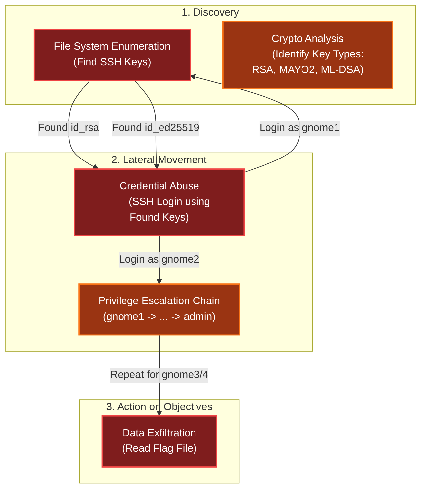

# Quantgnome Leap
Difficulty: <span style="color:red">❄ ❄</span> ❄ ❄ ❄  
Charlie in the hotel has quantum gnome mysteries waiting to be solved. What is the flag that you find?

## Hints
### Quantgnome Leap
If you want to create SSH keys, you would use the ssh-keygen tool. We have a special tool that generates post-quantum cryptographic keys. The suffix is the same as ssh-keygen. It is only the first three letters that change.
### Quantgnome Leap
Process information is very useful to determine where an application configuration file is located. I bet there is a secret located in that application directory, you just need the right user to read it!
### Quantgnome Leap
User keys are like presents. The keys are kept in a hidden location until they need to be used. Hidden files in Linux always start with a dot. Since everything in Linux is a file, directories that start with a dot are also...hidden!
### Quantgnome Leap
When you give a present, you often put a label on it to let someone know that the present is for them. Sometimes you even say who the present is from. The label is always put on the outside of the present so the public knows the present is for a specific person. SSH keys have something similar called a comment. SSH keys sometimes have a comment that can help determine who and where the key can be used.

## motd

```bash
                   +---------------------------------+
                   |  "If we knew the unknown, the   |
                   |  unknown wouldn't be unknown."  |
                   |   — Quantum Leap (TV series)    |
                   +---------------------------------+
                                     
                      You observed me, the Gnome...
                       ...and I observed you back.
                    Did you see me? Am I here or not?
                              Both? Neither?
                   Am I a figment of your imagination?
            Nay, I am the QuantGnome. Welcome to my challenge!
                                   ***
  Like me, the world of cryptography is full of mysteries and surprises.
   In this challenge, you will learn about the latest advancements in 
post-quantum cryptography (PQC), and how they can help secure our digital 
          future against the threats posed by quantum computers.
                                     
              I am a reminder that the future is uncertain, 
                 but with the right tools and knowledge,
            we can navigate the unknowns and emerge stronger.
                                   
                        Take the PQC leap with me!
                                     
      I have created a *PQC* key generation program on this system. 
                           Find and execute it.
```

## Solution
Following the hint about `ssh-keygen`, I searched the filesystem for similar tools and discovered the `pqc-keygen`:
```bash
qgnome@quantgnome_leap:~$ find /* 2>&1 | grep -i keygen
/opt/oqs-ssh/share/man/man1/ssh-keygen.1
/opt/oqs-ssh/bin/ssh-keygen
/usr/local/bin/pqc-keygen
/var/log/keygen.log
```

I ran the tool to generate the keys and to list the available algorithms, which displayed a mix of Classical, PQC, and Hybrid encryption methods:
```bash
qgnome@quantgnome_leap:~$ pqc-keygen 

— Summary -> Total algorithms = 28 | ✔ Keys generated = 28

Next, use -t to display key characteristics.

qgnome@quantgnome_leap:~$ pqc-keygen -t
Algorithm                             Bits  NIST    Kind   
------------------------------------  ----  ----  ---------
sphincssha2128fsimple                   32   1          PQC
sphincssha2256fsimple                   64   5          PQC
ed25519                                256   0    Classical
ecdsa-nistp256-sphincssha2128fsimple   288   1       Hybrid
ecdsa-nistp521-sphincssha2256fsimple   585   5       Hybrid
falcon512                              897   1          PQC
ecdsa-nistp256-falcon512              1153   1       Hybrid
mldsa-44                              1312   0          PQC
ecdsa-nistp256-mldsa-44               1568   1       Hybrid
falcon1024                            1793   5          PQC
mldsa-65                              1952   0          PQC
rsa-2048                              2048   0    Classical
ecdsa-nistp521-falcon1024             2314   5       Hybrid
ecdsa-nistp384-mldsa-65               2336   3       Hybrid
mldsa-87                              2592   0          PQC
mayo3                                 2986   3          PQC
rsa-3072                              3072   1    Classical
rsa3072-sphincssha2128fsimple         3104   1       Hybrid
ecdsa-nistp521-mldsa-87               3113   5       Hybrid
ecdsa-nistp384-mayo3                  3370   3       Hybrid
rsa3072-falcon512                     3969   1       Hybrid
rsa-4096                              4096   1    Classical
rsa3072-mldsa-44                      4384   0       Hybrid
mayo2                                 4912   1          PQC
ecdsa-nistp256-mayo2                  5168   1       Hybrid
mayo5                                 5554   5          PQC
ecdsa-nistp521-mayo5                  6075   5       Hybrid
rsa3072-mayo2                         7984   1       Hybrid
------------------------------------  ----  ----  ---------

You can use 'ssh-keygen -l -f <private key>' to see the bit size of a key.
Next step, SSH into pqc-server.com.

qgnome@quantgnome_leap:~$ for i in $(ls -1); do ssh-keygen -l -f $i; done
256 SHA256:jSd9Oh01nfXqc8Qc21YEA3dHf7k1xkgbmnWXDljnLJA  (ED25519)
2048 SHA256:4WWhFAxNP8QiW6fIfalp3POEKRSChUEKnYVDw4b6jEI  (RSA)
3072 SHA256:m1H5gxhoYmOgrt3TXd4lWUVgBcw9oeEkoJilxcoL0NM  (RSA)
4096 SHA256:IBJ3fXWja7+27Qe964IPF9KL0sAOyqQ9ZRwm9t8LN54  (RSA)
1153 SHA256:E4fAnisXN4csmKWgfZDTZgSe4Km0s34iWPyWvYzBa7o  (ECDSA_NISTP256_FALCON512)
5168 SHA256:WQYb8qvmhcfUtXdsleIwxetbfemq3WpWAX51QFrTRDw  (ECDSA_NISTP256_MAYO2)
1568 SHA256:Hyq4E8yn4OHW53CtklIu4vO42sOFu7UDIRzwjbIXnoU  (ECDSA_NISTP256_MLDSA-44)
288 SHA256:wyOR+UiCkUhFVJQYTLnEpuTEYhoS5OoSpL2pnE7TX2g  (ECDSA_NISTP256_SPHINCSSHA2128FSIMPLE)
3370 SHA256:tUx783Up7H5iQ9qSgcUGHBOI1TI7VF/ixfNQOrtHlDk  (ECDSA_NISTP384_MAYO3)
2336 SHA256:CcxQefcFIU0weFlcSHvzo8oi1qXvaRMv6wj/eI4kcEg  (ECDSA_NISTP384_MLDSA-65)
2314 SHA256:RMYzR+vLEyktvicll0HmWYZ/GTKWGy72iY8TdcZYiag  (ECDSA_NISTP521_FALCON1024)
6075 SHA256:VSSbch3yp1Bj84gQ5g5A3aYOZzK0hoZ63EE0dwO4wkY  (ECDSA_NISTP521_MAYO5)
3113 SHA256:PFxrZ/lp3gs0Z/pVNBROGRvUBndOCEBibTc4bHZmG0s  (ECDSA_NISTP521_MLDSA-87)
585 SHA256:vi7od+KH36dDwwLs8Sw88PjoRLje+a30yf9n2lWw9is  (ECDSA_NISTP521_SPHINCSSHA2256FSIMPLE)
1793 SHA256:ssWsj9tYNUSMbiD717QLF9ia2cNmZqI9XSXbIlyxuNA  (FALCON1024)
897 SHA256:KPpdiqx9QflJJwM6Ugx06QE2vsNruckUdSMkml0ZGtY  (FALCON512)
4912 SHA256:ikD6vsBwzutDlu2s44jDQm+z2J+7p7mhjPee29Ga/gM  (MAYO2)
2986 SHA256:BqZ0+DqurC5e7sLYjqDznrlICENRgsmGXlac+GIJhxk  (MAYO3)
5554 SHA256:DmrK8og+8hyGY0VoMrXB7eAd1JXA4JA3zEte/bocIPc  (MAYO5)
1312 SHA256:IXqDFKhctSD3uQdmM22p4RdUusi1IejUTnoCwZMSDLo  (MLDSA-44)
1952 SHA256:quXtrrcAfIREealrEGu3M3KDG5ZYVnpCHuwa7BGLYBc  (MLDSA-65)
2592 SHA256:rAI0gHRDHCEzYDv9wW2B8KMZmrKMt2SqLQOfkRm2BV4  (MLDSA-87)
3969 SHA256:fwC2Zf7YFJRSqkA/F5U25qGfPN4ml1+1x53Ci0kEezU  (RSA3072_FALCON512)
7984 SHA256:cMdXvd0aWpDlPmSFVGcxgySRvU9yuiRGKum54YNjKxs  (RSA3072_MAYO2)
4384 SHA256:PRt4x30hQUQB6dyp0HygWjlM4RduYxjE2LWMRKJLixA  (RSA3072_MLDSA-44)
3104 SHA256:oFtoDeKBTzpsY7RZNfLdx4F4dt7H89Jx+nTqE6+Zcwk  (RSA3072_SPHINCSSHA2128FSIMPLE)
32 SHA256:XtYsyRQHdvR7ilpq17F55oRdHxsYs4wQN61Fb9mMN6k  (SPHINCSSHA2128FSIMPLE)
64 SHA256:fzvuGvnBC2Y6Ljn80qL72eRyyqWTUjGFWazEoyBshmk  (SPHINCSSHA2256FSIMPLE)
```

Moving on to the login on `pqc-server.com` I checked the `~/.ssh` directory and found a collection of RSA keys that allowed the first leap:
```bash
qgnome@quantgnome_leap:~$ cat .ssh/id_rsa.pub 
ssh-rsa AAAAB3NzaC1yc2EAAAADAQABAAABgQCya6rjv+pf55l/EvEIZW+yhBdrpBrS0rmyysVhdR5Zn2aatLVDhRnNQrH+si6SOaDAOPhOhy037auUveLhEFaQBDQIDqisQ8JoTT/TKhyO97h1IUkl3zmsuw4Kcu1r24L2UJCIVStiJR8vQU8U0Kg5eWuDRev9j+2VMGqF2hmYqssTNbxHNeNbEr1R6/wciSAa3hNwksqE3dYjbr07veKAIcWcsaPMRHmjHrHXdLLwyweXhgzidd3AgzDskub9XdAiXs2B93mFNbQWel+nE2smxUVUY+SLsGXDTXAJu5AqYXrDEJtSuCOCHKXyPX7WCbmAllQo1FB/9K59pI552+K062SvGDCeLEPpcELozU52/awX2yeldNOj7Bn/xXdKpSPHLUrhsj8y/9gVTnS/0q6VLzO8qIwzxdGh7P0OtQqMrSRkTLEHtdOjojTmT70WUpUaVWXf65X8ymY72G49lJjFVAyM6AFBQK/K52f0UTl4XnvkSHwxYNFyk7wGkE07pWU= gnome1

qgnome@quantgnome_leap:~$ ssh gnome1@pqc-server.com
##############################################################################################################################################

Welcome, gnome1 user! You made the first leap!

You authenticated with an RSA key, but that isn't very secure in a post-quantum world. RSA depends on large prime numbers, which a quantum 
computer can easily solve with something like Shor's algorithm.

Take a look around and see if you can find a way to login to the gnome2 account.

##############################################################################################################################################
```

As `gnome1`, I found an ED25519 key key pointing to `gnome2`:
```bash
gnome1@pqc-server:~$ cat .ssh/id_ed25519.pub 
ssh-ed25519 AAAAC3NzaC1lZDI1NTE5AAAAIKUOOPy0e1+4EzuM5PYc1/lfsXrR9FFDxTxDztvCi0Ce gnome2
gnome1@pqc-server:~$ ssh gnome2@pqc-server.com
##############################################################################################################################################

Welcome, gnome2 user! You made the second leap!

You authenticated with an ED25519 key, smaller than an RSA key, but still not secure in a post-quantum world due to Shor's 
algorithm.

Take a look around and see if you can find a way to login to the gnome3 account.

##############################################################################################################################################
```

As `gnome2`, I found a key using the MAYO2 algorithm, pointing to `gnome3`:
```bash
gnome2@pqc-server:~$ cat .ssh/id_mayo2.pub 
ssh-mayo2 AAAACXNzaC1tYXlvMgAAEzCnvbGit3qCT/thcAuQO1oD/cTqLsG9gC2XVHMB76bqVfQhR8uR/TdjjiMnB0W4NWgDDar6TC14CyJvfPg17RiWcCXiR3g6lF10+rUpJiz0szKd008tbphVRpN4DNVLJaVNZcJvFCaZ+NtDUa4DkZGxF9k5SgqM3DmPJlj70bQL7NS6FZG5I6hcH07IRgChldcAqvYk4/QcO6mTj8BciTkNJti+jvxq1WaO4gwIJsBKxdqvPkUq7h8KzhBFvI2IcYqzx5UrbePAvTmRC81pLijIeXvQzIcuulQC+LdNKVOjXNvfNV76rA5M4MvP1wAVH4ZU93aEP7yUhgauqcMeKhM78fJZqukDaSNMylteat+M8vRJIePSYFeMQFKcdodOAhXv5LUP1R/Kl1UDseLKEHsC9vXWrzuiVo5dwU5TKfCzzx/AVD9HKzWvk13scn5qAAAOczLcG1MhmHPw0vtJQqxNfm0X2bJFqna4Gbgrg/lAW8GqqBo0aar2KX+qFLjg0DL64E+XvweqIzS4dkOmI+qUcQGqsxVptmLBy2311t07GH/B/01RvMUEpmluwvMVVIQAeU7Nl0SvCcmTNHjNeGj+bkY4hB22OEEP9cthxJLNi1bxCr/OsZeUXGAIBEjp4KczLSAxwUNifdy4LkKHCflRWqfJMVZz7tZhWc68gblznp2oW/no6Tiu+hAFB9RdlM8fnRZqKtf3HtqzILYZIi9LCxnlQCfzNxK2wevlx8+xqruN+PVLiERkJmgWcMoMCWNNGeP3qyEOXhmRg7yUOsLsAl6eQMcyEogvB2hf3StlpJxv1LMypjtMDsX8bST9DWifvY81KFF6+F90gtVKzCiMul/NcJaUWfowU40YnIOOFBUCYbR93qAhiIHQWjQQCty+6478N5ojOlVGYC5+ehCP5FuPI2A49cemSZrqUHmb2AH2/IdnVmxx4nZg4OPZTfWyH4vR7MKAVhJ4JOu+hliFG7yczASlLOFg90YELYQ7JmbiQSDf4fSZiWQP1XmnUrYhXBcOegQWr5LG3CCtipr3KV1dEBqgdXTbuiI0BYwWu20wJEfESwD9nhg578hO6kfy1BDwocTelDt7Jl9xdB9kuo60heglyc+71fZ5YV/TdaJc7uaODycD7QxLMVoH61qoIy3hVQfwd6TxfFjrc2ErusPBKqdcEjEvMbIf2vGiJtydl0hTAm4VTXiRT17v1vDzWx0OJmoYujyOWjrD57PDg/8ufUMtEp60JBRrwDrVffjkFzz9baq3159ensR2O3lYmEgpEYoS/2ZaYYXeUMWDR9BfGdCdnhf2O/4qjraICbYpCUHCOuqDPQFPgAR3G5VDiESwwxbG5/BiRJ7eiN2mzCx7E+g7McFPxCUJDJ8BR6GXxyIWUZgghGMwHwM2bl6x2sEqaxQvBMoMaOysAa/47wYWncjsT37y4/BoroXNTB9wzZq6BKOjdC0dvVkS324x23kXZb9K75IfWQMMyDOE/b1GRV7B9EkjukObsFdRhjgTwaBKEU48YZUI1MeJPmDsgsDCWwMuZnkl+kSEkZLJv9I9Q1Q1ggwKL/8rMsbGI4kTBqp5/dpxPKfu6XML3Jz0CqSMSC5+tgx594lzUxcW6y+ez/5pjH1LJGzOnEZ9T/5Efi1Fba89jruSn7hVLA3kVy0vRbQ9LiHpwM+7GyRPWspszI25CAII36tL8KWiXfKM5zd1m/iN5+htx98MSegoKUBxd0Vea3ATUKGuK6fezgEftKlB4TxLrwryS8W4xlbF/U5n7ferxM5MK4Q2H/tlUNlnBP+EacOcHQ2G6jZxYQHSS/yZypAvO7Hw4Lju1EYo63yv2wCZgWvXAOdJHGqWalo7x1sbdWiJGczqTjxfUawpZLghoFv/OpLf3hJlAq7o3EDxu27Lkw4yIYEiZB0XmHVzMLxlyXIwQc0HEvoqnvfwISiOIEtQBmiI8F4Q48YN8wakXUizzkU3TE60qVLFj2XHGzyjHN5NvctQd82dznc4rsWdNINt9v1XBgeeh+2KC6FA79SEo66eHsTjQOQnTGgYSzbimjZNiPslKtp9wnD1KyEWX5BBF9s/XBvc+l2WYwUKIrJna3z+/On4hjIf2QeJXX1+cq69+iYnXjgeQB3WYq/mbHAdYp/9m+fAAPD8UgMqzuvOJFJRbt3vcGfEJ6Twgzwrf1KJYsUQWKc2o0Gd61weIrvYpSTT0MG3iQz3/jZ2t/WUm4Bk8ctwWCRXkIcQmjNYQMedku1cETVimEjjBhDDDLuxR/5v+O0duwjgc3MExWlQuJnqrW3FpQv2/l5eeYQX8E0EkUcvDjGCuczpMGSRoGNTwemKdtXnTvwlwewokGAeL2VMXoQuf005fOaZeiT6UWw8OLGJm1xrb4zw4TWUNWhbOZILLBVODxC7PbrLs8eOHMh85QbdaH1anzr0Md9zb3XnBdpuBohaU2A+cEc++NGRHK6eWABpZ3DkrdpYtU7OYEfLoZQYgCIVcoM4fQ9lXijnd7rbqYcFETGkpoaNNOdV6ytsLqLumKKKnuLy36X/gNINa7GouImGVqsafGhYKJTcWCCXoEiAJRaK5fDpCawepcdgW6osU6kaZ8XRylesu9Zx/IOdFp8GuDsFVu4WR4eIcqUn1vZ6vkRlG+U2QkxYBALVyJD4OMcXqxzIln73IEQzxxx6p1z2xjLvMgaOZhVxFRRGywBnpuHCZpNBkm5uiJxO/BV8S20EmxX/nTw9soSRzZ0G0w/TZ9tjBbNA5/BWGHwGyHycAxzuCrpKuSw/CxE169KtC0/UBxzPniIFAR0zJLN4RJ/XDANIxJKCUAwMlbnwe3hZWTf/Ac/iS/9DeWEtNqPfeTJp61mLDp2p/ynWeO7CUp+pYh/0vCfppMTc29W3Ar6olK47X38rIHupYlqUH6+DsVgm6PgkERpmi3+Bglauxhny0UA0aDu0VEPP6Zen2pAu0azQH8O5HnjOzawBIQMkIHbVNjNnORD+uN/zMfIq38wA4LasyWdjNwDaa9RMI/34xNh0REJYpxp7DZ67qexxPpRApl2FylzaOhvLNqVtbmFMZb+hPQWh85ctnbGVZrouJrL93V0TWgYvivK3fWdywzqfwH8H+NuRuSXvkJYTFPKZcctoioxPVzzw+A8Vtq3/iP/PtkFU7xjq1Eg2UVKazzxcjyxigXBS+fF4Tr9qL8OqHX5McXp53IguU+jbWIUNkNLCjxhjgJ0lFv9mkLaHyeXpOBvAzt+HxIz+AMfuM95Eo9pbwKKUGqQepWL1FRyBsYetHIC2BzJj/5N7aM0sgQsuWCUWZsa/NQkBV//9zm1/YRZykormg6C0g0Eur1ojpk/HcHE+1rxNP7P7vTQgA6PecUHB473Y0+5zDmwaJ9+JjjKwsr5TkMTpJzxOS43cWrddLfEKHEg87pHzIQ9PzQErz4eW7UQUEZfu4AjEAHBrjOxgKXAz0FMLZtFUVYxUKOjbEIkOYjHNSi2tYiLU1KECWlwNVGKT0A+a4kk+oorM4lnOgiPV9dTpvdYGHRn2OXYzAvmSRAThTNdMN0+1MwI53dfW8p8n0S5xtY6VT5FuGRJqN+pZx0kBIVrQz9aHITx+YLQfyOW7PnC8q4SO7ScXhn6B7sKDBHf1OPDzKk2Y0qQwxpPNBQx4PonCLvK83y1CVRPtzlIbwOTTkOJzuIo9J2LD7j43PSv0l2l+6UltVcs1g8z21LVYhq/q8tHh6lVe3q/ooBROibICQFO0J0sozsJKbkpVJ+pGZlAoeZ09fwfdaydHrFdK54vt4KnO4TD5WEvInbBSr1ZeOTrhffCvBZaD45AH8zFBm8qBxKBRSmKcLzbDiWpHPDOg+Z528nY95utyJwfSk7k26K1jDd8UB/yFfr71wTZBmINnWsFFCnaPVn2rWNdREQvDvnh+3VTr69BcQB3lMlvqB6MSQ/UoVlDkk5QrIhLzGC7wJ/aribTA6d14wQlLfisHhnueVGJTzL6J46cRzZdTBdAHmvjXJ0y6TRWGBjCm7WPXhxXmLdfqDuOYPsc0EOO7HioopF1l2rMcrQz+qqDGj5gSG3u2RP4QKB3tlWGiGTLHpu9tzOeYpnNwufaZq+eFDUccDPt9aQBb4PYkl6eaLUVg1DUCWoiGD98RrPpAXuHxsW3uRiNPabLYPKevXhfK3JMx3vTiwjK+zLHxQaeqPXLgQCoJI7beNtwiMdx2FBSD9fzmd77jEoBSoSeNr3gPZalvU8uZkmxqg/zSVEGe2jZmcjK8/H1TO1eKxHOka/rXVP+zL94hmT4iDmRUCEzgUENGDKpfVk15MGuh3EJ2jCSaYgxkxxSdUugQpj4es+CgrKDHY7df5tuf0apIoaVZUbn5dYj4ZOVUKRN4SC31gWYoJF9yRDghJGHY8nNa6b1atOMAYNn+W4uCG2IHpB/o/AwBmFSIXmtsfnDNW8lXaZXLO0MmsxlVgrjO8F3i6RQDyLL+J6cC0OT/2+bp6WwyGEsZaRn5JuxmT/rWSpTKkPhKfBLC0Ta3FhEp42rbIMXjiebuOvEkVH5noWmnB6DKxytYvNwCfCypjEHJAqUsppRCEo+tKVywzOqrjuBXTk6vlo0m7chKF9hYpsrsnrHFQB/EpHugk6fmpBFl79YW4kJHGge2HX1bJ/l2+m7m3Fr+yAg90pCn0ek66/RYKj/5lDh1pyJ7H+Dgowj/ggqK5lbVDPGMLhZpK65sBIaZFHcb5CTuOybnUbgMxf+gfdxl6Ui0iuREi4vjCkg74usKGB5T31UaMaU9paQKyb7XvWF2zggtP4/MP/jlWn5fzvyp+v4+yDm012ZVFs3fSm5ZP3BFcbDWRcdsKYAvNzt9YgwEr/gLvbVEFAKwtQ1dDebIiBXgAC6tMEhDwIfDhusE8fqgQcsVhrcb/Qja7+eudUlbLtZBxPR746D9FvufqV8LXPMTB4pmO21IjgkmYeIXj2oBrYR8iiNDrk/44P709gug+C4JkqzYQUSM5uftKAviZK8Hr2dLmcguPOROlEP+u7P0Swjly++Yksy6PTvznBvMF8IBpOxCADIu1+ekJlJnoeeRT42It9JmPdIq48ppHfMAt/Al/O4aMWbCFLIP96d9DaimGQ6XnACgn/LAdmfwqzZiV34j1a823e+Ko2PuMw3sYXCjDP6UQcGyiN9AQzEc9Cbv4HCpkHusy4KSg0iJJbHqBDrwbfPyGCxJ8CmuGY8yqdGnoPs9xIpDlIUB1aIWCunWLqbRd3nqfYYWFh2ylyXBeZTLj5+nw7lnC99LvxpxmY+u1gybxl06Dci11kcf420QLB39DCNTtPtr7l7AsWadxx98Jh2Tao32LmwW82T5cAoAQ0r3XcJ4H4AKLm5Y685br90uo3X/ikICcxojUutRker2Q17zlY7ssuZCggF7cFN+r19irSYl4OyKoyJBepaYOLR/SBl0ejYLXKNodV4Y7/qSuy4R4Ps+oQlX4wPvlE0n/MUlhVm5nit8BX76cSoiHhiW+qmKyfn85ynY8LbyoXRydK5fYn0v+i7M4kGhIeB+aq4u5tf0FqgCaXtS5nXizyT8MRZrKyv5Ks9WYV44nl/qXirpPXabD5EDmIyd0S6h+IEEKqdApeD7kalaV8+yUiiN6zdcrfbsMnGRxbxIUbpEllM2HefRb4JQyy/xJ/eXPzAmFEGSi4uov3qtS+6PtaWry7USCiSRorWH0gcmoxqNDVJFqU0e9LLGnUi0h1Z2v7GW6wCipbfCM1wiVuBqVH9CcdctoiOeBCk7cpSrt/83UcKB2xiB39Rj22TJCYuUny8BMP988KL2EH+FFqlofNbe/19ML1BenE24lXOjQIYkFR2GIueu1CTITCdMaTPfScBB3fWLhLAJAtPdAktXMPUOB784P0hBkX619LlMvBITeqvlAcKR1XUB+n7QwkcRUjte419ksfeQvKKA3o9YpstJ+zkHXXUWmBbRuQBVbKxfnJMCgzWTqX62jSefTaztQvoNknryYQe3YLtpa9i/eaq1agrHGaUDIixH3NXnWbPGv9dy803TPInwvq1hbeABzYK+GoVw/DcTlShhMD0vPuMWzhBPPXE2T8ZDTrLjWyW/lR/hA1dqNitseGCcCmf7O3OcCLZb8yZhweJo2jNFxjt/8jIFm/Ma4BDGyVkKfquzVOG7F5clBv9dvKTQmueIUK8OrEs7CHye6+m/ALS02e+GtIvrV+EgshV5ub+NGyeU6zVzgrB94dqlPpV00Z4FBcRR+QBQeXEZlMvqrQN5EI3XpgnjhYbmNkXmeeBVu6+gcpRFkdHwDTUh0Bn7IJ6nd5nFi2A3g9dX1Vn9TKqHPDybnklJsPsQrdhV6cgLHrTdL14odrmbc3OX2w20+lGcTZvlFXTGVLz06W1xrf5Z1H/ApSMd2Wi6t3HW2VRQ/WSB5vzOUwIBq/TUV8rTxO3Kup6YEupBfXu5hGz8ZiVWwawNTSdlpHIm/ZqkcnuQkEkACuj68PdlUzutPV3Bj6qIJ82b1t2DTv3yrlThyATDVWTnaolZIq6m90UjEl9z gnome3
gnome2@pqc-server:~$ ssh gnome3@pqc-server.com
##############################################################################################################################################

Welcome, gnome3 user! You made the third leap!

You authenticated with a MAYO post-quantum key. 
A post-quantum cryptographic algorithm with promising results for embedded systems. HOWEVER, use MAYO with caution! Wait for a 
standardized implementation (if/when that happens).

Take a look around and see if you can find a way to login to the gnome4 account.

##############################################################################################################################################
```

As `gnome3`, I found a hybrid key pointing to `gnome4`:
```bash
gnome3@pqc-server:~$ cat .ssh/id_ecdsa_nistp256_sphincssha2128fsimple.pub 
ssh-ecdsa-nistp256-sphincssha2128fsimple AAAAKHNzaC1lY2RzYS1uaXN0cDI1Ni1zcGhpbmNzc2hhMjEyOGZzaW1wbGUAAAAIbmlzdHAyNTYAAABBBL6fN38B6kQNiS0vAvGeGjAJ7Da2YbpBaAXkeeDJ3CJIUZc8PzNWCfzW5qN8z0RnS1/Hia1jRt6dydqeiVHBa9cAAAAgRAPMBt8y/4/YdBEw9OutMv37HJy50gIQfmzUY5d82Bg= gnome4
gnome3@pqc-server:~$ ssh gnome4@pqc-server.com
##############################################################################################################################################

Welcome, gnome4 user! You made the fourth leap!

You authenticated with a post-quantum hybrid key! What does that mean? A blended approach with proven classical cryptography and post-quantum 
cryptography.

In this case, you authenticated with a NIST P-256 ECDSA key (a classical elliptic curve) that also uses post-quantum SPHINCS+ (standardized 
by NIST in FIPS 205 as SLH-DSA). That makes this key extremely robust. According to NIST, this is a security level 1 key, which means this 
key is at least as strong as AES128.

Instead of a single exchange/signature (as with RSA or ED25519), this key produces two (one classical and one post-quantum) that are both 
checked together. If one fails, authentication fails. A hybrid approach is a great first step when testing and implementing post-quantum 
cryptography, giving organizations 'Quantum Agility'.

Take a look around and see if you can find a way to login to the admin account.

##############################################################################################################################################
```

Finally, as `gnome4`, I found a hybrid key using NIST P-521 and ML-DSA-87 (CRYSTALS-Dilithium) pointing to `admin`:
```bash
gnome4@pqc-server:~$ cat .ssh/id_ecdsa_nistp521_mldsa87.pub 
ssh-ecdsa-nistp521-mldsa-87 AAAAG3NzaC1lY2RzYS1uaXN0cDUyMS1tbGRzYS04NwAAAAhuaXN0cDUyMQAAAIUEAKqZp85lwZsw4xT+CLYfMEkI3k+86rrskh+FGhAoeDzt9xbaDqYVVtDmBKUC/XEr1VwGjtYNKFTPNJveaLxDwnSMABINEgXzj3tGnB0McU0TE3jdkdN4UHvSbqqV4W3hS9F8voP7hsIQEws+DtXnuoezqB16NAfqs5qGV7zbrCcg1LKkAAAKIF8IGjU2eHZAuyvVDusPthHwmbLeHIYledG671S38+NjelMi9BvcfPkagdRMP/OJ8QlH1pYcXtQBTGzlI9RIxFfNo48OZVw/MWvO6WqBADui3tYCTTi6RGCm2aqdw6Js18Syrj7txp6cq6rcyIQDrVl1k2GzoEVmn58FO8NdEAqjJuUFK4Jzk9obXgCGXEBp9RYI6Hf+1spQ9+mufuykisYoBqZCHTwDW+QBauCiyXqhuwJd7n4it99TTzE/5aWohrHjNAI2Q/x6JYYl0KH+nSTH8lmxBXDjD2hrAOxsIDUc2nv05H5E51uzIp/ZN/ldUB6nGh/8Brlhm1dlv4RHCiRgxkLApm4wQdhe3juYVmavC1IHHMj4W7jz9aTJ5+hdKQGbOBfogiAQKAfgS3Jv229yJ4PNpIxiU7HtkrGwlDSaIFjXbJg+dCPkwLH3Weh2ZOf6DEgY0+9lQnWsrKnbmVJowLY2MRtZgcochXZj0B/6Ee+/iCdvlmcC4Y5wXqBXa7k5OVhfbyWs1iago49KbEXGUAZ2T+eaaxyLA7YYNgz6sfbIipnGjGsz8kO0mGxvQpUEtrRuxMNyyFQ+l/+JSCQ14MYsfCme1Q7M5PDWY5UOmeDdSYAO+SOmWvKlO5Zry0poujWV3cXN5eg4emIZ9EZ4Shcr+SgRtDxtXcds9+aA+qvtaruqJ6YC2xtloVevjutyAMiUOFu/gjjy876MVagXwVbOxULaTc0U16SK53yk7qQz7x1FFDfCmYMAtF7+XjIkIr3gc+BW6VMKdcH9vM6r3xlnd0Qy73DSn2plowdvxZEBeQVE/J396aaYoh8XCc4BgrXcjCoHEiYfK/v//dg6mbp7PvbCQ7tHSpQUqjgnrCVwYt9WUgh8JT/f+gkro2i5Sln60E9q+qydFssT4J7WQjlkkapR+DPzjXWzQJdOLLgtnWvy6M3jVvGnZWbutcQdXGPVFDCnHlmuHdHiP14gMdEXENXgfxZHvzkQW6eVa+nD0lnFgm95ADApCaRHCb5+VdCjoUzfqJyxDFL6EGJKzwzjMVlL7GEgUgALulbWGjqqZQ5YoJml6w1jXHPvlwMOM0K9f8UBaqDxjBYsH6Nies2cMV066SjCQxRSmLLMoxBj1oZnHbN/hps048Di4K08BdtIm6FXJElB7rNsHNcoQa6Qj5L772oXovp4MAANxMI0HrElO/SGd9/P9Zg+29/UvQvgvNI/TDT9zVocx44dYkKaqeKqP5KpBxD6fqYwf47dGZuLoe8VCjr75ymS54rIal58vXSGnAbeIqeB+/hJEuW/yoBajrP476+BCABBMdoh2DPnJ+jUydKTcpF4g3ddcGXS6WyiajOcsXctoRU/Wj1dqZ3dOH/8No92Bb2a7PEXuBC/WTgt4X0lsr8SmAVv/D6Q8fRnAFhVtQEZKSUxGlrts5kMcZA0zazj3GajGGjdF1bLX+djMHv9y7ZDhIbpEGPHItw44JnhgLl+J7gw8HJkq2oOd1R4WfHCmvodFi6TI+vhApKsDppXf4U40DZTYPjjauA0YTmtPQQUa/rLnZfwj9t037VBRh9z/Q4qcTtoVii56j3zOTI5pd1csu9PRmnz5Suh8P0neGPED7xPjg9mYSwTqFnwe+h+kM/RlhDzpuGhVWYIjUzk/uOYDJ/zlH4TeT5KMpO3wGuW12TbDWVTiuTMo/nOasPB1Q6JPEEtk0W7VrW8Rk8gX10hnHfiwLR/KXDaBvdZ7vmHDhqUP7O4OtVJ40nLpg7Od60xzkYCMeWEz4P2yhn2wkyYlWxdPjp3/oKnK1PZxo0tyZr03s7XQOLtqy8CoXy736xs4oLUgN0k3lDR3wz9tCHwxpY5NXsgQ19Mx+EFeKGH3aRwiOCudEb1zkG3vJGYBaPcvxqkU4SivIqgXdmxEPfW4Mvrjp2CAdxpmo+HaYEkcwal/6F1WNql+Veyui0t7FX2z6uZNBTETrqhj4Ghh4b/Mq+My03sGnqQi6jqa3ZgMStoDHUBPEFIlbsv6H0ZwwIrWVsp3uAXGH0pnlCKR36I6iSshZC/uiAu24QB2ThAMcqOiU+AnJ+AaQPceTfaP5vc/e7CRhjsXJGG3dMlFYjChQ2q5Pd1wlfN+olZWEMxpWqbtikTJ0o3MR3zTpKU3PG/U3kCdtSZGBAAYJhCg2z7lC4/j0Odapb0MecGSO07/18PQdf1d9CVzCmB5uuA50VlfB78xxsJ6jHku6v5YnZRqpuai1qvGHsHL379Ho39sGm0jprROidPAV81gSTomXtv8xuHyCSYSBs5zsH7fsEa5YoJTcs5M2hSZO0B24kwAtql6OMRGKKZSlZEY2M0lJS3DFRBOERRNiveK+LeF7uorhCDTod46GUKJ8ui1A2rV25DQ2tTmMDmEd5wlvzkIIlXYxDv9HKhFJ5WxmRlCuma6zWsPSCBmM1s66zn6n/8bpUvbczkc7giZ/GTvevMNry0Q9TSnqa+75xOtteL9cHs7hLof4NLvmiRFYCDKAIm6OX3WyNgsnLETkkChFWbE3nL0m6eBdrjFbGhSmkIqoxsZ/jpt2+FAnMYrcuGThb1rNQn4PZy+d4Sd5sXrDRJeITCAvHV8+A2FvZgJHsrx8LVKM/140BEw6mBnhLHRIJsawjGFFyl78+5tchFEfra3IN0oBTrweQnuZFsYiZl67KMvgZYaXLq2VfqGdQAwOc4p1AkPv8RTisjwFNX3KenZoSlZnwIE/hF2suDMt9cylGT/eO0VXcTbAYAVuMnANgYjhJfrY3imICLue4AOHsXHr2g621NaZR2Ak6YnlfMfPkJxjz/bnd6ZBi2wViPQzVqhbn+UOhFPlzXJMEf5p7kC0anuWB5dlE7KhtOJeW69PLZQVVMUuOX/1jUMRJI+6ZT3uwqk4ItK9iy5WtQFP95oR7hFqWI0vdVECN+4JneOcPv2vu+mJpfgQmlHGaVGok80apOJ5fbbh2yKKcdvpBNPd3lB+azdYG/ui8GwG+fOIUfzMPZ0FAWuKzO+KL3FdnzXaYn67dqpa6NMtdqX4NmGQHW28aoGqfe/sum0Q4FTQxXAJ5RAvJ34fttg5kswsFi+XZFRwpOmjl60hLS8Foy60asQG8ZQOFNSlikoD8YuKJvzd5xafUqnoaBLd6SwgoLQFLxETShyAM6ijCVM16ofodA8xbc0kXVSZtbJ49h55/KBgIrHyGgN6eqGufJ0mcF+PnbemKhvK0GRpi4tPuRSgxU3b8YgyCspu00K4YjrcDZcoYY3z1F4VWe0izFEeiMwtN25DQtVk2XzKZvtJJCS5A3v9qEssWj3pvsC9PEq4epLe48ztIDjgujzFHtjTRZVFiHfXWuvhQOPPDMEK8AqpkB4B4oO01UKe31aAxA9trs6xYRty22671Cpk3PoKkowGAjy+vehn5af0fr2MGA52MSytWBQpgXmoxxG7dxqr9zVg== admin
gnome4@pqc-server:~$ ssh admin@pqc-server.com
##############################################################################################################################################

You made the QuantGnome Leap! Your final stop.

You authenticated with another hybrid post-quantum key. What is different about this key? It uses the NIST P-521 elliptic curve (roughly 
equivalent to a 15360-bit RSA key) paired with ML-DSA-87. According to NIST, ML-DSA-87 is a security level 5 algorithm, which provides the 
highest security level and is meant for the most secure environments. NIST standardized CRYSTALS-Dilithium as ML-DSA in FIPS 204 with three 
defined security levels:

- ML-DSA-44: Security Level 2 - At least as strong as SHA256/SHA3-256
- ML-DSA-65: Security Level 3 - At least as strong as AES192
- ML-DSA-87: Security Level 5 - At least as strong as AES256

This is one of the strongest hybrid keys available in post-quantum cryptography. The other extremely strong security level 5 
algorithms all use a combination of the NIST P-521 elliptic curve and one of the following PQC algorithms:

- falcon1024: Falcon (FN-DSA) with a 1024 lattice dimensional size
- sphincssha2256fsimple: SLH-DSA (SPHINCS+) using SHA2 256 and fast signature generation (hence the 'f' in the algorithm name)
- mayo5: MAYO-5 is the highest of the four MAYO security levels

This entire build/system is based off of the Linux Foundation's Open Quantum Safe (OQS) initiative. It uses the OQS liboqs library which 
provides PQC algorithm support.
You can find out more about the OQS initiative at https://openquantumsafe.org/.

Next Step: You now have access to a directory in the same location as the SSH daemon. Time to look around for your final flag.
##############################################################################################################################################
```

I searched the file system for the flag:
```bash
admin@quantgnome_leap:~$ find /* 2>&1 | grep -i flag
/opt/oqs-ssh/flag
/opt/oqs-ssh/flag/flag
/proc/sys/kernel/acpi_video_flags
/proc/sys/kernel/sched_domain/cpu0/domain0/flags
/proc/sys/kernel/sched_domain/cpu0/domain1/flags
/proc/sys/kernel/sched_domain/cpu1/domain0/flags
/proc/sys/kernel/sched_domain/cpu1/domain1/flags
/proc/sys/kernel/sched_domain/cpu2/domain0/flags
/proc/sys/kernel/sched_domain/cpu2/domain1/flags
/proc/sys/kernel/sched_domain/cpu3/domain0/flags
/proc/sys/kernel/sched_domain/cpu3/domain1/flags
/proc/sys/kernel/sched_domain/cpu4/domain0/flags
/proc/sys/kernel/sched_domain/cpu4/domain1/flags
/proc/sys/kernel/sched_domain/cpu5/domain0/flags
/proc/sys/kernel/sched_domain/cpu5/domain1/flags
/proc/sys/kernel/sched_domain/cpu6/domain0/flags
/proc/sys/kernel/sched_domain/cpu6/domain1/flags
/proc/sys/kernel/sched_domain/cpu7/domain0/flags
/proc/sys/kernel/sched_domain/cpu7/domain1/flags
/proc/kpageflags
/sys/devices/pnp0/00:05/tty/ttyS2/flags
/sys/devices/pnp0/00:03/tty/ttyS0/flags
/sys/devices/pnp0/00:06/tty/ttyS3/flags
/sys/devices/pnp0/00:04/tty/ttyS1/flags
/sys/devices/virtual/net/eth0/flags
/sys/devices/virtual/net/lo/flags
/sys/module/scsi_mod/parameters/default_dev_flags
/usr/lib/bash/fdflags

admin@quantgnome_leap:~$ cat /opt/oqs-ssh/flag/flag
HHC{L3aping_0v3r_Quantum_Crypt0}
```

Then I submitted the flag `HHC{L3aping_0v3r_Quantum_Crypt0}` to complete the challenge.

## Dissecting the attack



<table>
     <thead>
         <tr>
             <th style="text-align:center">Phase</th>
             <th style="text-align:center">Vulnerability (CWE)</th>
             <th style="text-align:center">Mitigation</th>
         </tr>
     </thead>
     <tbody>
         <tr>
             <td rowspan="1"><strong>1. Access</strong><br/></td>
             <td style="border: 1px solid #ddd; padding:10px;"> <strong>CWE-312</strong><br/>Cleartext Storage of Sensitive Information<br/><em>(Unencrypted Private Keys)</em> </td>
             <td style="background-color:#14532d; color:white; border-radius:5px; padding:10px; border: 2px dashed #22c55e;"> <strong>Data Protection</strong><br/><em>(Encryption At Rest / Passphrases)</em> </td>
         </tr>
         <tr>
             <td rowspan="1"><strong>2. Lateral</strong><br/></td>
             <td style="border: 1px solid #ddd; padding:10px;"> <strong>CWE-668</strong><br/>Exposure of Resource to Wrong Sphere<br/><em>(User A holding User B's Key)</em> </td>
             <td style="background-color:#14532d; color:white; border-radius:5px; padding:10px; border: 2px dashed #22c55e;"> <strong>Access Control</strong><br/><em>(Principle of Least Privilege)</em> </td>
         </tr>
         <tr>
             <td rowspan="1"><strong>3. Action</strong><br/></td>
             <td style="border: 1px solid #ddd; padding:10px;"> <strong>CWE-200</strong><br/>Exposure of Sensitive Information to an Unauthorized Actor<br/><em>(Flag File Readable)</em></td>
             <td style="background-color:#14532d; color:white; border-radius:5px; padding:10px; border: 2px dashed #22c55e;"> <strong>Access Control</strong><br/><em>(Strict File Permissions)</em> </td>
         </tr>
     </tbody>
 </table>

### Fixing the Credential Storage (CWE-312)
**Vulnerability:** The private keys (e.g., id_rsa, id_mayo2) were stored on the disk without a passphrase. This meant that merely having read access to the file was sufficient to impersonate the user, bypassing the need for knowledge (a password) or biometrics.  
**Fix:** Enforce the use of Passphrases for SSH keys. When a key is generated, it should be encrypted using a strong KDF (Key Derivation Function) like bcrypt or Argon2.  
**Vulnerable Generation:**
```bash
# FLAW: Empty passphrase allows immediate use
ssh-keygen -t ed25519 -N "" -f ~/.ssh/id_ed25519
```
**Secure Generation:**
```bash
# FIX: Require user interaction to decrypt the key
ssh-keygen -t ed25519 -o -a 100 -f ~/.ssh/id_ed25519
```
**Impact:** Even if an attacker steals the private key file, they cannot use it to authenticate without also cracking the passphrase.

### Fixing the Access Control (CWE-668)
**Vulnerability:** The challenge relied on a "daisy chain" configuration where `gnome1` had access to `gnome2`'s private key, `gnome2` had `gnome3`'s key, and so on. This violates the Principle of Least Privilege and Separation of Duties. A compromised lower-privilege account should not inherently possess the credentials for a lateral or upward move.  
**Fix:** Store keys only within the directory of the user who owns them, not the user who needs them. Use Public Key Infrastructure (PKI) correctly: `gnome1` should hold their own private key, and `gnome2` should simply authorize `gnome1`'s public key in their `authorized_keys` file (if access is legitimately required).  
**Secure Architecture:**
- Generate: `gnome1` generates a key pair.
- Authorize: `gnome2` appends `gnome1.pub` to `~/.ssh/authorized_keys`.
- Authenticate: `gnome1` uses their own key to log in to `gnome2`.  

**Impact:** This prevents the exposure of `gnome2`'s identity. If `gnome1` is compromised, the attacker can access `gnome2`, but they cannot become `gnome2` elsewhere (e.g., to access `gnome3`) because they never possess `gnome2`'s private key.

### Fixing the Information Exposure (CWE-200)
**Vulnerability:** The final objective, the flag file located at `/opt/oqs-ssh/flag/flag`, was readable by the `admin` user. While gaining `admin` access effectively compromises the system, sensitive data at rest should still be protected by strict file permissions or encryption to prevent unauthorized reads if the application layer is bypassed.  
**Fix:** Apply Defense in Depth. Ensure that critical files are readable only by the specific process or `root` user required to access them, and consider encrypting highly sensitive data at rest.  
**Secure Configuration:**
```bash
# FIX: Restrict read access solely to root
chown root:root /opt/oqs-ssh/flag/flag
chmod 600 /opt/oqs-ssh/flag/flag
```
**Impact:** Ensures that even if an administrative account is compromised, the attacker cannot simply `cat` the sensitive file without first escalating privileges to root.

## Funsies
### Inception
Have you ever experienced a TeamViewer inception? I did...and a production server crashed 😁
<blockquote class="reddit-embed-bq" style="height:500px" data-embed-theme="dark" data-embed-height="579"><a href="https://www.reddit.com/r/geek/comments/q2oib/teamviewer_makes_it_pretty_easy_to_create_an/">Teamviewer makes it pretty easy to create an infinite window loop:</a><br> by<a href="https://www.reddit.com/user/revile221/">u/revile221</a> in<a href="https://www.reddit.com/r/geek/">geek</a></blockquote><script async="" src="https://embed.reddit.com/widgets.js" charset="UTF-8"></script>