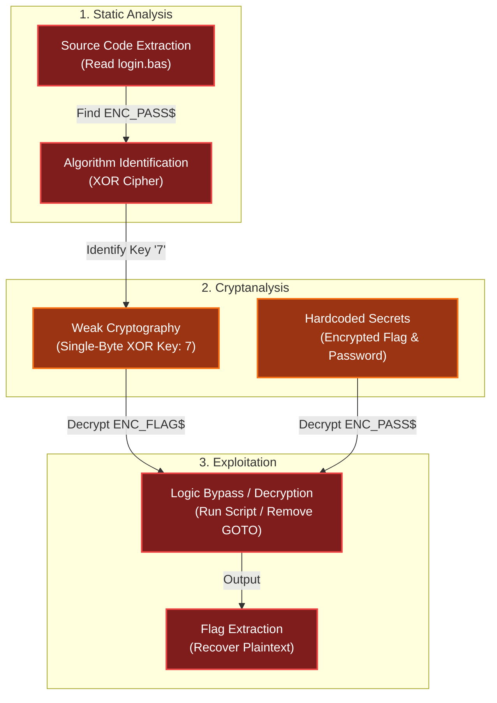

# Going in Reverse
Difficulty: <span style="color:red">❄ ❄</span> ❄ ❄ ❄  
Kevin in the Retro Store needs help rewinding tech and going in reverse. Extract the flag and enter it here.

## Hints
### Going in Reverse
It looks like the program on the disk contains some weird coding.
### Going in Reverse
Maybe it is encrypted OR encoded?
### Going in Reverse
Holy cow! Another retro floppy disk, what are the odds? Well it looks like this one is intact.

## Items
### Just a BASIC Program
  
You’ve stumbled upon an old Commodore 64 floppy disk containing a mysterious [BASIC program](/assets/static/posts/2025/2025-17-Going-in-Reverse/login.bas).
```vb
10 REM *** COMMODORE 64 SECURITY SYSTEM ***
20 ENC_PASS$ = "D13URKBT"
30 ENC_FLAG$ = "DSA|auhts*wkfi=dhjwubtthut+dhhkfis+hnkz" ' old "DSA|qnisf`bX_huXariz"
40 INPUT "ENTER PASSWORD: "; PASS$
50 IF LEN(PASS$) <> LEN(ENC_PASS$) THEN GOTO 90
60 FOR I = 1 TO LEN(PASS$)
70 IF CHR$(ASC(MID$(PASS$,I,1)) XOR 7) <> MID$(ENC_PASS$,I,1) THEN GOTO 90
80 NEXT I
85 FLAG$ = "" : FOR I = 1 TO LEN(ENC_FLAG$) : FLAG$ = FLAG$ + CHR$(ASC(MID$(ENC_FLAG$,I,1)) XOR 7) : NEXT I : PRINT FLAG$
90 PRINT "ACCESS DENIED"
100 END
```

## Solution
I literally just ran the script with [qbjs.org](https://qbjs.org/?code=UkVNICoqKiBDT01NT0RPUkUgNjQgU0VDVVJJVFkgU1lTVMYhCkVOQ19QQVNTJCA9ICJEMTNVUktCVCLFF0ZMQUfGF1NBfGF1aHRzKndrZmk9ZGhqd3VidHRodXQrZGhoa2Zpcytobmt6IiAnIG9sZMYwcW5pc2ZgYlhfaHVYYXJpeiIKSU5QVVQgIkVOVEVSIMRzV09SRDogIjvFDSQKSUYgTEVOKMUNKSA8PsUO6QCfKSBUSEVOIEdPVE8gOTAKRk9SIEkgPSAxIFRPyzfERUNIUiQoQVNDKE1JRCTGGCxJLDEpKSBYT1IgN8VbxRvJXMUfzmBORVhUIEkK6QEDIiA6INF06QElKcQexyvGCCvvAIfJK+4AizogxmkgOiBQUklOVMY+CsYMIkFDQ0VTUyBERU5JRUTkAZRE):


<iframe width="560" height="315" src="https://www.youtube.com/embed/Ei4CWnWWMdE?si=vxDNkmmyXopEM_1Z&hl=en" title="YouTube video player" frameborder="0" allow="accelerometer; autoplay; clipboard-write; encrypted-media; gyroscope; picture-in-picture; web-share" referrerpolicy="strict-origin-when-cross-origin" allowfullscreen></iframe>

And then I submitted the flag `CTF{frost-plan:compressors,coolant,oil}`.

### What happened
To make the code compatible with [qbjs.org](https://qbjs.org/) interpreter, I stripped out the line numbers. This inadvertently broke the `GOTO`s logic. Instead of jumping to the `ACCESS DENIED` section upon a failed password check, the interpreter executed the code sequentially. It fell right through to line `85`, decoding and printing the flag automatically.

### What the program actually does
The encryption used is a simple `XOR` cipher with the key `7`. The script compares the user input against an encrypted password string and, if successful, decrypts the flag using the same operation.

I wrote a script to demonstrate the intended decryption logic:
```vb
ENC_PASS$ = "D13URKBT"
ENC_FLAG$ = "DSA|auhts*wkfi=dhjwubtthut+dhhkfis+hnkz" 
ENC_OLD_FLAG$ = "DSA|qnisf`bX_huXariz"

PRINT "ENCODED PASS: "; ENC_PASS$
PRINT "DECODED PASS: "; DecodeString(ENC_PASS$, 7)
PRINT
PRINT "ENCODED FLAG: "; ENC_FLAG$
PRINT "DECODED FLAG: "; DecodeString(ENC_FLAG$, 7)
PRINT
PRINT "ENCODED OLD FLAG: "; ENC_OLD_FLAG$
PRINT "DECODED OLD FLAG: "; DecodeString(ENC_OLD_FLAG$, 7)

END

FUNCTION DecodeString (Encoded AS STRING, XorValue AS INTEGER)
    Result = ""    
    FOR i = 1 TO LEN(Encoded)
        CharCode = ASC(MID$(Encoded, i, 1))
        DecodedCharCode = CharCode XOR XorValue
        Result = Result + CHR$(DecodedCharCode)
    NEXT i
    DecodeString = Result
END FUNCTION
```


## Dissecting the attack

<table>
     <thead>
         <tr>
             <th style="text-align:center">Phase</th>
             <th style="text-align:center">Vulnerability (CWE)</th>
             <th style="text-align:center">Mitigation</th>
         </tr>
     </thead>
     <tbody>
         <tr>
             <td rowspan="1"><strong>1. Analysis</strong><br/></td>
             <td style="border: 1px solid #ddd; padding:10px;"> <strong>CWE-312</strong><br/>Cleartext Storage of Sensitive Information<br/><em>(Source Code Disclosure)</em> </td>
             <td style="background-color:#14532d; color:white; border-radius:5px; padding:10px; border: 2px dashed #22c55e;"> <strong>Obfuscation</strong><br/><em>(Compile/Pack Binary)</em> </td>
         </tr>
         <tr>
             <td rowspan="1"><strong>2. Credentials</strong><br/></td>
             <td style="border: 1px solid #ddd; padding:10px;"> <strong>CWE-798</strong><br/>Use of Hard-coded Credentials<br/><em>(Stored Password String)</em> </td>
             <td style="background-color:#14532d; color:white; border-radius:5px; padding:10px; border: 2px dashed #22c55e;"> <strong>Hashing</strong><br/><em>(One-Way Hash Functions)</em> </td>
         </tr>
         <tr>
             <td rowspan="1"><strong>3. Crypto</strong><br/></td>
             <td style="border: 1px solid #ddd; padding:10px;"> <strong>CWE-327</strong><br/>Use of a Broken or Risky Cryptographic Algorithm<br/><em>(Simple XOR)</em></td>
             <td style="background-color:#14532d; color:white; border-radius:5px; padding:10px; border: 2px dashed #22c55e;"> <strong>Strong Cryptography</strong><br/><em>(AES / NaCl)</em> </td>
         </tr>
     </tbody>
 </table>

### Fixing the Weak Cryptography (CWE-327)
**Vulnerability:** The application uses a simple XOR cipher with a single-digit key (7) to "encrypt" the password and the flag. XOR is symmetric and trivially reversible, providing no real security against reverse engineering.  
**Fix:** Use robust encryption algorithms. For a retro system like C64, options are limited, but in a modern context, you would use authenticated encryption (like AES-GCM) or simply not store the secret locally.  
**Vulnerable Code (BASIC):**
```vb
70 IF CHR$(ASC(MID$(PASS$,I,1)) XOR 7) <> MID$(ENC_PASS$,I,1) THEN GOTO 90
```
**Secure Concept (Modern Python):**
```python
from cryptography.hazmat.primitives.ciphers.aead import AESGCM
# FIX: Use strong encryption if reversibility is required
aesgcm = AESGCM(key)
decrypted_pass = aesgcm.decrypt(nonce, ciphertext, aad=None)
```
**Impact:** Prevents trivial decryption of the secrets by simply guessing the key or analyzing the algorithm.

### Fixing the Credential Storage (CWE-798 and CWE-312)
**Vulnerability:** The password is stored in a reversible format (`ENC_PASS$`). This allows anyone who decompiles the script to recover the original password.  
**Fix:** Use Cryptographic Hashing. Store only the hash of the password (e.g., SHA-256 or Argon2), which allows verification without revealing the original plaintext.  
**Vulnerable Code:**
```vb
20 ENC_PASS$ = "D13URKBT" ' XOR encrypted, but reversible
```
**Secure Concept:**
```python
import hashlib
# FIX: Store hash, compare input hash to stored hash
stored_hash = "e3b0c44298fc1c149afbf4c8996fb92427ae41e4649b934ca495991b7852b855"
if hashlib.sha256(user_input.encode()).hexdigest() == stored_hash:
    grant_access()
```
**Impact:** Even if the code is analyzed, the attacker cannot reverse the hash to find the original password, protecting the credential.

## Funsies
### Basic
Basic was my first programming language, and this book was the beginning of that:  


...And I still remember trying to run my first program, which was an attempt at coding an address book, all well written in Windows Notepad as a `txt` and not understanding why it wasn't just "running" before discovering I also needed QBasic to run it (spoiler alert: it didn't work at all 😁)
