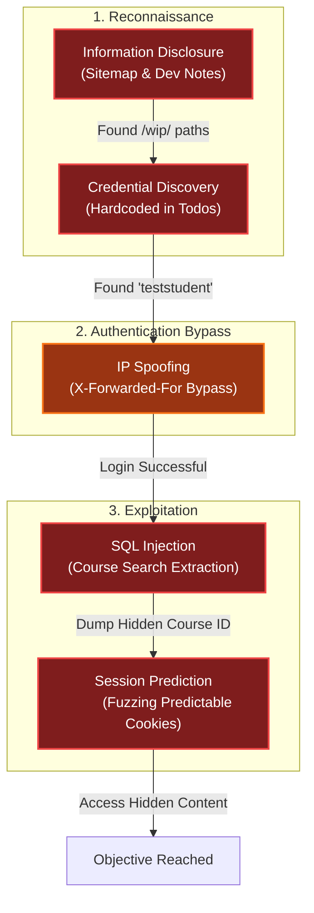

# Schrödinger's Scope
Difficulty: <span style="color:red">❄ ❄ ❄</span> ❄ ❄  
Kevin in the Retro Store ponders pentest paradoxes—can you solve Schrödinger's Scope?

## Hints
### Schrödinger's Scope
Pay close attention to the instructions and be very wary of advice from the tongues of gnomes! Perhaps not ignore everything, but be careful!
### Schrödinger's Scope
During any kind of penetration test, always be on the lookout for items which may be predictable from the available information, such as application endpoints. Things like a **sitemap** can be helpful, even if it is old or incomplete. Other predictable values to look for are things like token and cookie values
### Schrödinger's Scope
As you test this with a tool like [Burp Suite](https://portswigger.net/burp/communitydownload), resist temptations and stay true to the instructed path.
### Schrödinger's Scope
Watch out for tiny, pesky gnomes who may be **violating** your progess. If you find one, figure out how they are getting into things and consider **matching and replacing** them out of your way.
### Schrödinger's Scope
Though it might be more interesting to start off trying clever techniques and exploits, always start with the simple stuff first, such as reviewing HTML source code and basic SQLi.

## Solution
Accessing `https://flask-schrodingers-scope-firestore.holidayhackchallenge.com/?id=...`, I was presented with the following website:


The interface allowed for:
- `▶️ Enter Registration System`: Entering the registration system (the target scope)
- `🔁 Reset Session` and `🔁 Remove All Sessions`: Resetting sessions and the scope violation count
- `📋 View Status Report`: Showing the status of the ongoing report
- `📖 Instructions`: Showing the specific instructions for the penetration test 

### The offending gnome
While navigating the pages, I observed scope violations being triggered even when I wasn't directly visiting any out-of-scope URLs. Analyzing the page contents, I identified a single URL pointing outside of the `/register` scope:


This request was being initiated directly in the page source by a block of JavaScript code:
```js
(function() {
    if (window.gnomeVandalLoaded) return;
    window.gnomeVandalLoaded = true;
    
    document.addEventListener('DOMContentLoaded', function() {
        function getCookie(name) {
            var value = "; " + document.cookie;
            var parts = value.split("; " + name + "=");
            if (parts.length == 2) return parts.pop().split(";").shift();
        }

        if (getCookie('Schrodinger')) {
            var container = document.querySelector('.mini-gnome-container');
            if (container && !document.getElementById('mini-gnome')) {
                var img = document.createElement('img');
                img.src = '/gnomeU?id=b4eb456a-495c-4770-8d0c-2de0d2b96e50';
                img.id = 'mini-gnome';
                img.style.cssText = 'width: 20px;height: auto;position: fixed; left: 10px; bottom: 10px;';
                container.appendChild(img);
            }
        }
    });
})();
```

These little guys were the ones triggering subtle scope violations:

|  |  |  |  |

I managed to keep them out of my session by blocking the specific URL directly in the browser's DevTools:


### ✅ Uncovered developer information disclosure.
Following the hint regarding the **sitemap** and the links suggested by the in-page gnomes, I discovered the URL `https://flask-schrodingers-scope-firestore.holidayhackchallenge.com/register/sitemap?id=...`, which contained the `sitemap.xml` file for the website:
```xml
<?xml version="1.0" encoding="UTF-8"?>
<urlset
    xmlns="http://www.sitemaps.org/schemas/sitemap/0.9">
    <url>
        <loc>http://flask-schrodingers-scope-firestore.holidayhackchallenge.com/</loc>
        <changefreq>monthly</changefreq>
    </url>
    <url>
        <loc>http://flask-schrodingers-scope-firestore.holidayhackchallenge.com/admin</loc>
        <changefreq>monthly</changefreq>
    </url>
    <url>
        <loc>http://flask-schrodingers-scope-firestore.holidayhackchallenge.com/admin/</loc>
        <changefreq>monthly</changefreq>
    </url>
    <url>
        <loc>http://flask-schrodingers-scope-firestore.holidayhackchallenge.com/admin/console</loc>
        <changefreq>monthly</changefreq>
    </url>
    <url>
        <loc>http://flask-schrodingers-scope-firestore.holidayhackchallenge.com/admin/console/</loc>
        <changefreq>monthly</changefreq>
    </url>
    <url>
        <loc>http://flask-schrodingers-scope-firestore.holidayhackchallenge.com/admin/logs</loc>
        <changefreq>monthly</changefreq>
    </url>
    <url>
        <loc>http://flask-schrodingers-scope-firestore.holidayhackchallenge.com/admin/logs/</loc>
        <changefreq>monthly</changefreq>
    </url>
    <url>
        <loc>http://flask-schrodingers-scope-firestore.holidayhackchallenge.com/auth</loc>
        <changefreq>monthly</changefreq>
    </url>
    <url>
        <loc>http://flask-schrodingers-scope-firestore.holidayhackchallenge.com/auth/</loc>
        <changefreq>monthly</changefreq>
    </url>
    <url>
        <loc>http://flask-schrodingers-scope-firestore.holidayhackchallenge.com/auth/register</loc>
        <changefreq>monthly</changefreq>
    </url>
    <url>
        <loc>http://flask-schrodingers-scope-firestore.holidayhackchallenge.com/auth/register/</loc>
        <changefreq>monthly</changefreq>
    </url>
    <url>
        <loc>http://flask-schrodingers-scope-firestore.holidayhackchallenge.com/auth/register/login</loc>
        <changefreq>monthly</changefreq>
    </url>
    <url>
        <loc>http://flask-schrodingers-scope-firestore.holidayhackchallenge.com/auth/register/login/</loc>
        <changefreq>monthly</changefreq>
    </url>
    <url>
        <loc>http://flask-schrodingers-scope-firestore.holidayhackchallenge.com/register/</loc>
        <changefreq>monthly</changefreq>
    </url>
    <url>
        <loc>http://flask-schrodingers-scope-firestore.holidayhackchallenge.com/register/login</loc>
        <changefreq>monthly</changefreq>
    </url>
    <url>
        <loc>http://flask-schrodingers-scope-firestore.holidayhackchallenge.com/register/login/</loc>
        <changefreq>monthly</changefreq>
    </url>
    <url>
        <loc>http://flask-schrodingers-scope-firestore.holidayhackchallenge.com/register/reset</loc>
        <changefreq>monthly</changefreq>
    </url>
    <url>
        <loc>http://flask-schrodingers-scope-firestore.holidayhackchallenge.com/register/reset/</loc>
        <changefreq>monthly</changefreq>
    </url>
    <url>
        <loc>http://flask-schrodingers-scope-firestore.holidayhackchallenge.com/register/sitemap</loc>
        <changefreq>monthly</changefreq>
    </url>
    <url>
        <loc>http://flask-schrodingers-scope-firestore.holidayhackchallenge.com/register/sitemap/</loc>
        <changefreq>monthly</changefreq>
    </url>
    <url>
        <loc>http://flask-schrodingers-scope-firestore.holidayhackchallenge.com/register/status_report</loc>
        <changefreq>monthly</changefreq>
    </url>
    <url>
        <loc>http://flask-schrodingers-scope-firestore.holidayhackchallenge.com/register/status_report/</loc>
        <changefreq>monthly</changefreq>
    </url>
    <url>
        <loc>http://flask-schrodingers-scope-firestore.holidayhackchallenge.com/search</loc>
        <changefreq>monthly</changefreq>
    </url>
    <url>
        <loc>http://flask-schrodingers-scope-firestore.holidayhackchallenge.com/search/</loc>
        <changefreq>monthly</changefreq>
    </url>
    <url>
        <loc>http://flask-schrodingers-scope-firestore.holidayhackchallenge.com/search/student_lookup</loc>
        <changefreq>monthly</changefreq>
    </url>
    <url>
        <loc>http://flask-schrodingers-scope-firestore.holidayhackchallenge.com/search/student_lookup/</loc>
        <changefreq>monthly</changefreq>
    </url>
    <url>
        <loc>http://flask-schrodingers-scope-firestore.holidayhackchallenge.com/wip</loc>
        <changefreq>monthly</changefreq>
    </url>
    <url>
        <loc>http://flask-schrodingers-scope-firestore.holidayhackchallenge.com/wip/</loc>
        <changefreq>monthly</changefreq>
    </url>
    <url>
        <loc>http://flask-schrodingers-scope-firestore.holidayhackchallenge.com/wip/register</loc>
        <changefreq>monthly</changefreq>
    </url>
    <url>
        <loc>http://flask-schrodingers-scope-firestore.holidayhackchallenge.com/wip/register/</loc>
        <changefreq>monthly</changefreq>
    </url>
    <url>
        <loc>http://flask-schrodingers-scope-firestore.holidayhackchallenge.com/wip/register/dev</loc>
        <changefreq>monthly</changefreq>
    </url>
    <url>
        <loc>http://flask-schrodingers-scope-firestore.holidayhackchallenge.com/wip/register/dev/</loc>
        <changefreq>monthly</changefreq>
    </url>
    <url>
        <loc>http://flask-schrodingers-scope-firestore.holidayhackchallenge.com/wip/register/dev/dev_notes</loc>
        <changefreq>monthly</changefreq>
    </url>
    <url>
        <loc>http://flask-schrodingers-scope-firestore.holidayhackchallenge.com/wip/register/dev/dev_notes/</loc>
        <changefreq>monthly</changefreq>
    </url>
    <url>
        <loc>http://flask-schrodingers-scope-firestore.holidayhackchallenge.com/wip/register/dev/dev_todos</loc>
        <changefreq>monthly</changefreq>
    </url>
    <url>
        <loc>http://flask-schrodingers-scope-firestore.holidayhackchallenge.com/wip/register/dev/dev_todos/</loc>
        <changefreq>monthly</changefreq>
    </url>
</urlset>
```

Exploring the sitemap (and resetting the session whenever too many scope violations were triggered), I found interesting TODO notes left by the developer at `http://flask-schrodingers-scope-firestore.holidayhackchallenge.com/wip/register/dev/dev_todos?id=...`:


Searching for an updated version as suggested by the gnome hints, I found it by removing `wip` from the URL path, navigating to `https://flask-schrodingers-scope-firestore.holidayhackchallenge.com/register/dev/dev_todos?id=...`:


This successfully found and reported the "Uncovered developer information disclosure" vulnerability.

### ✅ Exploited Information Disclosure via login
Having obtained the credentials `teststudent` with password `2025h0L1d4y5` from the TODO notes, I attempted to log in to the student portal. However, I was blocked by the error `Invalid Forwarding IP`:


To bypass this restriction, I set the HTTP header `X-Forwarded-For: 127.0.0.1`:


Following the redirection, I successfully accessed the post-login page:


This successfully found and reported the "Exploited Information Disclosure via login" vulnerability.

### ✅ Found commented-out course search
Exploring the source code of the page I just accessed, I found a block of commented-out HTML code:


Uncommenting this block revealed the "Course Search" section on the page:


This successfully found and reported the "Found commented-out course search" vulnerability. 

### ✅ Identified SQL injection vulnerability
Following the newly revealed "Course Search" link, I was presented with a search page. Testing the input field confirmed it was vulnerable to SQL injection:


This successfully found and reported the "Identified SQL injection vulnerability" vulnerability. 

### ✅ Reported the unauthorized gnome course
Leveraging the SQL injection vulnerability, I dumped the course list and identified a course with a numbering scheme that stood out compared to the others:


I followed the link to access the course page:


This successfully found and reported the "Reported the unauthorized gnome course" vulnerability.

### ✅ Hidden course found via cookie prediction
Further exploring the sitemap, I tried accessing the dev notes similarly to how I accessed the dev todos, using the URL `https://flask-schrodingers-scope-firestore.holidayhackchallenge.com/register/dev/dev_notes?id=...`:


The notes revealed the existence of a `holiday_behavior` course that was not being shown because it was still `wip`. I found the course at `https://flask-schrodingers-scope-firestore.holidayhackchallenge.com/register/courses/wip/holiday_behavior?id=...`, but accessing it returned a 403 Forbidden error.

Checking the other courses, I observed that a `registration` cookie was set by each course page, and the value changed slightly for each one:

| course             | registration cookie   |
| ------------------ | --------------------- |
| `gnome_mischief`   | `eb72a05369dcb452`    |
| `reindeer_care`    | `eb72a05369dcb442`    |
| `gift_wrapping`    | `eb72a05369dcb454`    |
| `sleigh_mechanics` | `eb72a05369dcb44f`    |
| `cookie_baking`    | `eb72a05369dcb44a`    |
| `snow_dynamics`    | `eb72a05369dcb456`    |
| `toy_making`       | `eb72a05369dcb447`    |

Since the only change was in the last two characters and the format appeared to be hexadecimal, I decided to fuzz the cookie value using a wordlist ranging from `0x00` to `0xff`:
```bash
┌──(kali㉿mac-vikali)-[~/Desktop/scope]
└─$ wfuzz -c -w wordlist --hc=403 -u "https://flask-schrodingers-scope-firestore.holidayhackchallenge.com/register/courses/wip/holiday_behavior?id=b4eb456a-495c-4770-8d0c-2de0d2b96e50" -H "Cookie: Schrodinger=67724ccd-18ca-4ba6-a366-982f326ac51b; registration=eb72a05369dcb4FUZZ"
********************************************************
* Wfuzz 3.1.0 - The Web Fuzzer                         *
********************************************************

Target: https://flask-schrodingers-scope-firestore.holidayhackchallenge.com/register/courses/wip/holiday_behavior?id=b4eb456a-495c-4770-8d0c-2de0d2b96e50
Total requests: 256

=====================================================================
ID           Response   Lines    Word       Chars       Payload
=====================================================================
000000077:   200        927 L    2045 W     24096 Ch    "4c"

Total time: 23.65059
Processed Requests: 256
Filtered Requests: 255
Requests/sec.: 10.82425
```

The fuzzing was successful and I could access the hidden course by setting the registration cookie to `eb72a05369dcb44c`:


This granted me access to the full content of the hidden course:


This successfully found and reported the "Hidden course found via cookie prediction" vulnerability.

### 🏆 Neighborhood College Security Assessment Complete 🏆
Once all vulnerabilities were reported in a session that didn't trigger any scope violations, I accessed the summary page showing the complete assessment results:


## Dissecting the attack

<table>
     <thead>
         <tr>
             <th style="text-align:center">Phase</th>
             <th style="text-align:center">Vulnerability (CWE)</th>
             <th style="text-align:center">Mitigation</th>
         </tr>
     </thead>
     <tbody>
         <tr>
             <td rowspan="1"><strong>1. Recon</strong><br/></td>
             <td style="border: 1px solid #ddd; padding:10px;"> <strong>CWE-200</strong><br/>Exposure of Sensitive Information to an Unauthorized Actor<br/><em>(Sitemap & Dev Todos)</em> </td>
             <td style="background-color:#14532d; color:white; border-radius:5px; padding:10px; border: 2px dashed #22c55e;"> <strong>Minimize Information</strong><br/><em>(Disable Dev Routes in Prod)</em> </td>
         </tr>
         <tr>
             <td rowspan="1"><strong>2. Access</strong><br/></td>
             <td style="border: 1px solid #ddd; padding:10px;"> <strong>CWE-290</strong><br/>Authentication Bypass by Spoofing<br/><em>(Trusting X-Forwarded-For)</em> </td>
             <td style="background-color:#14532d; color:white; border-radius:5px; padding:10px; border: 2px dashed #22c55e;"> <strong>Network Security</strong><br/><em>(Verify Source IP / Zero Trust)</em> </td>
         </tr>
         <tr>
             <td rowspan="1"><strong>3. Injection</strong><br/></td>
             <td style="border: 1px solid #ddd; padding:10px;"> <strong>CWE-89</strong><br/>Improper Neutralization of Special Elements in an SQL Command<br/><em>(SQL Injection)</em></td>
             <td style="background-color:#14532d; color:white; border-radius:5px; padding:10px; border: 2px dashed #22c55e;"> <strong>Input Validation</strong><br/><em>(Parameterized Queries)</em> </td>
         </tr>
         <tr>
             <td rowspan="1"><strong>4. Prediction</strong><br/></td>
             <td style="border: 1px solid #ddd; padding:10px;"> <strong>CWE-639</strong><br/>Authorization Bypass Through User-Controlled Key<br/><em>(Predictable Session Cookie)</em> </td>
             <td style="background-color:#14532d; color:white; border-radius:5px; padding:10px; border: 2px dashed #22c55e;"> <strong>Access Control</strong><br/><em>(Cryptographically Secure UUIDs)</em> </td>
         </tr>
     </tbody>
 </table>

### Fixing the Information Disclosure (CWE-200)
**Vulnerability:** The application exposes a `sitemap.xml` that lists sensitive development paths like `/wip/register/dev/dev_todos`. These paths contain plaintext credentials (`teststudent` / `2025h0L1d4y5`), which allow attackers to bypass initial access controls.  
**Fix:** Implement strict Production Readiness Checks. Ensure that development routes, "work in progress" (WIP) directories, and debugging endpoints are disabled or strictly firewall-gated in the production environment.  
**Vulnerable Configuration:**
```python
# FLAW: Exposing dev routes in production
@app.route('/wip/register/dev/dev_todos')
def dev_todos():
    return render_template('dev_todos.html')
```
**Secure Configuration:**
```python
# FIX: Disable dev routes based on environment
if os.environ.get('FLASK_ENV') == 'development':
    @app.route('/dev/todos')
    def dev_todos():
        return render_template('dev_todos.html')
```
**Impact:** Prevents the leakage of sensitive infrastructure details and credentials to unauthenticated users.

### Fixing the Authentication Bypass (CWE-290)
**Vulnerability:** The application trusts the `X-Forwarded-For` header to verify if a request comes from localhost. Since this header can be easily spoofed by the client, it is not a valid security control.  
**Fix:** Do not rely on client-supplied headers for security decisions. If IP restriction is necessary, perform it at the network layer (firewall) or verify the request comes from a trusted proxy.  
**Vulnerable Code (Concept):**
```python
# FLAW: Trusting user input for security check
if request.headers.get('X-Forwarded-For') == '127.0.0.1':
    grant_admin_access()
```
**Secure Code:**
```python
# FIX: Rely on the actual socket connection address
if request.remote_addr == '127.0.0.1':
    grant_admin_access()
```
**Impact:** Prevents attackers from bypassing IP allowlists by simply modifying HTTP headers.

### Fixing the SQL Injection (CWE-89)
**Vulnerability:** The "Course Search" feature likely concatenates user input directly into a SQL query, allowing an attacker to manipulate the database command (e.g., `' OR 1=1 --`).  
**Fix:** Use Parameterized Queries (Prepared Statements). This ensures the database treats user input as data, not executable code.  
**Vulnerable Code:**
```python
# FLAW: String concatenation allows injection
query = "SELECT * FROM courses WHERE name LIKE '%" + user_input + "%'"
cursor.execute(query)
```
**Secure Code:**
```python
# FIX: Parameter binding
query = "SELECT * FROM courses WHERE name LIKE %s"
cursor.execute(query, ('%' + user_input + '%',))
```
**Impact:** Eliminates the possibility of SQL injection regardless of what characters the user enters.

### Fixing the IDOR/Cookie Prediction (CWE-639)
**Vulnerability:** The registration cookie uses a predictable sequential or hex-based pattern (`...4a`, `...4b`, `...4c`). This allows an attacker to guess valid session tokens for other users or resources (like the hidden course).  
**Fix:** Use Cryptographically Secure Random Tokens (UUIDs) for session identifiers.  
**Secure Design:** Instead of `eb72a...4c`, use a UUID, for example `f47ac10b-58cc-4372-a567-0e02b2c3d479`.  
**Impact:** The UUID usage largely increases the search space for a valid token ($2^{122}$ possibilities), preventing brute-force fuzzing.

## Funsies


## Kudos
### djsimpsondoh
Thanks for pointing me out to the right `dev_todos`, but when I saw that...
