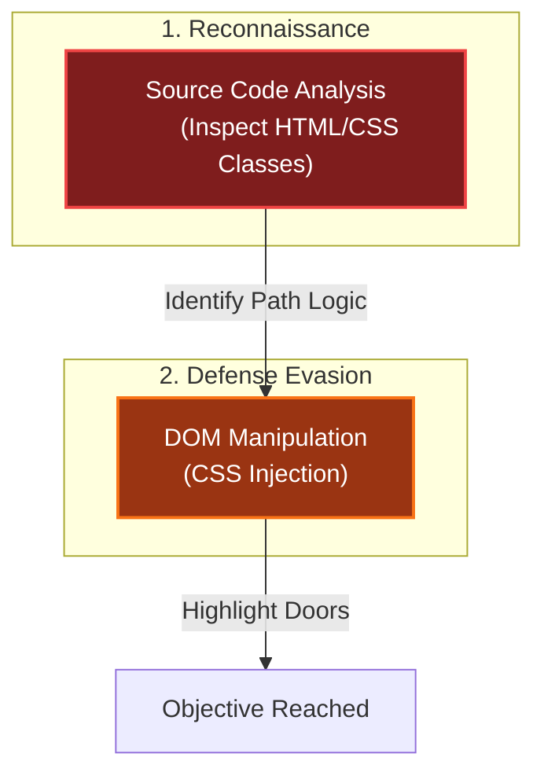

# Find and Shutdown Frosty's Snowglobe Machine
Difficulty: <span style="color:red">❄ ❄ ❄</span> ❄ ❄  
You've heard murmurings around the city about a wise, elderly gnome having a change of heart. He must have information about where Frosty's Snowglobe Machine is. You should find and talk to the gnome so you can get some help with how to make your way through the Data Center's labrynthian halls.  

Once you find the Snowglobe Machine, figure out how to shut it down and melt Frosty's cold, nefarious plans.

## Hints
### A Code in the Dark, You Must Find
The Elder Gnome said the route to the old secret lab inside the Data Center starts on the far East wing inside the building, and that the hallways leading to it are probably pitch dark. He also said the employees that used to work there left some kind of code outside the building as a reminder of the route. Perhaps you can search in the vicinity of the Data Center for this code.
### Backwards, You Should Look
The Elder also recalled a story of another "computer person" like yourself who managed to find an intern that got lost inside the Data Center about 10 years ago. But that was before the reconstruction, so the current route likely isn't exactly the same. Maybe you can search for the Data Center's past in the historical archives that is the Internet for more information that may be helpful.

## Solution
### CTF Mode
Just click on it 😏

### Traditional Mode
First, I zoomed out as much as possible to get a better view of the additional rooms layout:


Looking at the page source code, I noticed the datacenter doors were assigned the class `door-clicker`.

By following the other class names assigned to these objects, I could map out the path to the lab, as well as the paths leading to other parts of the map (such as the factory and the city):

| FROM           | TO           |
| -------------- | ------------ |
| datacenter     | gnomefactory |
| datacentermaze | datacenter   |
| datacentermaze | city         |
| datacenter1    | datacenter2  |
| datacenter2    | datacenter3  |
| datacenter3    | datacenter4  |
| datacenter4    | datacenter5  |
| datacenter5    | datacenter6  |
| datacenter6    | datacenter7  |
| datacenter7    | datacenter8  |
| datacenter8    | datacenter9  |
| datacenter9    | datacenter10 |
| datacenter10   | datacenter11 |
| datacenter11   | snowlab      |

To make navigation easier, I decided to inject some CSS. I added `background-color: green` to doors leading toward the objective and `background-color: red` to doors leading back to the city or dead ends.

I accomplished this using some quick regex replacements on the HTML block:
- **Find all doors leading back to the city:** `(door-clicker \w+ datacentermaze-city" style=".*?)"`
- **Find all doors going to another datacenter room:** `(door-clicker \w+ datacenter\d+-(?:datacenter\d+|snowlab)" style=".*?)"`

Since the HTML structure was quite large, here is a small example of the modification:  
***Original HTML***
```html
<div class="door-clicker one datacenter11-snowlab" style="transform: translate3d(1200px, -100px, 7400px);"></div>
<div class="door-clicker one datacentermaze-city" style="transform: translate3d(1000px, -100px, 7600px);"></div>
```

***Modified HTML***
```html
<div class="door-clicker one datacenter11-snowlab" style="transform: translate3d(1200px, -100px, 7400px); background-color: green;"></div>
<div class="door-clicker one datacentermaze-city" style="transform: translate3d(1000px, -100px, 7600px); background-color: red;"></div>
```

I then replaced the content of the entire session (`<div class="camera" ...>`) with my altered HTML.

The result highlighted the correct doors clearly:


Looking at the whole floor, this reveals the correct path through the maze:


Following this green path, I reached the lab and Frosty's Snowglobe Machine:


### Konami
Outside the datacenter, I also noticed a message hidden within the brick pattern of the wall:


By assuming the dark bricks represented `0`s and the bright bricks represented `1`s, the pattern decoded to: `01101001 01101101 01100001 01101110 01101111 01001011`.

In ASCII, this spells `imanoK`. Read backwards, it becomes `Konami`.

I was told that using the [Konami code](https://en.wikipedia.org/wiki/Konami_Code) might also be a valid way to solve this objective. To be honest, I didn't think of that at the time, and it didn't work for me when I tested it later, but it's very likely my execution was at fault! 😁

## Dissecting the attack

<table>
     <thead>
         <tr>
             <th style="text-align:center">Phase</th>
             <th style="text-align:center">Vulnerability (CWE)</th>
             <th style="text-align:center">Mitigation</th>
         </tr>
     </thead>
     <tbody>
         <tr>
             <td rowspan="1"><strong>1. Analysis</strong><br/></td>
             <td style="border: 1px solid #ddd; padding:10px;"> <strong>CWE-540</strong><br/>Inclusion of Sensitive Information in Source Code<br/><em>(Revealing Maze Topology)</em> </td>
             <td style="background-color:#14532d; color:white; border-radius:5px; padding:10px; border: 2px dashed #22c55e;"> <strong>Minimize Information</strong><br/><em>(Obfuscate Logic / Generic Naming)</em> </td>
         </tr>
         <tr>
             <td rowspan="1"><strong>2. Evasion</strong><br/></td>
             <td style="border: 1px solid #ddd; padding:10px;"> <strong>CWE-602</strong><br/>Client-Side Enforcement of Server-Side Security<br/><em>(Client-Side Darkness/Fog)</em></td>
             <td style="background-color:#14532d; color:white; border-radius:5px; padding:10px; border: 2px dashed #22c55e;"> <strong>Server-Side Validation</strong><br/><em>(Server-Side State Management)</em> </td>
         </tr>
     </tbody>
 </table>

### Fixing the Client-Side Trust (CWE-540 and CWE-602)
**Vulnerability:** The game logic (maze layout, winning path, and visibility) is fully exposed in the HTML/DOM. The client (browser) is trusted to enforce the "darkness" mechanic, which can be easily bypassed by modifying CSS.  
**Fix:** Implement Server-Side State Management. The server should only send the data for the current room the player is in. Do not send the entire map structure to the client at once.  
**Vulnerable Architecture (Client-Side):**
```html
<div class="room current">...</div>
<div class="room next-room">...</div>
<div class="room secret-lab">...</div>
```
**Secure Architecture (Server-Side):**
```python
# FIX: API only returns the specific room data
@app.route('/api/move', methods=['POST'])
def move_player():
    direction = request.json.get('direction')
    if is_valid_move(current_room, direction):
        new_room = get_room_data(direction)
        return jsonify(new_room) # Only sends data for the immediate next step
    else:
        return jsonify({"error": "Wall"}), 400
```
**Impact:** By restricting the data sent to the client, "God Mode" hacks (zooming out to see the whole map) become impossible because the browser simply doesn't have the information.