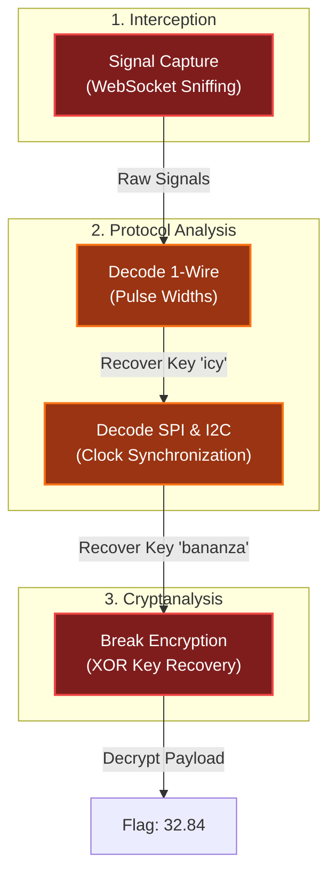

# On the Wire
Difficulty: <span style="color:red">❄ ❄ ❄ ❄</span> ❄  
Help Evan next to city hall hack this gnome and retrieve the temperature value reported by the I²C device at address 0x3C. The temperature data is XOR-encrypted, so you’ll need to work through each communication stage to uncover the necessary keys. Start with the unencrypted data being transmitted over the 1-wire protocol.

## Hints
### Protocols
**Key concept - Clock vs. Data signals:**
- Some protocols have separate clock and data lines (like SPI and I2C)
- For clocked protocols, you need to sample the data line at specific moments defined by the clock
- The clock signal tells you when to read the data signal

**For 1-Wire (no separate clock):**
- Information is encoded in pulse widths (how long the signal stays low or high)
- Different pulse widths represent different bit values
- Look for patterns in the timing between transitions

**For SPI and I2C:**
- Identify which line is the clock (SCL for I2C, SCK for SPI)
- Data is typically valid/stable when the clock is in a specific state (high or low)
- You need to detect clock edges (transitions) and sample data at those moments

**Technical approach:**
- Sort frames by timestamp
- Detect rising edges (0→1) and falling edges (1→0) on the clock line
- Sample the data line's value at each clock edge

### Structure
**What you're dealing with:**
- You have access to WebSocket endpoints that stream digital signal data
- Each endpoint represents a physical wire in a hardware communication system
- The data comes as JSON frames with three properties: `line` (wire name), `t` (timestamp), and `v` (value: 0 or 1)
- The server continuously broadcasts signal data in a loop - you can connect at any time
- This is a multi-stage challenge where solving one stage reveals information needed for the next

**Where to start:**
- Connect to a WebSocket endpoint and observe the data format
- The server automatically sends data every few seconds - just wait and collect
- Look for documentation on the protocol types mentioned (1-Wire, SPI, I2C)
- Consider that hardware protocols encode information in the timing and sequence of signal transitions, not just - the values themselves
- Consider capturing the WebSocket frames to a file so you can work offline

### On Rails
Stage-by-stage approach
1. Connect to the captured wire files or endpoints for the relevant wires.
2. Collect all frames for the transmission (buffer until inactivity or loop boundary).
3. Identify protocol from wire names (e.g., `dq` → 1-Wire; `mosi`/`sck` → SPI; `sda`/`scl` → I²C).
4. Decode the raw signal:
  - Pulse-width protocols: locate falling→rising transitions and measure low-pulse width.
  - Clocked protocols: detect clock edges and sample the data line at the specified sampling phase.
5. Assemble bits into bytes taking the correct bit order (LSB vs MSB).
6. Convert bytes to text (printable ASCII or hex as appropriate).
7. Extract information from the decoded output — it contains the XOR key or other hints for the next stage.

1. Repeat Stage 1 decoding to recover raw bytes (they will appear random).
2. Apply XOR decryption using the key obtained from the previous stage.
3. Inspect decrypted output for next-stage keys or target device information.

- Multiple 7-bit device addresses share the same SDA/SCL lines.
- START condition: SDA falls while SCL is high. STOP: SDA rises while SCL is high.
- First byte of a transaction = (7-bit address << 1) \| R/W. Extract address with `address = first_byte >> 1`.
- Identify and decode every device’s transactions; decrypt only the target device’s payload.

- Print bytes in hex and as ASCII (if printable) — hex patterns reveal structure.
- Check printable ASCII range (0x20–0x7E) to spot valid text.
- Verify endianness: swapping LSB/MSB will quickly break readable text.
- For XOR keys, test short candidate keys and look for common English words.
- If you connect mid-broadcast, wait for the next loop or detect a reset/loop marker before decoding.

- Buffering heuristic: treat the stream complete after a short inactivity window (e.g., 500 ms) or after a full broadcast loop.
- Sort frames by timestamp per wire and collapse consecutive identical levels before decoding to align with the physical waveform.

### Garbage?
**If your decoded data looks like gibberish:**
- The data may be encrypted with XOR cipher
- XOR is a simple encryption: `encrypted_byte XOR key_byte = plaintext_byte`
- The same operation both encrypts and decrypts: `plaintext XOR key = encrypted`, `encrypted XOR key = plaintext`

**How XOR cipher works:**
```js
function xorDecrypt(encrypted, key) {
  let result = "";
  for (let i = 0; i < encrypted.length; i++) {
    const encryptedChar = encrypted.charCodeAt(i);
    const keyChar = key.charCodeAt(i % key.length);  // Key repeats
    result += String.fromCharCode(encryptedChar ^ keyChar);
  }
  return result;
}
```

**Key characteristics:**
- The key is typically short and repeats for the length of the message
- You need the correct key to decrypt (look for keys in previous stage messages)
- If you see readable words mixed with garbage, you might have the wrong key or bit order

**Testing your decryption:**
- Encrypted data will have random-looking byte values
- Decrypted data should be readable ASCII text
- Try different keys from messages you've already decoded

### Bits and Bytes
**Critical detail - Bit ordering varies by protocol:**
**MSB-first (Most Significant Bit first):**
- SPI and I2C typically send the highest bit (bit 7) first
- When assembling bytes: `byte = (byte << 1) | bit_value`
- Start with an empty byte, shift left, add the new bit

**LSB-first (Least Significant Bit first):**
- 1-Wire and UART send the lowest bit (bit 0) first
- When assembling bytes: `byte |= bit_value << bit_position`
- Build the byte from bit 0 to bit 7

**I2C specific considerations:**
- Every 9th bit is an ACK (acknowledgment) bit - ignore these when decoding data
- The first byte in each transaction is the device address (7 bits) plus a R/W bit
- You may need to filter for specific device addresses

**Converting bytes to text:**  
`String.fromCharCode(byte_value)  // Converts byte to ASCII character`

## Solution
### 1-Wire
I started by inspecting the messages from the websocket `wss://signals.holidayhackchallenge.com/wire/dq`:
```js
{"type":"welcome","wire":"dq","message":"Connected to dq wire. Broadcasting continuously every 2000ms..."}
{"line":"dq","t":0,"v":1,"marker":"idle"}
{"line":"dq","t":1,"v":0,"marker":"reset"}
{"line":"dq","t":481,"v":1}
{"line":"dq","t":551,"v":0,"marker":"presence"}
{"line":"dq","t":701,"v":1}
// ... omissis ...
{"line":"dq","t":32851,"v":1}
{"line":"dq","t":32871,"v":1,"marker":"stop"}
```
The JSON fields can be interpreted as:
- `type` / `message`: Standard WebSocket handshake information
- `wire` / `line`: Identifies the bus being monitored (in this case, `dq`)
- `t`: The timestamp in microseconds
- `v`: The logic level, where 1 represents a HIGH state and 0 represents a LOW state
- `marker`: These act as a built-in logic analyzer, identifying specific protocol states:
    - `idle`: The bus is at rest (HIGH)
    - `reset`: The master pulls the bus LOW for a significant period (as seen from `t=1` to `t=481`) to synchronize all connected devices
    - `presence`: A slave device pulls the bus LOW to signal it is alive and listening
    - `stop`: Indicates the end of the current transmission loop

#### Decoding
In 1-Wire a short low pulse equals 1 and a long low pulse equals 0. Additionally, bits are transitted LSB-first. So, I wrote a decoder that listens the socket until `stop`, identifies low → high transitions, extracts the bits and packs them bits into bytes (LSB):
```python
# 1-wire.py

###########
# IMPORTS #
###########
import websocket
import json
import logging
import os
import argparse

##########
# CONFIG #
##########
logging.basicConfig(
    format="%(asctime)s | %(levelname)-8s | %(name)s | %(funcName)s | %(message)s",
    datefmt="%Y-%m-%d %H:%M:%S",
)
log = logging.getLogger(os.path.basename(__file__))

#############
# FUNCTIONS #
#############
def getBusMessages(ws_url):
    messages = []
    stop_marker_reached = False

    log.info (f"Connecting to websocket {ws_url}")
    ws = websocket.create_connection(ws_url)
    log.info (f"Receiving messages")
    while not stop_marker_reached:
        response = ws.recv()
        log.debug(response)
        messages.append(response)
        if json.loads(response).get("marker") == "stop":
            stop_marker_reached = True
    ws.close()
    log.info (f"Websocket connection closed after {len(messages)} messages")

    return messages

def getBits(messages, transition_delta):
    bits = []
    log.info("Extracting bits")
    for i in range(len(messages)):
        message = json.loads(messages[i])
        if message.get("type") or message.get("marker"):
            log.debug (f"Discarded message {i}: {message}")
        else:
            next_message = json.loads(messages[i+1])
            if message.get("v") == 0 and next_message.get("v") == 1:
                if next_message.get("t") - message.get("t") < transition_delta:
                    bits.append(1)
                else:
                    bits.append(0)
    log.info (f"Extracted {len(bits)} bits")
    return bits

def getBytes (bits):
    byte_list = []
    log.info("Converting bits to bytes (LSB)")
    for i in range(0, len(bits), 8):
        byte = [b for b in bits[i:i+8]][::-1]
        byte = int("".join(map(str, byte)), 2)
        byte_list.append(byte)
    log.info(f"Converted {len(bits)} bits to {len(byte_list)} bytes")
    return byte_list

def bytesToString (byte_list):
    log.info("Converting bytes to ASCII")
    return ''.join([chr(byte) for byte in byte_list])

########
# MAIN #
########
def parse_args():
    parser = argparse.ArgumentParser()
    parser.add_argument("websocket_url", help="The websocket URL to receive messages")
    parser.add_argument("--verbose", "-v", action="count", default=0, help="Increase verbosity (use -vv for very verbose / debug)")
    parser.add_argument("--transition-delta", "-t", type=int, default=20, help="Time delta between transition (default 20)")
    return parser.parse_args()

def main():
    args = parse_args()

    if args.verbose == 1:
        log.setLevel(logging.INFO)
        log.info("Log mode set to: INFO")
    elif args.verbose >= 2:
        log.setLevel(logging.DEBUG)
        log.debug("Log mode set to: DEBUG")

    messages = getBusMessages(args.websocket_url)
    bits = getBits (messages, args.transition_delta)
    byte_list = getBytes (bits)
    print (bytesToString (byte_list))

if __name__ == "__main__":
    main()
```

Running it produced (full debug log is available [here](/assets/static/posts/2025/2025-23-On-the-Wire/1-wire.py.log)):
```bash
(env) thedead@maccos 01 - 1-wire % python3 1-wire.py wss://signals.holidayhackchallenge.com/wire/dq -t 20 -v 
2025-12-14 22:58:01 | INFO     | 1-wire.py | main | Log mode set to: INFO
2025-12-14 22:58:01 | INFO     | 1-wire.py | getBusMessages | Connecting to websocket wss://signals.holidayhackchallenge.com/wire/dq
2025-12-14 22:58:02 | INFO     | 1-wire.py | getBusMessages | Receiving messages
2025-12-14 22:58:03 | INFO     | 1-wire.py | getBusMessages | Websocket connection closed after 919 messages
2025-12-14 22:58:03 | INFO     | 1-wire.py | getBits | Extracting bits
2025-12-14 22:58:03 | INFO     | 1-wire.py | getBits | Extracted 456 bits
2025-12-14 22:58:03 | INFO     | 1-wire.py | getBytes | Converting bits to bytes (LSB)
2025-12-14 22:58:03 | INFO     | 1-wire.py | getBytes | Converted 456 bits to 57 bytes
2025-12-14 22:58:03 | INFO     | 1-wire.py | bytesToString | Converting bytes to ASCII
Ìread and decrypt the SPI bus data using the XOR key: icy
```
The first XOR key is recovered: `icy`.

### SPI
SPI (Serial Peripheral Interface) provides two wires:
- MOSI (Master Out Slave In): `wss://signals.holidayhackchallenge.com/wire/mosi`
- SCK (Serial Clock): `wss://signals.holidayhackchallenge.com/wire/sck`

Similarly to 1-Wire, we can follow the websocket messages to understand better the contents.
#### MOSI
```js
{"type":"welcome","wire":"mosi","message":"Connected to mosi wire. Broadcasting continuously every 2000ms..."}
{"line":"mosi","t":0,"v":0,"marker":"idle-low"}
{"line":"mosi","t":0,"v":0,"marker":"data-bit"}
{"line":"mosi","t":10000,"v":0,"marker":"data-bit"}
// ...omissis...
{"line":"mosi","t":7980000,"v":1,"marker":"data-bit"}
{"line":"mosi","t":7990000,"v":0,"marker":"data-bit"}
{"line":"mosi","t":0,"v":0,"marker":"idle-low"}
{"line":"mosi","t":0,"v":0,"marker":"data-bit"}
```
Key observations:
- `wire` / `line`: Identifies the bus being monitored (in this case, `mosi`)
- `marker`: identifies the bus states
    - `idle-low`: The bus is at rest (LOW)
    - `data-bit`: A bit is currently on the line

#### SCK
```js
{"type":"welcome","wire":"sck","message":"Connected to sck wire. Broadcasting continuously every 2000ms..."}
{"line":"sck","t":4225000,"v":1,"marker":"sample"}
{"line":"sck","t":4230000,"v":0}
// ...omissis..
{"line":"sck","t":8000000,"v":0,"marker":"idle-low"}
```
Key observations:
- `wire` / `line`: Identifies the bus being monitored (in this case, `sck`)
- `marker`: identifies the bus states
  - `idle-low`: clock reset
  - `data-bit`: rising edge of the clock pulse on which to sample data

#### Decoding
Unlike the 1-Wire stream, neither MOSI nor SCK provided an explicit `stop` message. I relied on the `idle-low` state to identify the end of a transmission block.

In SPI, reading must occur at clock transitions. I used the `bisect.bisect_right` function to map the clock `sample` timestamp to the corresponding stable data value on the MOSI line.

I wrote the following script to handle this logic and decrypt the payload using the `icy` key obtained in the previous stage:
```python
# spi.py

###########
# IMPORTS #
###########
import websocket
import json
import logging
import os
import argparse
import bisect 

##########
# CONFIG #
##########
logging.basicConfig(
    format="%(asctime)s | %(levelname)-8s | %(name)s | %(funcName)s | %(message)s",
    datefmt="%Y-%m-%d %H:%M:%S",
)
log = logging.getLogger(os.path.basename(__file__))

#############
# FUNCTIONS #
#############
def getBusMessages(ws_url):
    messages = []
    stop = False

    log.info (f"Connecting to websocket {ws_url}")
    ws = websocket.create_connection(ws_url)
    log.info (f"Receiving messages")
    while not stop:
        response = ws.recv()
        log.debug(response)
        if json.loads(response).get("marker") == "idle-low" and response in messages:
            log.debug ("Found duplicated 'idle-low' message, assuming end of transmission")
            stop = True
        else:
            messages.append(response)
    ws.close()
    log.info (f"Websocket connection closed after {len(messages)} messages")

    return messages

def getsckSamples (messages):
    samples = []
    for message in messages:
        message = json.loads(message)
        if message.get("marker") == "sample":
            samples.append(message.get("t"))
    return samples

def getMosiData (messages):
    data = []
    for message in messages:
        message = json.loads(message)
        data.append((message.get("t"), message.get("v")))
    return data

def getBits(mosi_data, sck_samples):
    timestamps = [x[0] for x in mosi_data]

    bits = []
    log.info("Extracting bits")
    for sck_sample in sck_samples:
        idx = bisect.bisect_right(timestamps, sck_sample) - 1
        bits.append (mosi_data[idx][1])
    log.info (f"Extracted {len(bits)} bits")
    return bits

def getBytes (bits):
    byte_list = []
    log.info("Converting bits to bytes (MSB)")
    for i in range(0, len(bits), 8):
        byte = [b for b in bits[i:i+8]]
        byte = int("".join(map(str, byte)), 2)
        byte_list.append(byte)
    log.info(f"Converted {len(bits)} bits to {len(byte_list)} bytes")
    return byte_list

def bytesToString (byte_list):
    log.info("Converting bytes to ASCII")
    return ''.join([chr(byte) for byte in byte_list])

def xorDecrypt(encrypted, key):
    log.info(f"Decrypting with XOR key {key}")
    key_bytes = key.encode()
    result = bytearray()
    for i in range(len(encrypted)):
        result.append(encrypted[i] ^ key_bytes[i % len(key_bytes)])
    return bytes(result)

########
# MAIN #
########
def parse_args():
    parser = argparse.ArgumentParser()
    parser.add_argument("websocket_mosi_url", help="The websocket URL to receive MOSI messages")
    parser.add_argument("websocket_sck_url", help="The websocket URL to receive SCK messages")
    parser.add_argument("--xor_key", "-x", help="The XOR key to decrypt data")
    parser.add_argument("--verbose", "-v", action="count", default=0, help="Increase verbosity (use -vv for very verbose / debug)")
    return parser.parse_args()

def main():
    args = parse_args()

    if args.verbose == 1:
        log.setLevel(logging.INFO)
        log.info("Log mode set to: INFO")
    elif args.verbose >= 2:
        log.setLevel(logging.DEBUG)
        log.debug("Log mode set to: DEBUG")

    mosi_messages = getBusMessages(args.websocket_mosi_url)
    sck_messages = getBusMessages(args.websocket_sck_url)

    mosi_data = getMosiData (mosi_messages)
    sck_samples = getsckSamples (sck_messages)

    bits = getBits (mosi_data, sck_samples)
    byte_list = getBytes (bits)

    if args.xor_key:
        decrypted = xorDecrypt(byte_list, args.xor_key)

    print (bytesToString (decrypted))


if __name__ == "__main__":
    main()
```

This script recovered the second encryption key, `bananza`, and identified the target temperature sensor address as `0x3C` (full debug log is available [here](/assets/static/posts/2025/2025-23-On-the-Wire/spi.py.log)):
```bash
(env) thedead@maccos 02 - SPI % python3 spi.py wss://signals.holidayhackchallenge.com/wire/mosi wss://signals.holidayhackchallenge.com/wire/sck -x icy -v
2025-12-15 23:42:04 | INFO     | spi.py | main | Log mode set to: INFO
2025-12-15 23:42:04 | INFO     | spi.py | getBusMessages | Connecting to websocket wss://signals.holidayhackchallenge.com/wire/mosi
2025-12-15 23:42:04 | INFO     | spi.py | getBusMessages | Receiving messages
2025-12-15 23:42:07 | INFO     | spi.py | getBusMessages | Websocket connection closed after 802 messages
2025-12-15 23:42:07 | INFO     | spi.py | getBusMessages | Connecting to websocket wss://signals.holidayhackchallenge.com/wire/sck
2025-12-15 23:42:07 | INFO     | spi.py | getBusMessages | Receiving messages
2025-12-15 23:42:12 | INFO     | spi.py | getBusMessages | Websocket connection closed after 1602 messages
2025-12-15 23:42:12 | INFO     | spi.py | getBits | Extracting bits
2025-12-15 23:42:12 | INFO     | spi.py | getBits | Extracted 800 bits
2025-12-15 23:42:12 | INFO     | spi.py | getBytes | Converting bits to bytes (MSB)
2025-12-15 23:42:12 | INFO     | spi.py | getBytes | Converted 800 bits to 100 bytes
2025-12-15 23:42:12 | INFO     | spi.py | xorDecrypt | Decrypting with XOR key icy
2025-12-15 23:42:12 | INFO     | spi.py | bytesToString | Converting bytes to ASCII
read and decrypt the I2C bus data using the XOR key: bananza. the temperature sensor address is 0x3C
```

### I²C
Similar to SPI, I²C (Inter-Integrated Circuit) uses two lines:
- SDA (Serial Data): `wss://signals.holidayhackchallenge.com/wire/sda`
- SCL (Serial Clock): `wss://signals.holidayhackchallenge.com/wire/scl`

#### SDA
```js
{"type":"welcome","wire":"sda","message":"Connected to sda wire. Broadcasting continuously every 2000ms..."}
{"line":"sda","t":0,"v":1,"marker":"bus-idle"}
{"line":"sda","t":2000,"v":0,"marker":"start"}
{"line":"sda","t":4000,"v":1,"marker":"address-bit","byteIndex":0,"bitIndex":0,"type":"address"}
// ... omissis ...
{"line":"sda","t":74000,"v":0,"marker":"address-bit","byteIndex":0,"bitIndex":7,"type":"address"}
{"line":"sda","t":84000,"v":0,"marker":"ack-bit","byteIndex":0,"type":"ack"}
{"line":"sda","t":94000,"v":1,"marker":"ack-release","byteIndex":0,"type":"ack"}
// ... omissis ...
{"line":"sda","t":274000,"v":0,"marker":"data-bit","byteIndex":3,"bitIndex":0,"type":"data"}
// ... omissis ...
{"line":"sda","t":344000,"v":1,"marker":"data-bit","byteIndex":3,"bitIndex":7,"type":"data"}
{"line":"sda","t":354000,"v":0,"marker":"ack-bit","byteIndex":3,"type":"ack"}
{"line":"sda","t":364000,"v":1,"marker":"ack-release","byteIndex":3,"type":"ack"}
{"line":"sda","t":368000,"v":1,"marker":"stop"}
{"line":"sda","t":368000,"v":1,"marker":"gap-start"}
{"line":"sda","t":408000,"v":1,"marker":"bus-idle"}
```
The key differences in the SDA stream are:
- `wire` / `line`: Identifies the bus being monitored (in this case, `sda`)
- `marker`: Identifies specific bus states
    - `bus-idle`: The bus is free; no transaction is currently in progress
    - `start`: The master claims the bus and signals the initiation of a communication session
    - `address-bit`: The master transmits the slave device address, one bit at a time
    - `data-bit`: A single bit of the actual data payload is being transferred
    - `ack-bit`: After a full byte is transferred, the receiving device pulls SDA LOW to acknowledge (ACK) successful reception
    - `ack-release`: Alternatively, the receiving device leaves SDA HIGH to signal a failure or "Not Acknowledge" (NACK)
    - `stop`: The master terminates the session and releases the bus
    - `gap-start`: Indicates the beginning of a new session interval where data is not yet being clocked
- `byteIndex`: Indicates the position of the current 8-bit byte within the message structure
    - `0`: The Slave Address (7 bits) plus the Read/Write flag (1 bit)
    - `1`: The Data Byte or Register Address Byte
    - `2+`: Any subsequent data bytes being read from or written to the slave
- `bitIndex`: Specifies the index of the individual bit within the current byte
- `type`: Explicitly categorizes the nature of the bits being sent
    - `address`: The master is broadcasting the target slave's address
    - `data`: Payload data is being transmitted
    - `ack`: An ACK/NACK bit is being processed

#### SCL
```js
{"type":"welcome","wire":"scl","message":"Connected to scl wire. Broadcasting continuously every 2000ms..."}
{"line":"scl","t":0,"v":1,"marker":"bus-idle"}
{"line":"scl","t":4000,"v":0,"marker":"clock-low"}
{"line":"scl","t":9000,"v":1,"marker":"address-sample","byteIndex":0,"bitIndex":0,"type":"address"}
{"line":"scl","t":14000,"v":0,"marker":"address-hold","byteIndex":0,"bitIndex":0,"type":"address"}
// ... omissis ...
{"line":"scl","t":79000,"v":1,"marker":"address-sample","byteIndex":0,"bitIndex":7,"type":"address"}
{"line":"scl","t":84000,"v":0,"marker":"address-hold","byteIndex":0,"bitIndex":7,"type":"address"}
{"line":"scl","t":89000,"v":1,"marker":"ack-sample","byteIndex":0,"type":"ack"}
{"line":"scl","t":94000,"v":0,"marker":"ack-hold","byteIndex":0,"type":"ack"}
// ... omissis ...
{"line":"scl","t":279000,"v":1,"marker":"data-sample","byteIndex":3,"bitIndex":0,"type":"data"}
{"line":"scl","t":284000,"v":0,"marker":"data-hold","byteIndex":3,"bitIndex":0,"type":"data"}
// ... omissis ...
{"line":"scl","t":349000,"v":1,"marker":"data-sample","byteIndex":3,"bitIndex":7,"type":"data"}
{"line":"scl","t":354000,"v":0,"marker":"data-hold","byteIndex":3,"bitIndex":7,"type":"data"}
{"line":"scl","t":359000,"v":1,"marker":"ack-sample","byteIndex":3,"type":"ack"}
{"line":"scl","t":364000,"v":0,"marker":"ack-hold","byteIndex":3,"type":"ack"}
{"line":"scl","t":366000,"v":1,"marker":"stop-setup"}
{"line":"scl","t":368000,"v":1,"marker":"gap-start"}
{"line":"scl","t":408000,"v":1,"marker":"bus-idle"}
```
The key differences in the SCL stream are:
- `wire` / `line`: Identifies the bus being monitored (in this case, `scl`)
- `marker`: Identifies specific bus states
    - `bus-idle`: The bus is free; no transaction is currently happening
    - `clock-low`: The master holds the SCL line LOW, which allows the SDA line to safely change state (setup)
    - `address-hold` / `data-hold` / `ack-hold`: The SCL line is held LOW while the master (or slave) places the current bit of the Address, Data, or ACK/NACK byte onto the SDA line
    - `address-sample` / `data-sample` / `ack-sample`: The SCL line transitions HIGH, signaling to the receiving device that the data on the SDA line is stable and valid to read (sample)
    - `stop-setup`: The SCL line is held HIGH to prepare for the STOP condition (where SDA transitions from LOW to HIGH)
    - `gap-start`: Signals a delay period where no clocking activity is occurring

#### Decoding
Since there was no explicit "stop" message for the stream (only stop markers for individual transactions), I buffered messages until no new data arrived.

Additionally, the SDA messages were very rich in metadata, which allowed me to avoid using the SCL stream completely by leveraging on the `start` and `stop` markers within the SDA stream to frame each transaction. Some scripting later I came up with this:
```python
# i2c.py

###########
# IMPORTS #
###########
import websocket
import json
import logging
import os
import argparse

##########
# CONFIG #
##########
logging.basicConfig(
    format="%(asctime)s | %(levelname)-8s | %(name)s | %(funcName)s | %(message)s",
    datefmt="%Y-%m-%d %H:%M:%S",
)
log = logging.getLogger(os.path.basename(__file__))

#############
# FUNCTIONS #
#############
def getBusMessages(ws_url):
    messages = []
    duplicates = 0

    log.info (f"Connecting to websocket {ws_url}")
    ws = websocket.create_connection(ws_url)
    log.info (f"Receiving messages")
    while duplicates <= len(messages):
        response = ws.recv()
        if response not in messages:
            log.debug(f"New message: {response}")
            messages.append(response)
        else:
            duplicates += 1
            log.debug (f"Found {duplicates} duplicated messages - {response}")
    ws.close()
    log.info (f"Websocket connection closed after {len(messages)} messages")

    return messages

def getTransactions (messages):
    transactions = []

    transaction = None
    for message in messages:
        message = json.loads(message)

        marker = message.get("marker")
        message_type = message.get("type")
        t = message.get("t")

        if marker == "start":
            log.debug (f"New transaction found at timestamp {t}")
            transaction = {"start": t, "address": [], "data": []}
        elif message_type == "address" or message_type == "data":
            v = message.get("v")
            transaction[message_type].append(v)
            log.debug (f"\t{marker} found at timestamp {t} with value {v}")
        elif marker == "stop":
            transactions.append(transaction)
            log.info (f"Appending new transaction {transaction}")

    return transactions

def getBytes (bits):
    byte_list = []
    log.debug("Converting bits to bytes (MSB)")
    for i in range(0, len(bits), 8):
        byte = [b for b in bits[i:i+8]]
        byte = int("".join(map(str, byte)), 2)
        byte_list.append(byte)
    log.debug(f"Converted {len(bits)} bits to {len(byte_list)} bytes")
    return byte_list

def bytesToString (byte_list):
    log.debug("Converting bytes to ASCII")
    return ''.join([chr(byte) for byte in byte_list])

def xorDecrypt(encrypted, key):
    log.debug(f"Decrypting with XOR key {key}")
    key_bytes = key.encode()
    result = bytearray()
    for i in range(len(encrypted)):
        result.append(encrypted[i] ^ key_bytes[i % len(key_bytes)])
    return bytes(result)

########
# MAIN #
########
def parse_args():
    parser = argparse.ArgumentParser()
    parser.add_argument("websocket_sda_url", help="The websocket URL to receive SDA messages")
    parser.add_argument("--xor_key", "-x", help="The XOR key to decrypt data")
    parser.add_argument("--verbose", "-v", action="count", default=0, help="Increase verbosity (use -vv for very verbose / debug)")
    return parser.parse_args()

def main():
    args = parse_args()

    if args.verbose == 1:
        log.setLevel(logging.INFO)
        log.info("Log mode set to: INFO")
    elif args.verbose >= 2:
        log.setLevel(logging.DEBUG)
        log.debug("Log mode set to: DEBUG")

    log.info (f"ARGS: {args}")

    sda_messages = getBusMessages(args.websocket_sda_url)
    transactions = getTransactions(sda_messages)

    for transaction in transactions:
        address = getBytes(transaction["address"])[0] >> 1
        data = getBytes(transaction["data"])

        output = " -- TX --\n"
        output += f"Start time: {transaction["start"]}\n"
        output += f"Address   : {hex(address)}\n"
        output += f"Data      : {bytesToString(data)}\n"
        if args.xor_key:
            output += f"Decrypted : {bytesToString(xorDecrypt(data, args.xor_key))}\n"
        output += " -- END --"

        print (output)
    
if __name__ == "__main__":
    main()
```

Running it produced (full debug log is available [here](/assets/static/posts/2025/2025-23-On-the-Wire/i2c.py.log)):
```bash
(env) thedead@maccos 03 - I2C % python3 i2c.py wss://signals.holidayhackchallenge.com/wire/sda -v -x bananza 
2025-12-17 01:36:34 | INFO     | i2c.py | main | Log mode set to: INFO
2025-12-17 01:36:34 | INFO     | i2c.py | main | ARGS: Namespace(websocket_sda_url='wss://signals.holidayhackchallenge.com/wire/sda', xor_key='bananza', verbose=1)
2025-12-17 01:36:34 | INFO     | i2c.py | getBusMessages | Connecting to websocket wss://signals.holidayhackchallenge.com/wire/sda
2025-12-17 01:36:34 | INFO     | i2c.py | getBusMessages | Receiving messages
2025-12-17 01:36:40 | INFO     | i2c.py | getBusMessages | Websocket connection closed after 286 messages
2025-12-17 01:36:40 | INFO     | i2c.py | getTransactions | Appending new transaction {'start': 2000, 'address': [1, 0, 0, 1, 0, 0, 0, 0], 'data': [0, 1, 0, 1, 0, 1, 1, 0, 0, 1, 0, 1, 0, 1, 0, 0, 0, 1, 0, 0, 1, 0, 1, 1]}
2025-12-17 01:36:40 | INFO     | i2c.py | getTransactions | Appending new transaction {'start': 410000, 'address': [0, 1, 1, 1, 1, 0, 0, 0], 'data': [0, 1, 0, 1, 0, 0, 0, 1, 0, 1, 0, 1, 0, 0, 1, 1, 0, 1, 0, 0, 0, 0, 0, 0, 0, 1, 0, 1, 1, 0, 0, 1, 0, 1, 0, 1, 1, 0, 1, 0]}
2025-12-17 01:36:40 | INFO     | i2c.py | getTransactions | Appending new transaction {'start': 998000, 'address': [1, 0, 1, 0, 0, 0, 1, 0], 'data': [0, 1, 0, 1, 0, 0, 1, 1, 0, 1, 0, 1, 0, 0, 0, 1, 0, 1, 0, 1, 1, 1, 1, 1, 0, 1, 0, 1, 0, 0, 1, 0, 0, 1, 0, 0, 1, 1, 1, 0, 0, 0, 0, 1, 0, 0, 1, 0, 0, 0, 1, 1, 0, 0, 0, 1, 0, 0, 0, 0, 0, 0, 1, 1]}
2025-12-17 01:36:40 | INFO     | i2c.py | getTransactions | Appending new transaction {'start': 1856000, 'address': [0, 1, 0, 1, 0, 0, 1, 0], 'data': [0, 1, 0, 1, 0, 1, 1, 0, 0, 1, 0, 1, 0, 1, 0, 0, 0, 1, 0, 1, 1, 1, 1, 0, 0, 1, 0, 0, 0, 0, 0, 1, 0, 0, 0, 0, 0, 0, 1, 0, 0, 0, 0, 0, 1, 1, 1, 1, 0, 0, 0, 1, 1, 0, 0, 1]}
 -- TX --
Start time: 2000
Address   : 0x48
Data      : VTK
Decrypted : 45%
 -- END --
 -- TX --
Start time: 410000
Address   : 0x3c
Data      : QS@YZ
Decrypted : 32.84
 -- END --
 -- TX --
Start time: 998000
Address   : 0x51
Data      : SQ_RN1
Decrypted : 1013 hPa
 -- END --
 -- TX --
Start time: 1856000
Address   : 0x29
Data      : VT^A
Decrypted : 450 lux
 -- END --
```

Knowing that the temperature sensor is at address `0x3C`, I submitted `32.84` as the answer for this challenge.

## Dissecting the attack

<table>
     <thead>
         <tr>
             <th style="text-align:center">Phase</th>
             <th style="text-align:center">Vulnerability (CWE)</th>
             <th style="text-align:center">Mitigation</th>
         </tr>
     </thead>
     <tbody>
         <tr>
             <td rowspan="1"><strong>1. Interception</strong><br/></td>
             <td style="border: 1px solid #ddd; padding:10px;"> <strong>CWE-319</strong><br/>Cleartext Transmission of Sensitive Information<br/><em>(Unencrypted Signal Lines)</em> </td>
             <td style="background-color:#14532d; color:white; border-radius:5px; padding:10px; border: 2px dashed #22c55e;"> <strong>Transport Security</strong><br/><em>(Physical Security / Encryption)</em> </td>
         </tr>
         <tr>
             <td rowspan="1"><strong>2. Decryption</strong><br/></td>
             <td style="border: 1px solid #ddd; padding:10px;"> <strong>CWE-327</strong><br/>Use of a Broken or Risky Cryptographic Algorithm<br/><em>(XOR Encryption)</em> </td>
             <td style="background-color:#14532d; color:white; border-radius:5px; padding:10px; border: 2px dashed #22c55e;"> <strong>Strong Cryptography</strong><br/><em>(Use AES-GCM / ChaCha20)</em> </td>
         </tr>
         <tr>
             <td rowspan="1"><strong>3. Extraction</strong><br/></td>
             <td style="border: 1px solid #ddd; padding:10px;"> <strong>CWE-200</strong><br/>Exposure of Sensitive Information to an Unauthorized Actor<br/><em>(Leaked Sensor Data)</em></td>
             <td style="background-color:#14532d; color:white; border-radius:5px; padding:10px; border: 2px dashed #22c55e;"> <strong>Access Control</strong><br/><em>(Authorize Peripheral Access)</em> </td>
         </tr>
     </tbody>
 </table>

### Fixing the Cryptography (CWE-319, CWE-327 and CWE-200)
**Vulnerability:** The application uses simple XOR encryption for data on the wire. XOR is symmetric and easily broken with known-plaintext attacks or key reuse, making it unsuitable for confidentiality.  
**Fix:** Use standard, authenticated encryption like AES-GCM (Galois/Counter Mode). This ensures both confidentiality and integrity.  
**Vulnerable Code (Concept):**
```python
def xor_encrypt(data, key):
    # FLAW: Weak XOR encryption
    return bytes([b ^ key[i % len(key)] for i, b in enumerate(data)])
```
**Secure Code:**
```python
from cryptography.hazmat.primitives.ciphers.aead import AESGCM
import os

def secure_encrypt(data, key):
    # FIX: Use AES-GCM for authenticated encryption
    aesgcm = AESGCM(key)
    nonce = os.urandom(12)
    return nonce + aesgcm.encrypt(nonce, data, None)
```
**Impact:** Intercepting the bus traffic would yield only random noise without the specific AES key, which should be rotated and securely stored.

## Funsies
I <ins>***obviously***</ins> used a ton of AI during this challenge, and I felt like sharing this video about it:
<iframe width="560" height="315" src="https://www.youtube.com/embed/Npsg0UvEGIw?si=bdk0cLX6txnvWhf8&hl=en" title="YouTube video player" frameborder="0" allow="accelerometer; autoplay; clipboard-write; encrypted-media; gyroscope; picture-in-picture; web-share" referrerpolicy="strict-origin-when-cross-origin" allowfullscreen></iframe>

And if you're not catching the reference, I warmly suggest watching [Whiplash](https://www.imdb.com/it/title/tt2582802/), great movie!