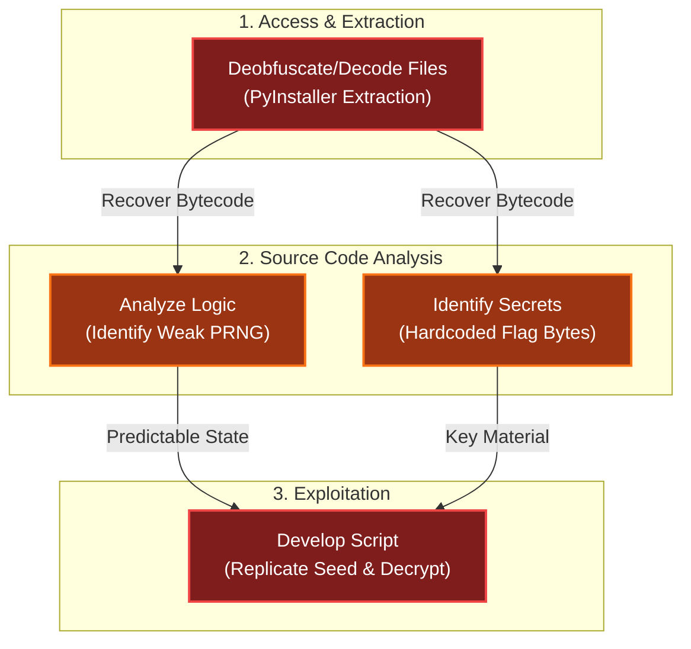

# Free Ski
Difficulty: <span style="color:red">❄ ❄ ❄ ❄ ❄</span>  
Go to the retro store and help Goose Olivia ski down the mountain and collect all five treasure chests to reveal the hidden flag in this classic SkiFree-inspired challenge.

## Hints
### Extraction
Have you ever used [PyInstaller Extractor](https://github.com/extremecoders-re/pyinstxtractor)?
### Decompilation!
Many Python decompilers don't understand Python 3.13, but [Decompyle++](https://github.com/zrax/pycdc) does!

## Items
### Free Ski EXE
  
A PyInstaller-compiled [executable](/assets/static/posts/2025/2025-24-Free-Ski/FreeSki.exe) containing a SkiFree-inspired skiing game with hidden treasure chests and flag mechanics.

## Solution
My first step was to break open the executable. I used [PyInstaller Extractor](https://github.com/extremecoders-re/pyinstxtractor) to unpack `FreeSki.exe`:
```bash
┌──(kali㉿mac-vikali)-[~/Desktop/FreeSki]
└─$ python3 ../repos/pyinstxtractor/pyinstxtractor.py FreeSki.exe 
[+] Processing FreeSki.exe
[+] Pyinstaller version: 2.1+
[+] Python version: 3.13
[+] Length of package: 16806404 bytes
[+] Found 98 files in CArchive
[+] Beginning extraction...please standby
[+] Possible entry point: pyiboot01_bootstrap.pyc
[+] Possible entry point: pyi_rth_inspect.pyc
[+] Possible entry point: pyi_rth_pkgres.pyc
[+] Possible entry point: pyi_rth_setuptools.pyc
[+] Possible entry point: pyi_rth_multiprocessing.pyc
[+] Possible entry point: pyi_rth_pkgutil.pyc
[+] Possible entry point: FreeSki.pyc
[+] Found 471 files in PYZ archive
[!] Error: Failed to decompress PYZ.pyz_extracted/jaraco.pyc, probably encrypted. Extracting as is.
[!] Error: Failed to decompress PYZ.pyz_extracted/setuptools/_distutils/compilers.pyc, probably encrypted. Extracting as is.
[!] Error: Failed to decompress PYZ.pyz_extracted/setuptools/_distutils/compilers/C.pyc, probably encrypted. Extracting as is.
[!] Error: Failed to decompress PYZ.pyz_extracted/setuptools/_vendor.pyc, probably encrypted. Extracting as is.
[!] Error: Failed to decompress PYZ.pyz_extracted/setuptools/_vendor/jaraco.pyc, probably encrypted. Extracting as is.
[+] Successfully extracted pyinstaller archive: FreeSki.exe

You can now use a python decompiler on the pyc files within the extracted directory
```
Inside the `FreeSki.exe_extracted` directory, I found `FreeSki.pyc`, the compiled Python bytecode. While the hints suggested `Decompyle++`, I reliably obtained only the bytecode but not a readable python source code. After a bit of research, I turned to [pyLingual](https://pylingual.io/), which successfully reconstructed the source code:
```bash
┌──(pylingual_venv)─(kali㉿mac-vikali)-[~/Desktop/FreeSki]
└─$ pylingual FreeSki.exe_extracted/FreeSki.pyc -o ./
───────────────────────────────────────────────────────────────────────────────────────────────────────────────────────────────────────────────────────────────────────────────────────────────────────────────
                                                       ,ggggggggggg,              ,gggg,                                                                                                                       
                                                      dP"""88""""""Y8,           d8" "8I                                                           ,dPYb,                                                      
                                                      Yb,  88      `8b           88  ,dP                                                           IP'`Yb                                                      
                                                       `"  88      ,8P        8888888P"     gg                                                     I8  8I                                                      
                                                           88aaaad8P"            88         ""                                                     I8  8'                                                      
                                                           88"""""gg     gg      88         gg    ,ggg,,ggg,     ,gggg,gg  gg      gg    ,gggg,gg  I8 dP                                                       
                                                           88     I8     8I ,aa,_88         88   ,8" "8P" "8,   dP"  "Y8I  I8      8I   dP"  "Y8I  I8dP                                                        
                                                           88     I8,   ,8IdP" "88P         88   I8   8I   8I  i8'    ,8I  I8,    ,8I  i8'    ,8I  I8P                                                         
                                                           88    ,d8b, ,d8IYb,_,d88b,,_   _,88,_,dP   8I   Yb,,d8,   ,d8I ,d8b,  ,d8b,,d8,   ,d8b,,d8b,_                                                       
                                                           88    P""Y88P"888"Y8P"  "Y888888P""Y88P'   8I   `Y8P"Y8888P"8888P'"Y88P"`Y8P"Y8888P"`Y88P'"Y88                                                      
                                                                       ,d8I'                                         ,d8I'                                                                                     
                                                                     ,dP'8I                                        ,dP'8I                                                                                      
                                                                    ,8"  8I                                       ,8"  8I                                                                                      
                                                                    I8   8I                                       I8   8I                                                                                      
                                                                    `8, ,8I                                       `8, ,8I                                                                                      
                                                                     `Y8P"                                         `Y8P"                                                                                       
                                                                                                                                                                                                               
                                                                                 The University of Texas at Dallas, Syssec Lab                                                                                 
                                                                                         0.1.0 - https://pylingual.io                                                                                          
───────────────────────────────────────────────────────────────────────────────────────────────────────────────────────────────────────────────────────────────────────────────────────────────────────────────
[00:32:22] INFO     Loading FreeSki.exe_extracted/FreeSki.pyc...                                                                                                                              decompiler.py:444
[00:32:23] INFO     Detected version as 3.13                                                                                                                                                  decompiler.py:452
           INFO     Loading models for 3.13...                                                                                                                                                     models.py:95
[00:32:33] WARNING  Using CPU for models                                                                                                                                                          models.py:125
[00:32:51] INFO     Decompiling pyc /home/kali/Desktop/FreeSki/FreeSki.exe_extracted/FreeSki.pyc to /home/kali/Desktop/FreeSki/decompiled_FreeSki.py                                          decompiler.py:473
[00:32:52] INFO     Masking bytecode for FreeSki.pyc...                                                                                                                                       decompiler.py:204
           INFO     Segmenting bytecode for FreeSki.pyc...                                                                                                                                    decompiler.py:227
           WARNING  Asking to truncate to max_length but no maximum length is provided and the model has no predefined maximum length. Default to no truncation.                tokenization_utils_base.py:2912
[00:32:55] INFO     Translating statements for FreeSki.pyc...                                                                                                                                 decompiler.py:293
[00:34:25] INFO     Unmasking lines for FreeSki.pyc...                                                                                                                                        decompiler.py:217
           INFO     Reconstructing control flow for FreeSki.pyc...                                                                                                                            decompiler.py:307
           INFO     Reconstructing source for FreeSki.pyc...                                                                                                                                  decompiler.py:326
           INFO     Checking decompilation for FreeSki.pyc...                                                                                                                                 decompiler.py:356
           INFO     Trying to fix segmentation for <module>.Skier.UpdateLocation                                                                                                              decompiler.py:373
[00:34:26] INFO     Unmasking lines for FreeSki.pyc...                                                                                                                                        decompiler.py:217
           INFO     Reconstructing source for FreeSki.pyc...                                                                                                                                  decompiler.py:326
           INFO     Checking decompilation for FreeSki.pyc...                                                                                                                                 decompiler.py:356
[00:34:27] INFO     Unmasking lines for FreeSki.pyc...                                                                                                                                        decompiler.py:217
           INFO     Reconstructing source for FreeSki.pyc...                                                                                                                                  decompiler.py:326
           INFO     Checking decompilation for FreeSki.pyc...                                                                                                                                 decompiler.py:356
           INFO     Unmasking lines for FreeSki.pyc...                                                                                                                                        decompiler.py:217
           INFO     Reconstructing source for FreeSki.pyc...                                                                                                                                  decompiler.py:326
           INFO     Checking decompilation for FreeSki.pyc...                                                                                                                                 decompiler.py:356
[00:34:28] INFO     Unmasking lines for FreeSki.pyc...                                                                                                                                        decompiler.py:217
           INFO     Reconstructing source for FreeSki.pyc...                                                                                                                                  decompiler.py:326
           INFO     Checking decompilation for FreeSki.pyc...                                                                                                                                 decompiler.py:356
           INFO     Unmasking lines for FreeSki.pyc...                                                                                                                                        decompiler.py:217
           INFO     Reconstructing source for FreeSki.pyc...                                                                                                                                  decompiler.py:326
           INFO     Checking decompilation for FreeSki.pyc...                                                                                                                                 decompiler.py:356
[00:34:29] INFO     Unmasking lines for FreeSki.pyc...                                                                                                                                        decompiler.py:217
           INFO     Reconstructing source for FreeSki.pyc...                                                                                                                                  decompiler.py:326
           INFO     Checking decompilation for FreeSki.pyc...                                                                                                                                 decompiler.py:356
           INFO     Could not fix segmentation for <module>.Skier.UpdateLocation                                                                                                              decompiler.py:417
           INFO     Removing compile errors                                                                                                                                                   decompiler.py:175
           INFO     Purging <module>.Skier.UpdateLocation                                                                                                                                     decompiler.py:190
           INFO     Checking decompilation for FreeSki.pyc...                                                                                                                                 decompiler.py:356
           INFO     Purging <module>.ObstacleSet.CollisionDetect                                                                                                                              decompiler.py:190
           INFO     Checking decompilation for FreeSki.pyc...                                                                                                                                 decompiler.py:356
[00:34:31] INFO     Decompilation complete                                                                                                                                                    decompiler.py:479
           INFO     79.31% code object success rate                                                                                                                                           decompiler.py:480
           INFO     Result saved to decompiled_FreeSki.py                                                                                                                                     decompiler.py:483
                                                                                     Equivalence Results for FreeSki.pyc                                                                                       
                                                              ┏━━━━━━━━━━━━━━━━━━━━━━━━━━━━━━━━━━━━━━━━━━━━━┳━━━━━━━━━┳━━━━━━━━━━━━━━━━━━━━━━━━┓                                                               
                                                              ┃ Code Object                                 ┃ Success ┃ Message                ┃                                                               
                                                              ┡━━━━━━━━━━━━━━━━━━━━━━━━━━━━━━━━━━━━━━━━━━━━━╇━━━━━━━━━╇━━━━━━━━━━━━━━━━━━━━━━━━┩                                                               
                                                              │ <module>                                    │ Success │ Equal                  │                                                               
                                                              │ <module>.SkierStates                        │ Success │ Equal                  │                                                               
                                                              │ <module>.Skier                              │ Success │ Equal                  │                                                               
                                                              │ <module>.Skier.__init__                     │ Success │ Equal                  │                                                               
                                                              │ <module>.Skier.Draw                         │ Success │ Equal                  │                                                               
                                                              │ <module>.Skier.TurnLeft                     │ Success │ Equal                  │                                                               
                                                              │ <module>.Skier.TurnRight                    │ Success │ Equal                  │                                                               
                                                              │ <module>.Skier.SlowDown                     │ Success │ Equal                  │                                                               
                                                              │ <module>.Skier.SpeedUp                      │ Success │ Equal                  │                                                               
                                                              │ <module>.Skier.Cruise                       │ Success │ Equal                  │                                                               
                                                              │ <module>.Skier.StateChange                  │ Success │ Equal                  │                                                               
                                                              │ <module>.Skier.UpdateLocation               │ Failure │ Compilation Error      │                                                               
                                                              │ <module>.Skier.isMoving                     │ Success │ Equal                  │                                                               
                                                              │ <module>.Skier.Crash                        │ Success │ Equal                  │                                                               
                                                              │ <module>.Skier.Reset                        │ Success │ Equal                  │                                                               
                                                              │ <module>.Skier.isReadyForReset              │ Success │ Equal                  │                                                               
                                                              │ <module>.Obstacles                          │ Success │ Equal                  │                                                               
                                                              │ <module>.CalculateObstacleProbabilityRanges │ Success │ Equal                  │                                                               
                                                              │ <module>.Mountain                           │ Success │ Equal                  │                                                               
                                                              │ <module>.Mountain.__init__                  │ Success │ Equal                  │                                                               
                                                              │ <module>.Mountain.GetObstacles              │ Failure │ Different bytecode     │                                                               
                                                              │ <module>.Mountain.GetTreasureLocations      │ Success │ Equal                  │                                                               
                                                              │ <module>.ObstacleSet                        │ Success │ Equal                  │                                                               
                                                              │ <module>.ObstacleSet.__init__               │ Success │ Equal                  │                                                               
                                                              │ <module>.ObstacleSet.Update                 │ Failure │ Different control flow │                                                               
                                                              │ <module>.ObstacleSet.CollisionDetect        │ Failure │ Compilation Error      │                                                               
                                                              │ <module>.SetFlag                            │ Success │ Equal                  │                                                               
                                                              │ <module>.main                               │ Failure │ Different control flow │                                                               
                                                              └─────────────────────────────────────────────┴─────────┴────────────────────────┘                                                               
───────────────────────────────────────────────────────────────────────────────────────────────────────────────────────────────────────────────────────────────────────────────────────────────────────────────
```

The decompiled code provided a clear view of the game’s logic, including the `Skier` class, `Mountain` configurations, and the `SetFlag` function:
```python
# Decompiled with PyLingual (https://pylingual.io)
# Internal filename: 'FreeSki.py'
# Bytecode version: 3.13.0rc3 (3571)
# Source timestamp: 1970-01-01 00:00:00 UTC (0)

global Mountains
global mountain_width
global flag_text_surface
global grace_period
import pygame
import enum
import random
import binascii
pygame.init()
pygame.font.init()
screen_width = 800
screen_height = 600
framerate_fps = 60
object_horizonal_hitbox = 1.5
object_vertical_hitbox = 0.5
max_speed = 0.4
accelerate_increment = 0.02
decelerate_increment = 0.05
scale_factor = 0.1
pixels_per_meter = 30
skier_vertical_pixel_location = 100
mountain_width = 1000
obstacle_draw_distance = 23
skier_start = 5
grace_period = 10
screen = pygame.display.set_mode((screen_width, screen_height))
clock = pygame.time.Clock()
dt = 0
pygame.key.set_repeat(500, 100)
pygame.display.set_caption('FreeSki v0.0')
skierimage = pygame.transform.scale_by(pygame.image.load('img/skier.png'), scale_factor)
skier_leftimage = pygame.transform.scale_by(pygame.image.load('img/skier_left.png'), scale_factor)
skier_rightimage = pygame.transform.scale_by(pygame.image.load('img/skier_right.png'), scale_factor)
skier_crashimage = pygame.transform.scale_by(pygame.image.load('img/skier_crash.png'), scale_factor)
skier_pizzaimage = pygame.transform.scale_by(pygame.image.load('img/skier_pizza.png'), scale_factor)
treeimage = pygame.transform.scale_by(pygame.image.load('img/tree.png'), scale_factor)
yetiimage = pygame.transform.scale_by(pygame.image.load('img/yeti.png'), scale_factor)
treasureimage = pygame.transform.scale_by(pygame.image.load('img/treasure.png'), scale_factor)
boulderimage = pygame.transform.scale_by(pygame.image.load('img/boulder.png'), scale_factor)
victoryimage = pygame.transform.scale_by(pygame.image.load('img/victory.png'), 0.7)
gamefont = pygame.font.Font('fonts/VT323-Regular.ttf', 24)
text_surface1 = gamefont.render('Use arrow keys to ski and find the 5 treasures!', False, pygame.Color('blue'))
text_surface2 = gamefont.render('          find all the lost bears. don\'t drill into a rock. Win game.', False, pygame.Color('yellow'))
flagfont = pygame.font.Font('fonts/VT323-Regular.ttf', 32)
flag_text_surface = flagfont.render('replace me', False, pygame.Color('saddle brown'))
flag_message_text_surface1 = flagfont.render('You win! Drill Baby is reunited with', False, pygame.Color('yellow'))
flag_message_text_surface2 = flagfont.render('all its bears. Welcome to Flare-On 12.', False, pygame.Color('yellow'))
class SkierStates(enum.Enum):
    CRUISING = enum.auto()
    ACCELERATING = enum.auto()
    DECELERATING = enum.auto()
    TURNING_LEFT = enum.auto()
    TURNING_RIGHT = enum.auto()
    CRASHED = enum.auto()
SkierStateImages = {SkierStates.CRUISING: skierimage, SkierStates.ACCELERATING: skierimage, SkierStates.DECELERATING: skier_pizzaimage, SkierStates.TURNING_LEFT: skier_leftimage, SkierStates.TURNING_RIGHT: skier_rightimage, SkierStates.CRASHED: skier_crashimage}
class Skier:
    def __init__(self, x, y):
        """X and Y denote the pixel coordinates of the bottom center of the skier image"""
        self.state = SkierStates.CRUISING
        self.elevation = 0.0
        self.horizonal_location = 0.0
        self.speed = 0.0
        self.x = x
        self.y = y
        imagerect = skierimage.get_rect()
        self.rect = pygame.Rect(self.x - imagerect.left / 2, self.y - imagerect.height, 0, 0)
    def Draw(self, surface):
        surface.blit(SkierStateImages[self.state], self.rect)
    def TurnLeft(self):
        self.StateChange(SkierStates.TURNING_LEFT)
    def TurnRight(self):
        self.StateChange(SkierStates.TURNING_RIGHT)
    def SlowDown(self):
        self.speed -= decelerate_increment
        if self.speed < 0.0:
            self.speed = 0.0
        self.StateChange(SkierStates.DECELERATING)
    def SpeedUp(self):
        self.speed += accelerate_increment
        if self.speed > max_speed:
            self.speed = max_speed
        self.StateChange(SkierStates.ACCELERATING)
    def Cruise(self):
        self.StateChange(SkierStates.CRUISING)
    def StateChange(self, newstate):
        if self.state!= SkierStates.CRASHED:
            self.state = newstate
    def UpdateLocation(self):
        """update elevation and horizonal location based on one frame of the current speed and turning status\nspeed will be split between down and to the turning side with simplified math to avoid calculating \nsquare roots"""
        # ***<module>.Skier.UpdateLocation: Failure: Compilation Error
        self.elevation -= self.speed * 0.7 and self.horizonal_location -= self.speed * 0.7 and (self.0.05 == SkierStates.TURNING_LEFT)
            if self.state == SkierStates.TURNING_RIGHT:
                self.elevation -= self.speed * 0.7
            else:
                self.elevation -= self.speed
        if self.elevation < 0:
            self.elevation = 0
    def isMoving(self):
        if self.speed!= 0:
            return True
        else:
            return False
    def Crash(self):
        self.StateChange(SkierStates.CRASHED)
        self.speed = 0.0
    def Reset(self):
        self.state = SkierStates.CRUISING
        self.speed = 0.0
        self.elevation = 0.0
        self.horizonal_location = 0.0
    def isReadyForReset(self):
        if self.state == SkierStates.CRASHED or self.elevation == 0.0:
            return True
        else:
            return False
class Obstacles(enum.Enum):
    BOULDER = enum.auto()
    TREE = enum.auto()
    YETI = enum.auto()
    TREASURE = enum.auto()
ObstacleImages = {Obstacles.BOULDER: boulderimage, Obstacles.TREE: treeimage, Obstacles.YETI: yetiimage, Obstacles.TREASURE: treasureimage}
ObstacleProbabilities = {Obstacles.BOULDER: 0.005, Obstacles.TREE: 0.01, Obstacles.YETI: 0.005}
fakeObstacleProbabilities = {Obstacles.BOULDER: 0.1, Obstacles.TREE: 0.1, Obstacles.YETI: 0.1}
def CalculateObstacleProbabilityRanges(probabilities):
    remaining = 1.0
    last_end = 0.0
    range_dict = {}
    for key in probabilities.keys():
        new_last_end = last_end + probabilities[key]
        range_dict[key] = (last_end, new_last_end)
        last_end = new_last_end
    return range_dict
ObstacleProbabilitiesRanges = CalculateObstacleProbabilityRanges(ObstacleProbabilities)
class Mountain:
    def __init__(self, name, height, treeline, yetiline, encoded_flag):
        self.name = name
        self.height = height
        self.treeline = treeline
        self.yetiline = yetiline
        self.encoded_flag = encoded_flag
        self.treasures = self.GetTreasureLocations()
    def GetObstacles(self, elevation):
        # ***<module>.Mountain.GetObstacles: Failure: Different bytecode
        obstacles = [None] * mountain_width
        if elevation > self.height - grace_period:
            return obstacles
        else:
            random.seed(binascii.crc32(self.name.encode('utf-8')) + elevation)
            for i in range(0, mountain_width):
                r = random.random()
                obstacle = None
                for rangekey in ObstacleProbabilitiesRanges:
                    if rangekey == Obstacles.TREE and elevation > self.treeline:
                            continue
                    if rangekey == Obstacles.YETI and elevation > self.yetiline:
                            continue
                    probrange = ObstacleProbabilitiesRanges[rangekey]
                    if r >= probrange[0] and r <= probrange[1]:
                            obstacle = rangekey
                            break
                obstacles[i] = obstacle
            treasure_row = None
            for key in self.treasures.keys():
                if elevation + 5 >= key and key >= elevation - 5:
                        treasure_row = key
                        treasure_h = self.treasures[treasure_row]
                        for i in range((-5), 6):
                            obstacles[(treasure_h + i) % mountain_width] = None
                        if treasure_row == int(elevation):
                            obstacles[treasure_h % mountain_width] = Obstacles.TREASURE
                        return obstacles
                        break
            else:
                return obstacles
    def GetTreasureLocations(self):
        locations = {}
        random.seed(binascii.crc32(self.name.encode('utf-8')))
        prev_height = self.height
        prev_horiz = 0
        for i in range(0, 5):
            e_delta = random.randint(200, 800)
            h_delta = random.randint(int(0 - e_delta / 4), int(e_delta / 4))
            locations[prev_height - e_delta] = prev_horiz + h_delta
            prev_height = prev_height - e_delta
            prev_horiz = prev_horiz + h_delta
        return locations
Mountains = [Mountain('Mount Snow', 3586, 3400, 2400, b'\x90\x00\x1d\xbc\x17b\xed6S"\xb0<Y\xd6\xce\x169\xae\xe9|\xe2Gs\xb7\xfdy\xcf5\x98'), Mountain('Aspen', 11211, 11000, 10000, b'U\xd7%x\xbfvj!\xfe\x9d\xb9\xc2\xd1k\x02y\x17\x9dK\x98\xf1\x92\x0f!\xf1\\\xa0\x1b\x0f'), Mountain('Whistler', 7156, 6000, 6500, b'\x1cN\x13\x1a\x97\xd4\xb2!\xf9\xf6\xd4#\xee\xebh\xecs.\x08M!hr9?\xde\x0c\x86\x02'), Mountain('Mount Baker', 10781, 9000, 6000, b'\xac\xf9#\xf4T\xf1%h\xbe3FI+h\r\x01V\xee\xc2C\x13\xf3\x97ef\xac\xe3z\x96'), Mountain('Mount Norquay', 6998, 6300, 3000, b'\x0c\x1c\xad!\xc6,\xec0\x0b+"\x9f@.\xc8\x13\xadb\x86\xea{\xfeS\xe0S\x85\x90\x03q'), Mountain('Mount Erciyes', 12848, 10000, 12000, b'n\xad\xb4l^I\xdb\xe1\xd0\x7f\x92\x92\x96\x1bq\xca`PvWg\x85\xb21^\x93F\x1a\xee'), Mountain('Dragonmount', 16282, 15500, 16000, b'Z\xf9\xdf\x7f_\x02\xd8\x89\x12\xd2\x11p\xb6\x96\x19\x05x))v\xc3\xecv\xf4\xe2\\\x9a\xbe\xb5')]
class ObstacleSet(list):
    def __init__(self, mountain, top, max_distance):
        super().__init__([])
        self.mountain = mountain
        self.top = None
        self.max = max_distance
        self.Update(top)
    def Update(self, newtop):
        # ***<module>.ObstacleSet.Update: Failure: Different control flow
        if self.top and newtop >= self.top:
            return
        else:
            if self.top and self.top > 0 and (self.top > newtop):
                        del self[0]
                        self.top = self[0][0]
            if len(self) == 0:
                for e in range(newtop, newtop - self.max, (-1)):
                    self.append((e, self.mountain.GetObstacles(e)))
            else:
                for e in range(self[(-1)][0] - 1, newtop - self.max, (-1)):
                    self.append((e, self.mountain.GetObstacles(e)))
            self.top = newtop
    def CollisionDetect(self, skier):
        # ***<module>.ObstacleSet.CollisionDetect: Failure: Compilation Error
        for row in self:
            if row[0] > skier.elevation:
                continue
            else:
                if row[0] < skier.elevation - object_vertical_hitbox:
                    return
                else:
                    hitrange_left = skier.horizonal_location - object_horizonal_hitbox
                    hitrange_right = skier.horizonal_location + object_horizonal_hitbox
                    for x in range(int(hitrange_left), int(hitrange_right) + 1):
                        obj_at_loc = row[1][x % mountain_width]
                        return (obj_at_loc, row, x % mountain_width) for hitrange_left in obj_at_loc if hitrange_left <= x and x <= hitrange_right
def SetFlag(mountain, treasure_list):
    global flag_text_surface
    product = 0
    for treasure_val in treasure_list:
        product = product << 8 ^ treasure_val
    random.seed(product)
    decoded = []
    for i in range(0, len(mountain.encoded_flag)):
        r = random.randint(0, 255)
        decoded.append(chr(mountain.encoded_flag[i] ^ r))
    flag_text = 'Flag: %s' % ''.join(decoded)
    print(flag_text)
    flag_text_surface = flagfont.render(flag_text, False, pygame.Color('saddle brown'))
def main():
    # ***<module>.main: Failure: Different control flow
    victory_mode = False
    running = True
    reset_mode = True
    if running:
        screen.fill(pygame.Color('white'))
        if reset_mode:
            player_started = False
            treasures_collected = []
            skier = Skier(screen_width / 2, skier_vertical_pixel_location)
            mnt = random.choice(Mountains)
            skier.elevation = mnt.height - skier_start
            obstacles = ObstacleSet(mnt, mnt.height - skier_start, obstacle_draw_distance)
            reset_mode = False
        for event in pygame.event.get():
            if event.type == pygame.QUIT:
                running = False
            if event.type == pygame.KEYDOWN:
                if skier.isReadyForReset():
                    reset_mode = True
                    break
                else:
                    player_started = True
                    if event.key == pygame.K_w or event.key == pygame.K_UP:
                        skier.SlowDown()
                    else:
                        if event.key == pygame.K_s or event.key == pygame.K_DOWN:
                            skier.SpeedUp()
                        else:
                            if event.key == pygame.K_a or event.key == pygame.K_LEFT:
                                skier.TurnLeft()
                            else:
                                if event.key == pygame.K_d or event.key == pygame.K_RIGHT:
                                    skier.TurnRight()
            else:
                if event.type == pygame.KEYUP:
                    skier.Cruise()
        if victory_mode:
            screen.blit(victoryimage, (42, 42))
            x = screen_width / 2 - flag_text_surface.get_width() / 2
            y = screen_height / 2 - flag_text_surface.get_height() / 2 + 40
            screen.blit(flag_text_surface, (x, y))
        else:
            skier.UpdateLocation()
            obstacles.Update(int(skier.elevation + skier_vertical_pixel_location / pixels_per_meter))
            if skier.isMoving():
                collided_data = obstacles.CollisionDetect(skier)
                if collided_data!= None:
                    collided_object, collided_row, collided_row_offset = collided_data
                    if collided_object == Obstacles.TREASURE:
                        collided_row[1][collided_row_offset] = None
                        treasures_collected.append(collided_row[0] * mountain_width + collided_row_offset)
                        if len(treasures_collected) == 5:
                            SetFlag(mnt, treasures_collected)
                            victory_mode = True
                    else:
                        skier.Crash()
            top_edge = skier.elevation + skier_vertical_pixel_location / pixels_per_meter
            left_edge = skier.horizonal_location - screen_width / 2 / pixels_per_meter
            right_edge = skier.horizonal_location + screen_width / 2 / pixels_per_meter
            right_edge += 2
            bottom_edge = skier.elevation + screen_height / pixels_per_meter
            skier_drawn = False
            for obstacle_row in obstacles:
                if not skier_drawn:
                    if obstacle_row[0] + 1 < skier.elevation:
                        skier.Draw(screen)
                        skier_drawn = True
                for obstacle_x in range(int(left_edge - 1), int(right_edge + 1)):
                    obstacle = obstacle_row[1][obstacle_x % mountain_width]
                    if obstacle:
                        obstacle_image = ObstacleImages[obstacle]
                        x = obstacle_x * pixels_per_meter * 1.0 - left_edge * pixels_per_meter
                        y = top_edge * pixels_per_meter - obstacle_row[0] * pixels_per_meter * 1.0
                        y -= obstacle_image.get_height()
                        screen.blit(obstacle_image, (x, y))
            if player_started == False:
                info_text = 'Use arrow keys to ski and find the 5 treasures!'
            else:
                if skier.isReadyForReset():
                    info_text = 'Aww shucks, didn\'t make it. Press any key to try again.'
                else:
                    info_text = 'Skiing %s    elevation: %.2f, horizonal: %.2f, treasures %d/5' % (mnt.name, skier.elevation, skier.horizonal_location, len(treasures_collected))
            screen.blit(gamefont.render(info_text, False, pygame.Color('blue')), (0, 0))
        pygame.display.flip()
        dt = clock.tick(framerate_fps) / 1000
    pygame.quit()
if __name__ == '__main__':
    main()
```

The game randomly selects a mountain at the start. If the player collects five treasures without crashing, the `SetFlag` function is triggered:
```python
mnt = random.choice(Mountains)
# ...omissis...
skier.UpdateLocation()
obstacles.Update(int(skier.elevation + skier_vertical_pixel_location / pixels_per_meter))
if skier.isMoving():
    collided_data = obstacles.CollisionDetect(skier)
    if collided_data!= None:
        collided_object, collided_row, collided_row_offset = collided_data
        if collided_object == Obstacles.TREASURE:
            collided_row[1][collided_row_offset] = None
            treasures_collected.append(collided_row[0] * mountain_width + collided_row_offset)
            if len(treasures_collected) == 5:
                SetFlag(mnt, treasures_collected)
                victory_mode = True
        else:
            skier.Crash()
```

### The Mountains

By examining the `Mountain` class, I noticed how treasure locations are generated using `random.seed()` and the mountains initializations:
```python
class Mountain:
    def __init__(self, name, height, treeline, yetiline, encoded_flag):
        self.name = name
        self.height = height
        self.treeline = treeline
        self.yetiline = yetiline
        self.encoded_flag = encoded_flag
        self.treasures = self.GetTreasureLocations()
    # ...omissis...
    def GetTreasureLocations(self):
        locations = {}
        random.seed(binascii.crc32(self.name.encode('utf-8')))
        prev_height = self.height
        prev_horiz = 0
        for i in range(0, 5):
            e_delta = random.randint(200, 800)
            h_delta = random.randint(int(0 - e_delta / 4), int(e_delta / 4))
            locations[prev_height - e_delta] = prev_horiz + h_delta
            prev_height = prev_height - e_delta
            prev_horiz = prev_horiz + h_delta
        return locations
Mountains = [Mountain('Mount Snow', 3586, 3400, 2400, b'\x90\x00\x1d\xbc\x17b\xed6S"\xb0<Y\xd6\xce\x169\xae\xe9|\xe2Gs\xb7\xfdy\xcf5\x98'), Mountain('Aspen', 11211, 11000, 10000, b'U\xd7%x\xbfvj!\xfe\x9d\xb9\xc2\xd1k\x02y\x17\x9dK\x98\xf1\x92\x0f!\xf1\\\xa0\x1b\x0f'), Mountain('Whistler', 7156, 6000, 6500, b'\x1cN\x13\x1a\x97\xd4\xb2!\xf9\xf6\xd4#\xee\xebh\xecs.\x08M!hr9?\xde\x0c\x86\x02'), Mountain('Mount Baker', 10781, 9000, 6000, b'\xac\xf9#\xf4T\xf1%h\xbe3FI+h\r\x01V\xee\xc2C\x13\xf3\x97ef\xac\xe3z\x96'), Mountain('Mount Norquay', 6998, 6300, 3000, b'\x0c\x1c\xad!\xc6,\xec0\x0b+"\x9f@.\xc8\x13\xadb\x86\xea{\xfeS\xe0S\x85\x90\x03q'), Mountain('Mount Erciyes', 12848, 10000, 12000, b'n\xad\xb4l^I\xdb\xe1\xd0\x7f\x92\x92\x96\x1bq\xca`PvWg\x85\xb21^\x93F\x1a\xee'), Mountain('Dragonmount', 16282, 15500, 16000, b'Z\xf9\xdf\x7f_\x02\xd8\x89\x12\xd2\x11p\xb6\x96\x19\x05x))v\xc3\xecv\xf4\xe2\\\x9a\xbe\xb5')]
```
In this implementation, the seed is derived from the CRC-32 hash of the mountain's name thus the random treasure locations are actually entirely deterministic.

I wrote a script to calculate the exact vertical and horizontal coordinates for every treasure on every mountain:
```python
# treasures.py

import random
import binascii

class Mountain:
    def __init__(self, name, height, treeline, yetiline, encoded_flag):
        self.name = name
        self.height = height
        self.treeline = treeline
        self.yetiline = yetiline
        self.encoded_flag = encoded_flag
        self.treasures = self.GetTreasureLocations()
    def GetTreasureLocations(self):
        locations = {}
        random.seed(binascii.crc32(self.name.encode('utf-8')))
        prev_height = self.height
        prev_horiz = 0
        for i in range(0, 5):
            e_delta = random.randint(200, 800)
            h_delta = random.randint(int(0 - e_delta / 4), int(e_delta / 4))
            locations[prev_height - e_delta] = prev_horiz + h_delta
            prev_height = prev_height - e_delta
            prev_horiz = prev_horiz + h_delta
        return locations

Mountains = [Mountain('Mount Snow', 3586, 3400, 2400, b'\x90\x00\x1d\xbc\x17b\xed6S"\xb0<Y\xd6\xce\x169\xae\xe9|\xe2Gs\xb7\xfdy\xcf5\x98'), Mountain('Aspen', 11211, 11000, 10000, b'U\xd7%x\xbfvj!\xfe\x9d\xb9\xc2\xd1k\x02y\x17\x9dK\x98\xf1\x92\x0f!\xf1\\\xa0\x1b\x0f'), Mountain('Whistler', 7156, 6000, 6500, b'\x1cN\x13\x1a\x97\xd4\xb2!\xf9\xf6\xd4#\xee\xebh\xecs.\x08M!hr9?\xde\x0c\x86\x02'), Mountain('Mount Baker', 10781, 9000, 6000, b'\xac\xf9#\xf4T\xf1%h\xbe3FI+h\r\x01V\xee\xc2C\x13\xf3\x97ef\xac\xe3z\x96'), Mountain('Mount Norquay', 6998, 6300, 3000, b'\x0c\x1c\xad!\xc6,\xec0\x0b+"\x9f@.\xc8\x13\xadb\x86\xea{\xfeS\xe0S\x85\x90\x03q'), Mountain('Mount Erciyes', 12848, 10000, 12000, b'n\xad\xb4l^I\xdb\xe1\xd0\x7f\x92\x92\x96\x1bq\xca`PvWg\x85\xb21^\x93F\x1a\xee'), Mountain('Dragonmount', 16282, 15500, 16000, b'Z\xf9\xdf\x7f_\x02\xd8\x89\x12\xd2\x11p\xb6\x96\x19\x05x))v\xc3\xecv\xf4\xe2\\\x9a\xbe\xb5')]

for Mountain in Mountains:
    m = {'name': Mountain.name, 'treasures': Mountain.treasures}
    print (f"{m}")
```
Running this script gave me the coordinates for each peak:
```bash
(env) thedead@maccos 24 - Free Ski % python3 treasures.py           
{'name': 'Mount Snow', 'treasures': {2966: 113, 2420: 85, 1718: 188, 1094: 142, 466: 85}}
{'name': 'Aspen', 'treasures': {10865: -43, 10529: -122, 9903: -102, 9183: -61, 8621: -15}}
{'name': 'Whistler', 'treasures': {6373: -141, 6127: -150, 5897: -119, 5610: -145, 5124: -184}}
{'name': 'Mount Baker', 'treasures': {9997: -31, 9525: -69, 9112: -3, 8523: 106, 7856: -45}}
{'name': 'Mount Norquay', 'treasures': {6642: -67, 5901: -13, 5692: -8, 5486: -57, 5115: -146}}
{'name': 'Mount Erciyes', 'treasures': {12235: 10, 11950: -38, 11660: -22, 11412: -16, 10701: -47}}
{'name': 'Dragonmount', 'treasures': {15590: -111, 14939: -184, 14634: -193, 14339: -247, 13706: -280}}
```

### The Obstacles
The `SetFlag` function requires the `treasures_collected` list, which is an array of values calculated as `vertical_position * mountain_width + horizontal_offset`:
```python
object_horizonal_hitbox = 1.5
object_vertical_hitbox = 0.5
# ...omissis...
mountain_width = 1000
# ...omissis...
class ObstacleSet(list):
    # ...omissis...
    def CollisionDetect(self, skier):
        for row in self:
            if row[0] > skier.elevation:
                continue
            else:
                if row[0] < skier.elevation - object_vertical_hitbox:
                    return
                else:
                    hitrange_left = skier.horizonal_location - object_horizonal_hitbox
                    hitrange_right = skier.horizonal_location + object_horizonal_hitbox
                    for x in range(int(hitrange_left), int(hitrange_right) + 1):
                        obj_at_loc = row[1][x % mountain_width]
                        return (obj_at_loc, row, x % mountain_width) for hitrange_left in obj_at_loc if hitrange_left <= x and x <= hitrange_right
# ...omissis...
collided_data = obstacles.CollisionDetect(skier)
# ...omissis...
collided_object, collided_row, collided_row_offset = collided_data
# ...omissis...
treasures_collected.append(collided_row[0] * mountain_width + collided_row_offset)
```
Aside from the line `for hitrange_left in obj_at_loc if hitrange_left <= x and x <= hitrange_right` which was probably an hallucination by the decompiler, having the coordinates and knowing that `mountain_width` is a constant `1000`, I calculated the required input values for each mountain:
```python
# collisions.py

mountains = [{'name': 'Mount Snow', 'treasures': {2966: 113, 2420: 85, 1718: 188, 1094: 142, 466: 85}}, {'name': 'Aspen', 'treasures': {10865: -43, 10529: -122, 9903: -102, 9183: -61, 8621: -15}}, {'name': 'Whistler', 'treasures': {6373: -141, 6127: -150, 5897: -119, 5610: -145, 5124: -184}}, {'name': 'Mount Baker', 'treasures': {9997: -31, 9525: -69, 9112: -3, 8523: 106, 7856: -45}}, {'name': 'Mount Norquay', 'treasures': {6642: -67, 5901: -13, 5692: -8, 5486: -57, 5115: -146}}, {'name': 'Mount Erciyes', 'treasures': {12235: 10, 11950: -38, 11660: -22, 11412: -16, 10701: -47}}, {'name': 'Dragonmount', 'treasures': {15590: -111, 14939: -184, 14634: -193, 14339: -247, 13706: -280}}]

mountain_width = 1000

for mountain in mountains:
    treasure_list = []
    for key in mountain['treasures']:
        treasure_list.append(key * mountain_width + mountain['treasures'][key])
    print (f"{mountain['name']} --> {treasure_list}")
```
These values will be later used in the `SetFlag` function to decode the flag:
```bash
(env) thedead@maccos 24 - Free Ski % python3 collisions.py
Mount Snow --> [2966113, 2420085, 1718188, 1094142, 466085]
Aspen --> [10864957, 10528878, 9902898, 9182939, 8620985]
Whistler --> [6372859, 6126850, 5896881, 5609855, 5123816]
Mount Baker --> [9996969, 9524931, 9111997, 8523106, 7855955]
Mount Norquay --> [6641933, 5900987, 5691992, 5485943, 5114854]
Mount Erciyes --> [12235010, 11949962, 11659978, 11411984, 10700953]
Dragonmount --> [15589889, 14938816, 14633807, 14338753, 13705720]
```

### The Flag
Finally, I looked at how `SetFlag` uses these values. It shifts and XORs the treasure values to create a new seed for `random.seed()`, then XORs the `encoded_flag` with pseudo-random integers:
```python
def SetFlag(mountain, treasure_list):
    global flag_text_surface
    product = 0
    for treasure_val in treasure_list:
        product = product << 8 ^ treasure_val
    random.seed(product)
    decoded = []
    for i in range(0, len(mountain.encoded_flag)):
        r = random.randint(0, 255)
        decoded.append(chr(mountain.encoded_flag[i] ^ r))
    flag_text = 'Flag: %s' % ''.join(decoded)
    print(flag_text)
    flag_text_surface = flagfont.render(flag_text, False, pygame.Color('saddle brown'))
# ...omissis...
SetFlag(mnt, treasures_collected)
```

Since I already had all the necessary components (the encoded flags and the treasure values), I combined them into a final decryption script:
```python
# SetFlag.py

import random
import binascii

mountains = [('Mount Snow', 3586, 3400, 2400, b'\x90\x00\x1d\xbc\x17b\xed6S"\xb0<Y\xd6\xce\x169\xae\xe9|\xe2Gs\xb7\xfdy\xcf5\x98'), ('Aspen', 11211, 11000, 10000, b'U\xd7%x\xbfvj!\xfe\x9d\xb9\xc2\xd1k\x02y\x17\x9dK\x98\xf1\x92\x0f!\xf1\\\xa0\x1b\x0f'), ('Whistler', 7156, 6000, 6500, b'\x1cN\x13\x1a\x97\xd4\xb2!\xf9\xf6\xd4#\xee\xebh\xecs.\x08M!hr9?\xde\x0c\x86\x02'), ('Mount Baker', 10781, 9000, 6000, b'\xac\xf9#\xf4T\xf1%h\xbe3FI+h\r\x01V\xee\xc2C\x13\xf3\x97ef\xac\xe3z\x96'), ('Mount Norquay', 6998, 6300, 3000, b'\x0c\x1c\xad!\xc6,\xec0\x0b+"\x9f@.\xc8\x13\xadb\x86\xea{\xfeS\xe0S\x85\x90\x03q'), ('Mount Erciyes', 12848, 10000, 12000, b'n\xad\xb4l^I\xdb\xe1\xd0\x7f\x92\x92\x96\x1bq\xca`PvWg\x85\xb21^\x93F\x1a\xee'), ('Dragonmount', 16282, 15500, 16000, b'Z\xf9\xdf\x7f_\x02\xd8\x89\x12\xd2\x11p\xb6\x96\x19\x05x))v\xc3\xecv\xf4\xe2\\\x9a\xbe\xb5')]
mountain_width = 1000

def GetTreasureLocations(name, height):
    locations = {}
    random.seed(binascii.crc32(name.encode('utf-8')))
    prev_height = height
    prev_horiz = 0
    for i in range(0, 5):
        e_delta = random.randint(200, 800)
        h_delta = random.randint(int(0 - e_delta / 4), int(e_delta / 4))
        locations[prev_height - e_delta] = prev_horiz + h_delta
        prev_height = prev_height - e_delta
        prev_horiz = prev_horiz + h_delta
    return locations

def SetFlag(encoded_flag, treasure_list):
    product = 0
    for treasure_val in treasure_list:
        product = product << 8 ^ treasure_val
    random.seed(product)
    decoded = []
    for i in range(0, len(encoded_flag)):
        r = random.randint(0, 255)
        decoded.append(chr(encoded_flag[i] ^ r))
    flag_text = 'Flag: %s' % ''.join(decoded)
    return flag_text

for mountain in mountains:
    treasures = GetTreasureLocations(mountain[0], mountain[1])
    treasure_list = []
    for key in treasures:
        treasure_list.append(key * mountain_width + treasures[key])
    flag = SetFlag(mountain[4], treasure_list)

    print (f'{mountain[0]}\n\t{treasures}\n\t{treasure_list}\n\t{flag}')
```
Executing the script produced the following output:
```bash
(env) thedead@maccos 24 - Free Ski % python3 SetFlag.py
Mount Snow
        {2966: 113, 2420: 85, 1718: 188, 1094: 142, 466: 85}
        [2966113, 2420085, 1718188, 1094142, 466085]
        Flag: frosty_yet_predictably_random
Aspen
        {10865: -43, 10529: -122, 9903: -102, 9183: -61, 8621: -15}
        [10864957, 10528878, 9902898, 9182939, 8620985]
jƂÀ0î›'Zsv4&Ùo9`\        ÿg´
```
```bash
Whistler
        {6373: -141, 6127: -150, 5897: -119, 5610: -145, 5124: -184}
        [6372859, 6126850, 5896881, 5609855, 5123816]
        Flag: HáOA
ÎblښV<’lÝOÒ¸™.ÿ”p±
Mount Baker
        {9997: -31, 9525: -69, 9112: -3, 8523: 106, 7856: -45}
        [9996969, 9524931, 9111997, 8523106, 7855955]
        Flag: çj=#ú%m™²x›žæÙC3¸¬ÜžÇ
Mount Norquay
        {6642: -67, 5901: -13, 5692: -8, 5486: -57, 5115: -146}
        [6641933, 5900987, 5691992, 5485943, 5114854]
        Flag: ðJ ©y͘¯ZSë6‚éÃò&3;«°Ä§Öµ
Mount Erciyes
        {12235: 10, 11950: -38, 11660: -22, 11412: -16, 10701: -47}
        [12235010, 11949962, 11659978, 11411984, 10700953]
        Flag: §-ë/# îŸÒl_rªß@*¶ðJøæ€Ö¸¿ø
Dragonmount
        {15590: -111, 14939: -184, 14634: -193, 14339: -247, 13706: -280}
        [15589889, 14938816, 14633807, 14338753, 13705720]
        Flag: 
              çnf¿‡ü€ãß8¦âù].ûÐ ¿Ù]閑b
```

While most mountains returned gibberish, Mount Snow revealed a readable string.

The hidden flag is: `frosty_yet_predictably_random`.

## Interesting things
### PyLingual
[PyLingual.io](https://pylingual.io/) was a very cool discovery, it uses transformer models and traditional program-analysis to decompile the source code. For some reason, when using the website the results quality is lower and actually misses the `SetFlag` function call in the main - thus I resorted to executing it locally.

## Dissecting the attack

<table>
     <thead>
         <tr>
             <th style="text-align:center">Phase</th>
             <th style="text-align:center">Vulnerability (CWE)</th>
             <th style="text-align:center">Mitigation</th>
         </tr>
     </thead>
     <tbody>
         <tr>
             <td rowspan="1"><strong>1. Extraction</strong><br/></td>
             <td style="border: 1px solid #ddd; padding:10px;"> <strong>CWE-312</strong><br/>Cleartext Storage of Sensitive Information<br/><em>(Exposed Bytecode)</em> </td>
             <td style="background-color:#14532d; color:white; border-radius:5px; padding:10px; border: 2px dashed #22c55e;"> <strong>Code Obfuscation</strong><br/><em>(Encrypt/Native Compile)</em> </td>
         </tr>
         <tr>
             <td rowspan="1"><strong>2. Analysis</strong><br/></td>
             <td style="border: 1px solid #ddd; padding:10px;"> <strong>CWE-338</strong><br/>Use of Cryptographically Weak PRNG<br/><em>(Predictable Random Seed)</em> </td>
             <td style="background-color:#14532d; color:white; border-radius:5px; padding:10px; border: 2px dashed #22c55e;"> <strong>Strong Cryptography</strong><br/><em>(Use CSPRNG / Secrets API)</em> </td>
         </tr>
         <tr>
             <td rowspan="1"><strong>3. Decryption</strong><br/></td>
             <td style="border: 1px solid #ddd; padding:10px;"> <strong>CWE-798</strong><br/>Use of Hard-coded Credentials<br/><em>(Flag Logic in Client)</em></td>
             <td style="background-color:#14532d; color:white; border-radius:5px; padding:10px; border: 2px dashed #22c55e;"> <strong>Server-Side Validation</strong><br/><em>(Move Logic to Server)</em> </td>
         </tr>
     </tbody>
 </table>

### Fixing the Packaging (CWE-312)
**Vulnerability:** The application was distributed as a standard PyInstaller executable, which is effectively a self-extracting zip containing easily reversible bytecode (`.pyc` files). This allowed effortless decompilation.  
**Fix:** Use Obfuscation or Native Compilation. Tools like PyArmor encrypt the bytecode at runtime, or Cython compiles the Python code into C extensions (`.pyd`/`.so`), making reverse engineering significantly harder.  
**Secure Build Process:**
```bash
# FIX 1: Use PyArmor to obfuscate the script before packaging
pyarmor gen --pack dist FreeSki.py

# FIX 2: Or use Cython to compile critical logic to C
# setup.py
from setuptools import setup
from Cython.Build import cythonize
setup(ext_modules=cythonize("FreeSki.py"))
```
**Impact:** While not impossible to reverse, this raises the barriers requiring substantially more time to dissect the game logic.

### Fixing the Randomness (CWE-338)
**Vulnerability:** The game uses the standard `random` library with a predictable seed (`crc32(mountain_name)`). This allows an attacker to calculate the exact future state of the game (treasure locations) without playing.  
**Fix:** Use a Cryptographically Secure Pseudo-Random Number Generator (CSPRNG) if the values are secret, or avoid client-side deterministic seeding for secret logic.  
**Vulnerable Code (FreeSki.py):**
```python
# FLAW: Seed is derived from a static string (Mountain Name)
random.seed(binascii.crc32(self.name.encode('utf-8')))
e_delta = random.randint(200, 800)
```
**Secure Code:**
```python
import secrets

# FIX: Use 'secrets' for non-reproducible, secure randomness
# Note: This makes the game state unpredictable even to the developer
e_delta = secrets.randbelow(600) + 200
```
**Impact:** Using secrets ensures that treasure locations cannot be pre-calculated by analyzing the binary.

### Fixing the Architecture (CWE-798)
**Vulnerability:** The flag is encrypted but the key (treasure locations) and the ciphertext (encoded bytes) are both present in the client-side code. This is a "Security through Obscurity" failure.  
**Fix:** Move the sensitive logic to a server. The client should only send the score/inputs, and the server should validate the win condition and return the flag.  
**Secure Design:**
- Client: Collects treasures, sends `POST /api/verify_win` with replay data.
- Server: Re-simulates the run or checks anti-cheat telemetery.
- Server: Returns `{"flag": "frosty_..."}` only upon successful validation.

**Code Impact:**
```python
# REMOVED: No secret logic on client
# self.encoded_flag = ... (Deleted)
# SetFlag(...) (Deleted)

# ADDED: Network call to verify the win and receive the flag, additional data can be passed for re-simulation or anti-cheat telemetery
def ClaimVictory(treasures):
    response = requests.post("https://freeski.server/api/verify_win", json={"treasures": treasures})
    if response.ok:
        print(f"Flag: {response.json()['flag']}")
```
**Impact:** Removing the secrets from the client code also removes the ability to reconstruct the flag and cheat the game.


